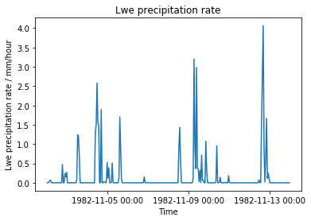
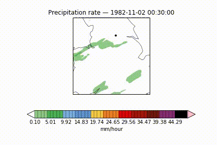
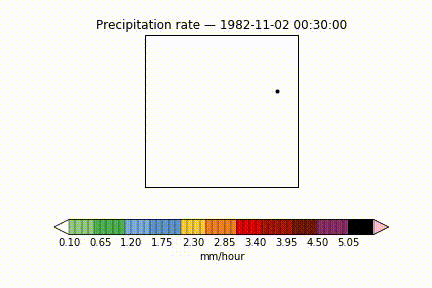

## Animations  

In order to sense check whether the process for clipping the data to a location of interest has worked, an animation which cycles through hourly precipitation accumulations is created with the location of interest marked on. This can be compared against a time-series plot for the same time period to check for accuracy. 

For instance, the time-series of precipitation values for a location in Leeds for some days in November 1982 is shown below.

  <i />

Two animations at different spatial resolutions covering the same time-period, with the location in Leeds marked on are shown below. 

