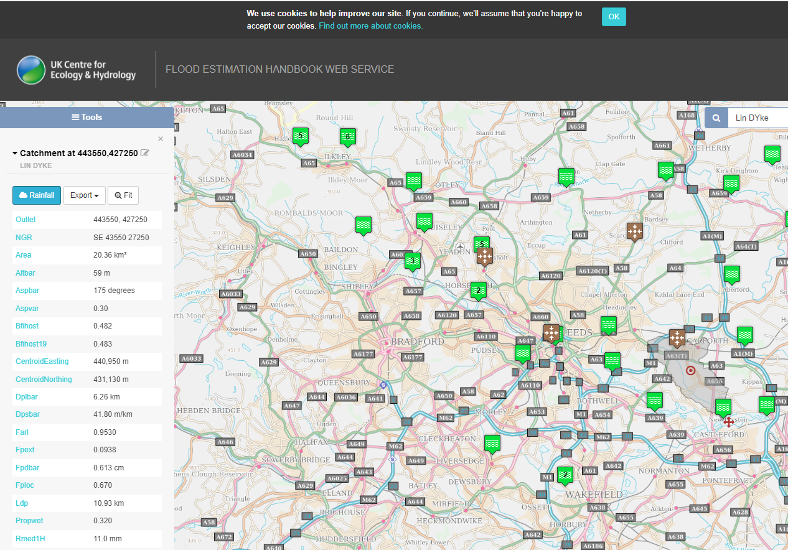
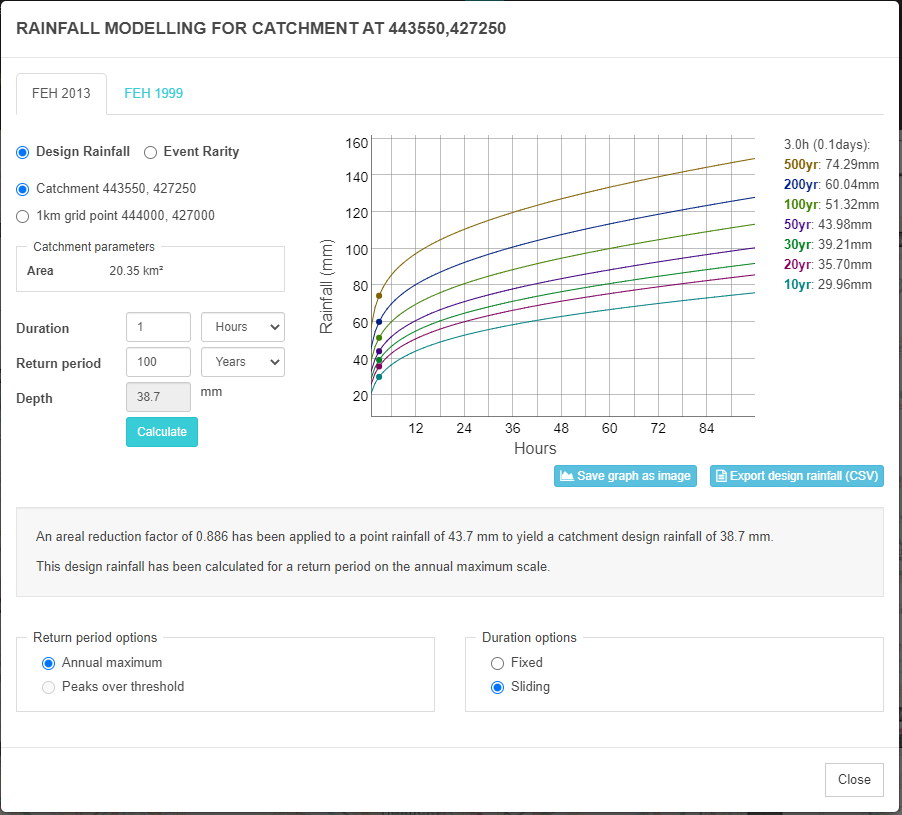
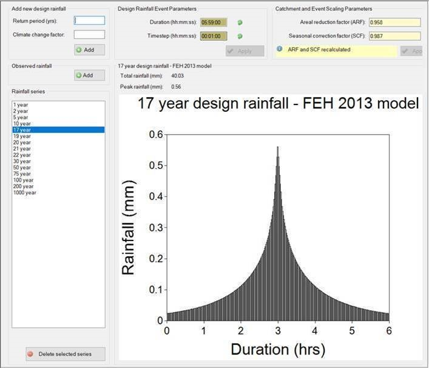
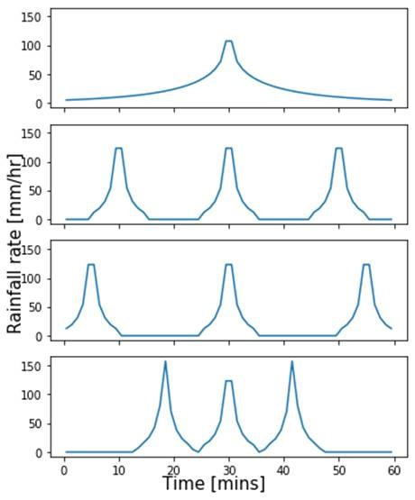
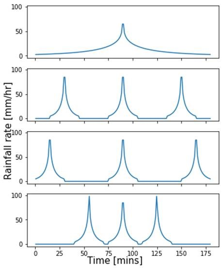
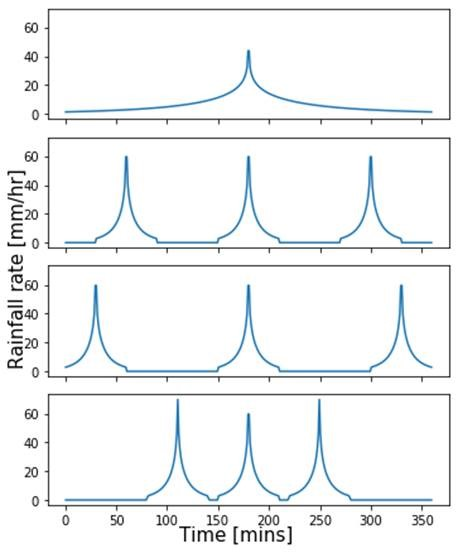

## Creating synthetic rainfall events
### Background
One research objective is to explore and identify the pluvial flood model sensitivity to alterations in the temporal pattern of the design storm rainfall inputs (e.g. the distribution of rainfall over time).

This sensitivity will be tested using a 2D flood model, built in Hec-Ras, which covers the Lin Dyke catchment in east Leeds. The model takes a rainfall input and simulates the movement of this water overland, according to a topographic profile, defined in a Digital Elevation Model. This rainfall input is in the format of a design storm hyetograph which represents the distribution of rainfall intensity over time. 

The standard process for deriving a design storm hyetograph is to use the FEH DDF model to estimate the design rainfall depth (in mm) for the required duration and return period for the 1km grid cell within which the catchment being modelled is found, and then to convert this rainfall depth, using ReFH2 software, into a design rainfall hyetograph at the required time step.

ReFH2 uses the FSR 75% winter and 50% summer design storm profiles to translate rainfall depths into hyetographs. These profiles are symmetrical and single peaked, with a slow build up and gradual decay (info on specification here: https://tinyurl.com/39jnvu8n). The profiles are consistent for different durations and locations. 

Evidence indicates that these profiles are not particularly representative of real convective events. Firstly, research indicates that events may often have multiple peaks embedded within a longer period of lighter rainfall (e.g. see rainfall event over Garforth in (Birch et al., 2021)), and secondly, that many convective events may be front-loaded (with the majority of the rainfall occurring at the start of the event) or back-loaded (with the majority of rainfall occurring at the end of the event). 

It is unclear, however, how these variations might impact on the flooding outcome. Thus, the objective of this piece of work is to formulate design storm hyetographs using different profiles, to use these to run the flood model and to observe the extent to which this impacts the outomces. 

### Standard approach to generating design storm hyetograph for Lin Dyke

The standard process for deriving the precipitation inputs includes the following stages:
* Use the FEH DDF model to estimate the design rainfall depth (in mm) for the required duration and return period for the 1km grid cell within which the modelling area is found

  

 Figure 1. Example ReFH2 design storm hyetograph for a 6hr duration storm with a 17 year return period 

* Convert this rainfall depth, using ReFH2 software, into a design rainfall hyetograph at the required time step (e.g. Figure 1)
* Extract the data on the net rainfall after losses have been subtracted from ReFH2
* Feed in this net rainfall data as the precipitation input to Hec-RAS

 Figure 1. Example ReFH2 design storm hyetograph for a 6hr duration storm with a 17 year return period 

### Approach to generating synthetic design storm hyetographs
In order to generate synthetic design storm hyetographs:
* Use the FEH DDF model to estimate the design rainfall depth (in mm) for the required duration and return period for the 1km grid cell within which the modelling area is found
* Generate synthetic design storm hyetographs which preserve the total event rainfall volume and duration, but splitting this rainfall volume into multiple peaks (see below)
* Feed these design storm hyetographs into ReFH2 as observed rainfall data, alongside data on antecedent conditions, and extract the data on the net rainfall after losses have been subtracted from ReFH2
* Feed in this net rainfall data as the precipitation input to Hec-RAS

Several methods are explored for generating synthetic design storm hyetographs which preserve the total event rainfall volume and duration, but splitting this rainfall volume into multiple peaks. For now, an event with 3 peaks will be considered.

The following parameters must be accounted for to construct multiple peaks:
  1. The rainfall volume for each peak  
    * Suggestion: Divide the total volume by the number of peaks so each peak has an equal volume and there is the same total rainfall.
  2. The shape of each peak  
    * Suggestion: Use the same shape, but different peak rainfall height so it gives the desired volume given a start-to-end duration for the peak.
  3. The start-to-end duration of each peak  
    * This is a parameter we can play with, but probably we will mainly look at short durations.
  4. The spacing between peaks  
    * What is a "fair" spacing for comparison so that the overall "event duration" is the same (i.e. the total length of the event including the non rain periods)?

Three different possible approaches are considered for constructing a multi-peaked hyetograph (with 3 peaks):
- 'Divide-time'  
  - The first peak starts at the same time as the single peak, and the last peak finishes at the same time,  and there is a third peak located in the middle.
- 'Max-spread'  
  - The centre of the peaks are equally spread out over the duration of the event. There is the same amount of time between the start of the event and the 1st peak, the 1st peak and the 2nd peak, the 2nd peak and the 3rd peak, and the 3rd peak and the end of the event. (i.e. centre of the peaks at t=(1/6)*d, (3/6)*d, and (5/6)*d)
- 'Sub-peak timing'  
  - Divide the single peak into 3 sections so that each has the same volume of rainfall. Then calculate the "average arrival time" of the rainfall in each subpeak (using these as the centre for the multiple peaks). Peak timing calculated so that Nth part of rainfall falls on average at the same time as in the single peak consider each minute as a block with constant rainfall rate for simplicity (don't understand this)

Figure 2 visualises these 3 methods alongside an equivalent single peaked storm for 1h, 3h and 6h durations.

    

 Figure 1. 4 methods (1= single peak, 2=divide-time, 3=max-spread, 4=sub-peak timing), for 1hr (left), 3hr (middle) and 6hr (right).  

 <!-- Script initially calculates a rate in mm/hr, can divide this by 60 to get a rate in mm/min
 Best to use 1 minute data to drive the model
 Input for Hec-Ras = mm/timestep.

 Does using multiple peaks make sense for a 1hr storm? SB: Even for the 6-hour rainfall events, most of the rainfall occurs in a much shorter period (maybe an hour or so). With a 1-hour duration, the peaks become very narrow to begin with, so splitting a single hour up into sub-peaks may not be so realistic. For 3 hours, it probably still makes sense.

 where I’ve been using ReFH2 to generate inputs to Hec-Ras I have been using the 6th column – ‘Total net rain mm (100 year) – urbanised model’, which has had some kind of losses removed from it, and is what I believe you are supposed to use as input to the flood model.  -->
