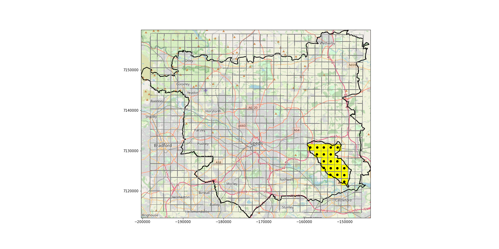

# Creating synthetic rainfall events

## Table of contents

1. [ Motivation. ](#motiv)
2. [ Generating FSR design storms with ReFH2. ](#fsr_designstorms)
3. [ Generating synthetic storms](#synthetic_storms)  
  a. [ Overview of methodology. ](#method_overview)  
  b. [ Details on options for multi peaked storms ](#details_options)  
  c. [ Defining antecedent conditions ](#antecedent_conditions)    
  d. [ Removing losses with ReFH2](#loss_removal)  

## Motivation
One research objective is to explore and identify the pluvial flood model sensitivity to alterations in the temporal pattern of the design storm rainfall inputs (e.g. the distribution of rainfall over time).

This sensitivity will be tested using a 2D flood model, built in Hec-Ras, which covers the Lin Dyke catchment in east Leeds. The model takes a rainfall input and simulates the movement of this water overland, according to a topographic profile, defined in a Digital Elevation Model. This rainfall input is in the format of a design storm hyetograph which represents the distribution of rainfall intensity over time. 

The standard process for deriving a design storm hyetograph is to use the FEH DDF model to estimate the design rainfall depth (in mm) for the required duration and return period for catchment being modelled, and then to convert this rainfall depth, using ReFH2 software, into a design rainfall hyetograph at the required time step.

ReFH2 uses the FSR 75% winter and 50% summer design storm profiles to translate rainfall depths into hyetographs. These profiles are symmetrical and single peaked, with a slow build up and gradual decay (info on specification here: https://tinyurl.com/39jnvu8n). The profiles are consistent for different durations and locations. 

Evidence indicates that these profiles are not particularly representative of real convective events. Firstly, research indicates that events may often have multiple peaks embedded within a longer period of lighter rainfall (e.g. see rainfall event over Garforth in (Birch et al., 2021)), and secondly, that many convective events may be front-loaded (with the majority of the rainfall occurring at the start of the event) or back-loaded (with the majority of rainfall occurring at the end of the event). 

It is unclear, however, how these variations might impact on the flooding outcome. Thus, the objective of this piece of work is to formulate design storm hyetographs using different profiles, to use these to run the flood model and to observe the extent to which this impacts the outomces. 

## Generating FSR design storms with ReFH2

The standard process for deriving a design storm using the FSR design storm profiles is as follows:
* Use the FEH DDF model to estimate the design rainfall depth (in mm) for the required duration and return period for the catchment
    * The FEH web service allows a catchment boundary to be determined
    * For the catchment it calculates the rainfall depth associated with a particular duration and return period
    * For Lin Dyke, for a 100 year return period, a rainfall depth of 59.98mm equates to a 6hr duration, 51.32mm for a 3hr duration and 38.7mm for a 1hr duration
* Convert this rainfall depth, using ReFH2 software, into a design rainfall hyetograph at the required time step (e.g. Figure 1)
* Extract the data on the net rainfall after losses have been subtracted from ReFH2
* Feed in this net rainfall data as the precipitation input to Hec-RAS   
   

## Generating synthetic design storm hyetographs

### Overview of methodology  
In order to generate synthetic design storm hyetographs:
* Use the FEH DDF model to estimate the design rainfall depth (in mm) for the required duration and return period for the 1km grid cell within which the modelling area is found
* Generate synthetic design storm hyetographs which preserve the total event rainfall volume and duration, but splitting this rainfall volume over time differently (according to one of two methods)
* Feed these design storm hyetographs into ReFH2 as observed rainfall data, alongside data on antecedent conditions, and extract the data on the net rainfall after losses have been subtracted from ReFH2
* Feed in this net rainfall data as the precipitation input to Hec-RAS

  
### Determining design rainfall volume from ReFH2
Load the catchment descriptors for Lin Dyke into ReFH2. Skip through to the second page and select Catchment Descriptors -> Model parameters and select 'Summer' from the season. Go back a page and set the duration to 06:01:00 and the timestep to 00:01:00. This results in a total rainfall depth of 59.28mm.

  
### Options for defining synthetic multi-peaked events

Two options are explored here for generating synthetic rainfall events with different temporal distributions. 
* Multiple peaked events: https://github.com/masher92/UKCP18/tree/master/CatchmentAnalysis/CreateSyntheticRainfallEvents/MultiplePeaks
* Events using summary profiles derived from analysis of UK extremes: https://github.com/masher92/UKCP18/tree/master/CatchmentAnalysis/CreateSyntheticRainfallEvents/RobertoProfiles

  
### Defining antecedent conditions
  
The design storm hyetograph input to Hec-Ras is expected to be the net rainfall after losses have been subtracted. When FEH rainfall depths and ReFH2 design storm profiles are provided, ReFH2 calculates the net rainfall after losses have been subtracted. It is also possible to import observed rainfall data into ReFH2, alongside antecedent rainfall conditions for at least the 3 days prior to the event, and the rainfall data with losses subtracted will be returned.

The antecedent conditions for Lin Dyke are defined at https://github.com/masher92/UKCP18/tree/master/CatchmentAnalysis/CreateSyntheticRainfallEvents/DeriveAntecedentConditions 

To calculate appropriate antecedent conditions, the CEH-GEAR precipitation data is extracted for the cells which are found within the catchment area (below)

 The cells within the Lin Dyke catchment 

Using the hourly values for June, July and August for the period covered by the data (1990-2014), an average daily rainfall amount is calculated. For the Lin Dyke catchment this is 0.51mm.

For each of the three days previous to the rainfall event being modelled, this is set as the daily rainfall amount. Three days is the minimum number of days of antecedent data that is required.

<!-- ## Questions about standard practice for defining antecedent conditions?
  * How is it usually done? https://refhdocs.hydrosolutions.co.uk/Initial-Conditions-Design-Estimates/
  * Could try find out exact method from manual to replicate
  * Or could try testing by experimenting with ReFH2
  * Could look at impact of using more than 3 days antecedent conditions - or of splitting the same rainfall amount differently over the X number of days of antecedent conditions provided and see if this makes a difference to the amount of losses subtracted (additional stage would be whether if there is a difference in the net rainfall after losses if this translates into a difference in flooding outcome)
 -->
 
  
### Removing losses with ReFH2

FOR MY ANALYSIS I HAVE BEEN USING THE JJA MEAN RAINFALL OVER 15 DAYS

Losses can be removed from synthetic rainfall profiles using ReFH2 following this procedure:
* Select 'Add' under Observed rainfall on the left
* Select rainfall data from file (this must be in a format with no column names, otherwise it will reject it)
* Add antecedent rainfall data from file (this must be in a format with no column names, otherwise it will reject it)
* Select next
* Select 'Observed rainfall - 05/04/22' (or equivalent) from the top down menu at the top left
* Select 'export' and then 'this event' above the plot of 'Observed rainfall - 05/04/22 - as rural' to export the rainfall with rural model losses remove
* Select 'export' and then 'this event' above the plot of 'Observed rainfall - 05/04/22 - urbanised' to export the rainfall with urban model losses remove
* Columns "Total net rain mm (Observed rainfall - 05/04/2022) - as 100% rural model" or "Total net rain mm (Observed rainfall - 05/04/2022) - urbanised model" can be used as the input to Hec-Ras 
  
An exploration of the impact of removing the losses is at https://github.com/masher92/UKCP18/blob/master/CatchmentAnalysis/CreateSyntheticRainfallEvents/RemoveLosses.ipynb
