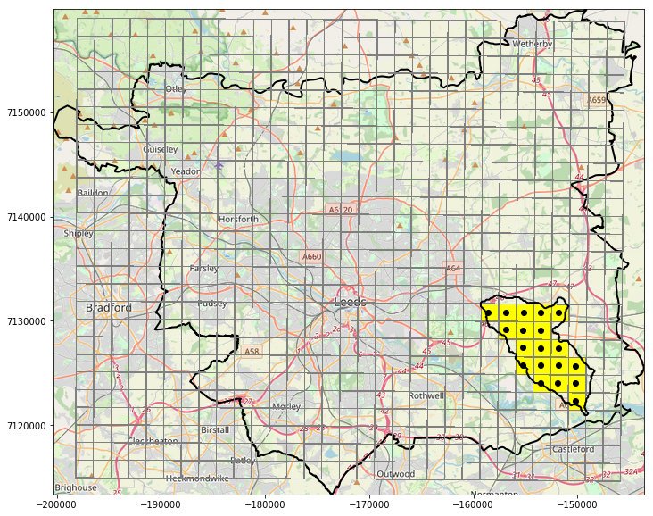

## Find antecedent conditions

The design storm hyetograph input to Hec-Ras is expected to be the net rainfall after losses have been subtracted, which is calculated in ReFH2. It is possible to read in the synthetic rainfall events to ReFH2 as observed rainfall data, so ReFH2 can then return the data with losses subtracted. However, for ReFH2 to do this, antecedent rainfall conditions for at least the 3 days prior to the event are required. 

To calculate appropriate antecedent conditions, the CEH-GEAR precipitation data is extracted for the cells which are found within the catchment area (Figure 1)

 Figure 1. 

  
  Lin Dyke = 0.507553426072435
