# Appendix D: Leeds Urban Catchments

This file contains analysis of 20 urban catchments within Leeds. 

## Table of contents

1. [ Catchment locations. ](#loc)
2. [ Catchment descriptors. ](#descriptors)
3. [ Catchment rainfall from FEH. ](#rainfall)  
  a. [ FEH13 rainfall values. ](#feh13_rainfall)  
  b. [ Relationship with catchment descriptors. ](#rainfallvsdescriptors)
4. [ Catchment runoff. ](#runoff)  
  a. [ ReFH2: Calculating catchment runoff. ](#calculatingrunoff)  
  b. [ ReFH2 outputs: peak flow and direct runoff. ](#peakflow_directrunoff)  
  c. [ Variation in peak flow with rurality and seasonality. ](#flow_vs_rurality_seasonality)  
  d. [ Variation in peak flow between catchments. ](#flow_vs_catchments)  
5. [ Critical storm durations. ](#criticaldurations)  
  a. [Relationship with catchment descriptors. ](#criticaldurationsvsdescriptors)  

## Catchment Locations

  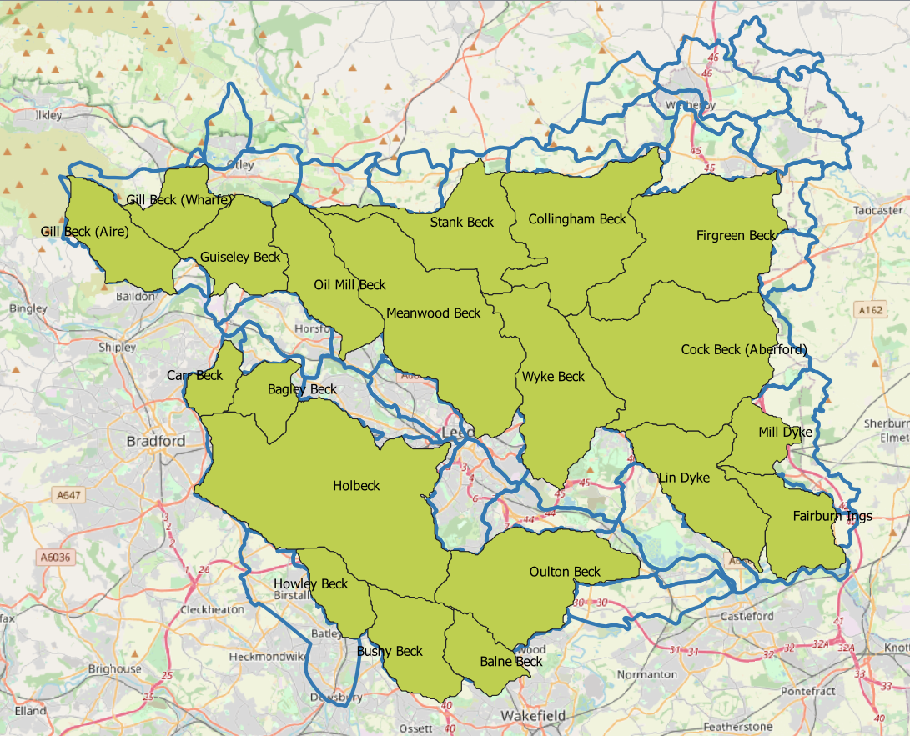  

 Figure 1. Urban catchments defined by LCC (blue outlines), and catchment boundaries from FEH web server (green fill) 

Leeds City Council (LCC) defined the boundaries of 46 urban catchments in Leeds, shown in blue in Figure 1. Using the FEH web service, 20 catchments with boundaries closely matching those identified by LCC have been identified and are shown in green on Figure 1.  The area of these 20 catchments range between 5km2 and 71km2 (Figure 2).  The LCC catchments which couldn't be generated in the FEH web service are sub-catchments of major rivers (Aire, Wharfe, Nidd and Calder). Additionally, LCC define Holbeck and Wortley Beck as seperate catchments, but the FEH produces one catchment boundary for Holbeck covering the area of both.

  

 Figure 2. Histogram of catchment area (km2) 

The FEH web service identifies the catchment area upstream of a catchment outlet point. For each catchment it generates:
* The catchment boundaries as a shapefile;
* Design rainfall depths for pre-defined return period/duration combinations;  
* Catchment descriptors based on the Integrated Hydrological Digital Terrain Model (IHDTM).

This data is analysed in more depth below.

## Catchment Descriptors
The catchment descriptors file generated by the FEH webservice contains various metrics related to the climate, drainage characteristics and soils in the catchment. Some characteristics that are likely to cause sensitivity to high intensity rainfall and to influence pluvial flood risk are:

* ALTBAR: Mean catchment altitude (m above sea level), derived from the IHDTM.
* BFIHOST: Catchment Average Base Flow Index. This is measure of catchment responsiveness derived using the 29-class Hydrology Of Soil Types (HOST) classification. Values over 0.65 represent permeability, and those below 0.65 represent an impermeable catchment.
* DPSBAR: This landform descriptor (mean Drainage Path Slope) provides an index of overall catchment steepness. It was developed for the Flood Estimation Handbook and is calculated as the mean of all inter-nodal slopes (derived using the IHDTM) for the catchment. The index is expressed in metres per kilometre with values ranging from >300 in mountainous terrain to <25 in the flattest parts of the country.
* SAAR: Average annual rainfall in the standard period (1961-1990) in millimetres.
* URBEXT2000: Index of urban and suburban land cover in 1990 / 2000 expressed as a fraction. A value of less than 0.3 represents a rural catchment, and more than 0.3 an urban catchment.
* LDP: Longest drainage path (in kilometres), defined by recording the greatest distance from a catchment node to the defined outlet.

For each of these catchment descriptors the spread of values across the 20 catchments is plotted in a histogram. To understand the geographic spread in these values a heat map of the catchments is plotted, and additionally the values are plotted on a scatter plot against both the easting and northing of the central point of the catchments. For descriptors other than altitude, the value are also plotted on a scatter plot against altitude.

### Altitude (m above sea level)

  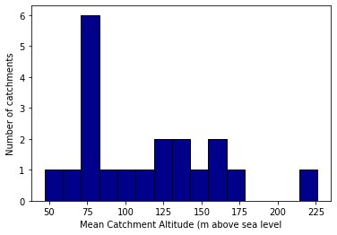
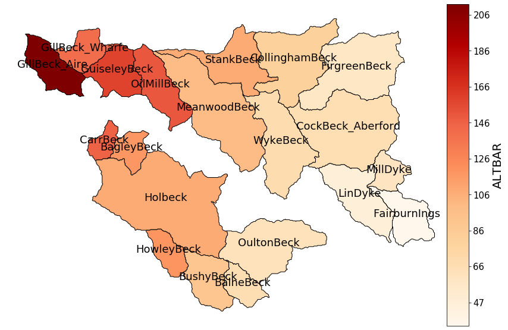    

  
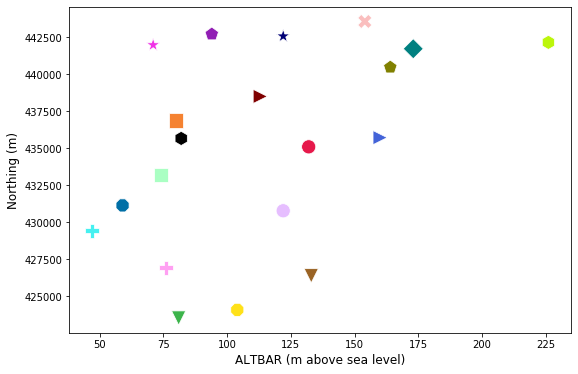
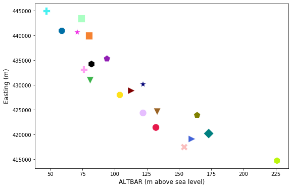    

 Figure 3. Mean Catchment Altitude (m above sea level) 

The altitude of the catchments vary between 47m and 226m above sea level. The highest catchment is Gill Beck (Aire) in the north west. There is a strong negative relationship between catchment altitude and easting (meaning the further west you go, the higher the altitude) and a weaker positive relationship between altitude and northing.

### Catchment Steepness (m per km)

  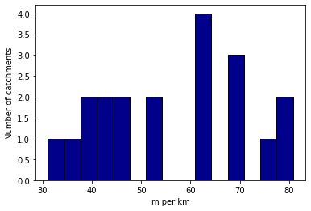
    

  
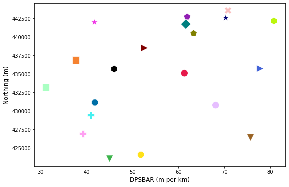
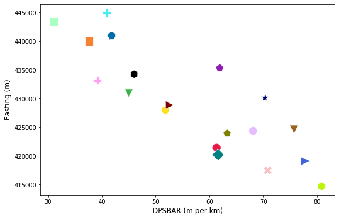  
  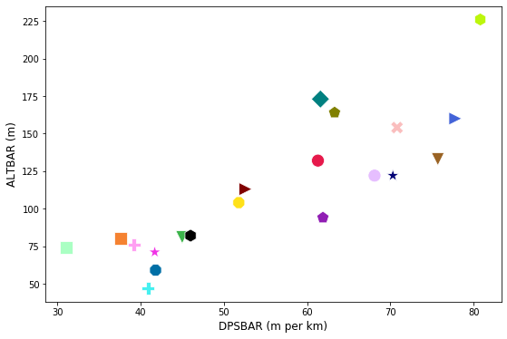  

 Figure 4. Catchment steepness (Metres per km)) 

The steepness of the catchments varies between 31.1 and 80.8 m per km. Catchments with a higher mean catchment altitude tend to have a higher catchment steepness. There is a negative correlation and positive correlation with northing, however, these relationship are less than strong than they are for altitude. 

### Longest Drainage Path (km)

  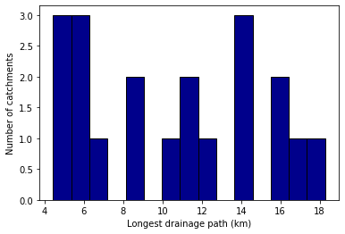
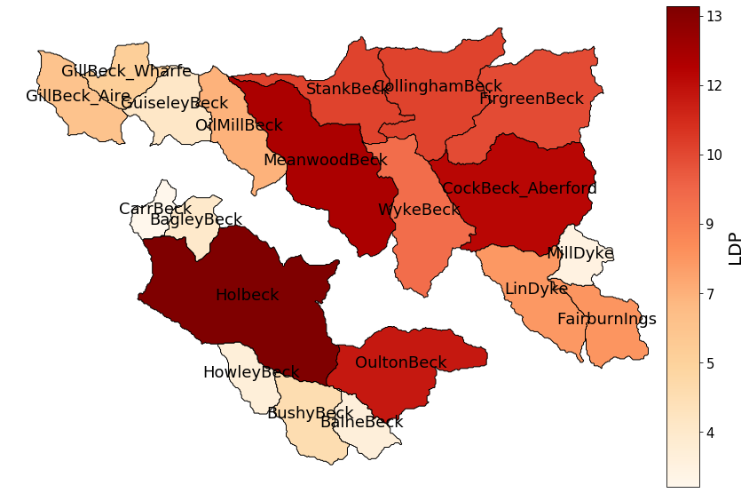    

  
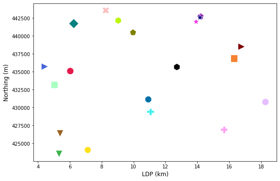
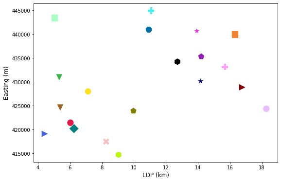  
  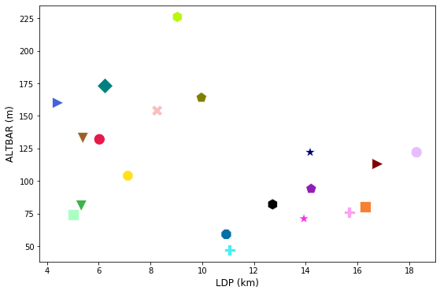  

 Figure 5. Longest drainage path (km)) 

  
The longest drainage path is 18.3km in Holbeck, and the shortest is Carr Beck at 4.5km. There is no clear relationship between a catchment's longest drainage path and its easting, northing or altitude.

### Urban Extent (%)

  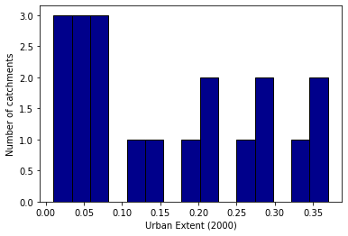
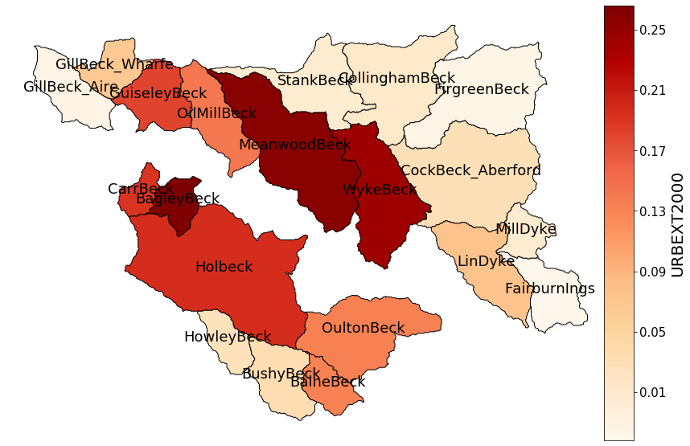    

  
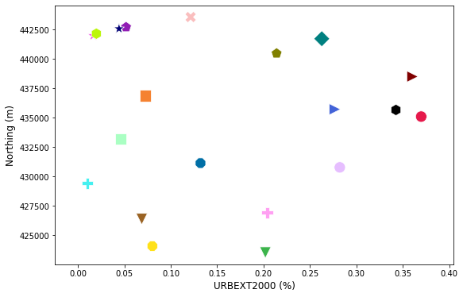
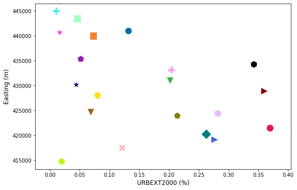  
  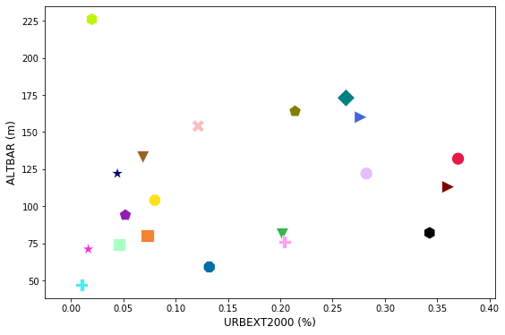  

 Figure 6. URBEXT (%) 

The urban extent in the catchments also has no correlation with easting, northing or altitude. Rather the catchments with the greatest urban extent are in the middle of the catchment in the area proximate to Leeds City Centre. Bagley Beck, Meanwood Beck and Wyke Beck are the only catchments with > 0.3% urban extent and therefore classified as urban.

### Base Flow Index

  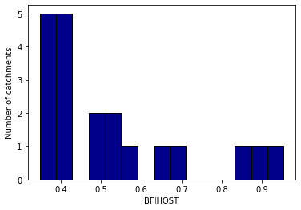
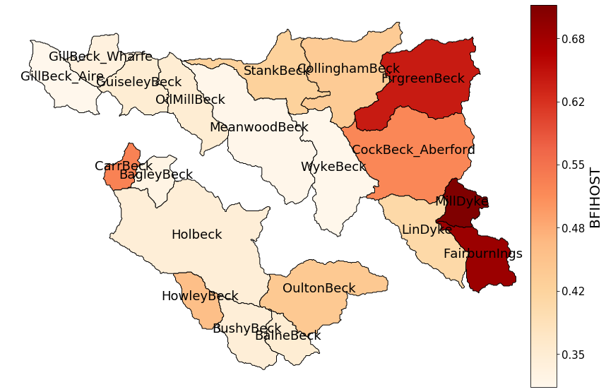    

  
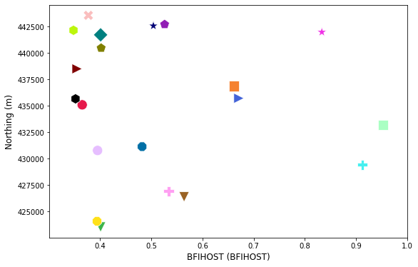
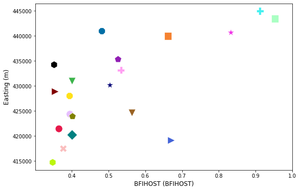  
  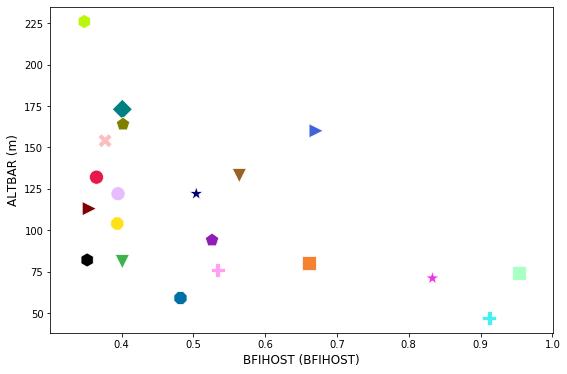  

 Figure 7. BFIHOST 

The Base Flow Index has a weak positive relationship with easting, and a negative relationship with altitude, with the highest values generally found in catchments in the east.
Cock Beck, Firgreen Beck, Fairburn Ings and Mill Dyke have values over 0.65, which represents that they are permeable catchments. The rest of the catchments have values below 0.65, so are classed as impermeable.

### Standard Average Areal Rainfall (mm)

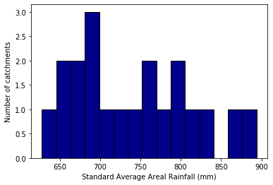
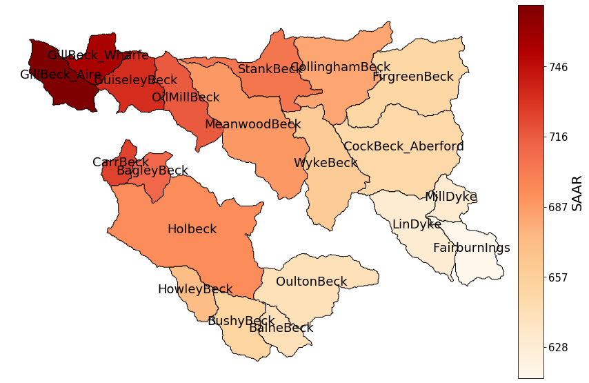   

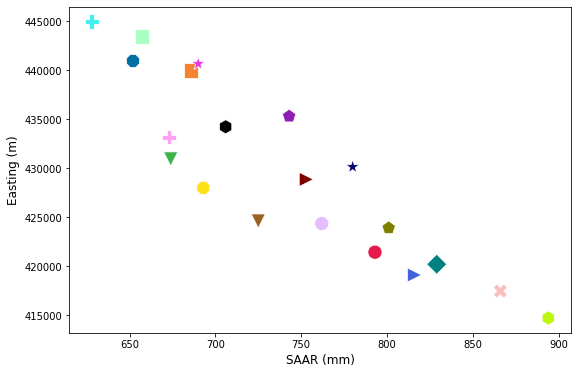   
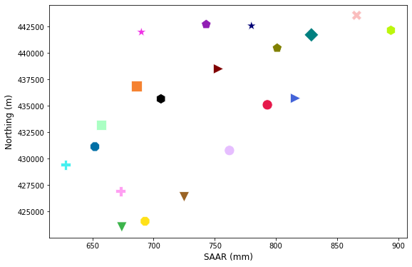     
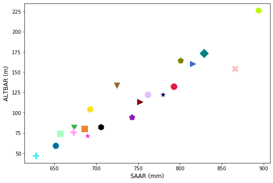       

 Figure 8. Standard Average Areal Rainfall (mm) 

SAAR is strongly postively related to altitude, and consequently negatively related to easting. There is a weaker positive relationship with northing. 

## Catchment rainfall (FEH13)

## Rainfall values: FEH13

The FEH uses a depth-duration-frequency (DDF) model, based on complex statistical analysis of datasets of annual and seasonal maximum precipitation values, to estimate the annual maximum rainfall for events of particular durations and corresponding to certain return periods. FEH DDF design rainfall is supplied through the FEH web service.

  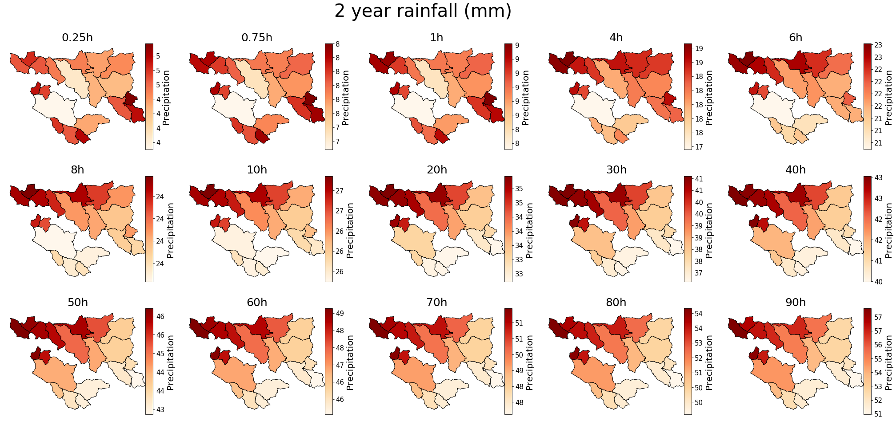  
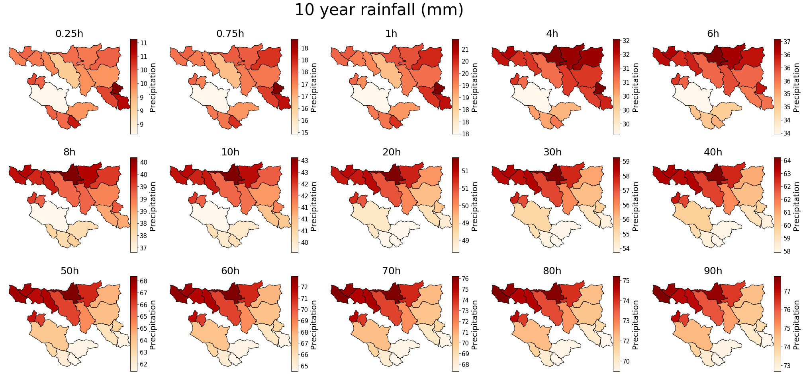
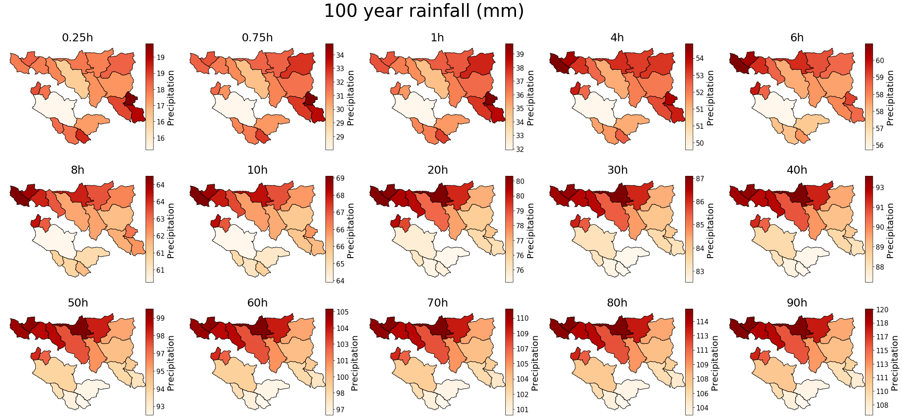

  

In Figure 9, the annual maximum rainfall accumulations within the specified durations (between 0.25 and 96 hours, at 0.25h intervals) are shown for each return period, with a line for each catchment.

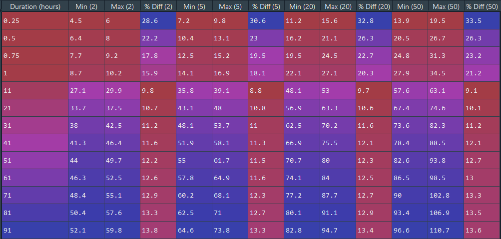

 Figure 9. Annual maximum rainfall accumulations within the specified durations, over a range of return periods. Each line represents a different catchment 

Figure 10 helps to visualise the catchments which have the maximum and minimum precipitation values associated with certain durations and return periods, and to assess how much variation there is in this. 

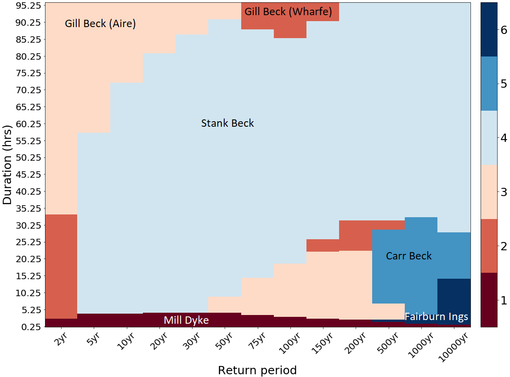
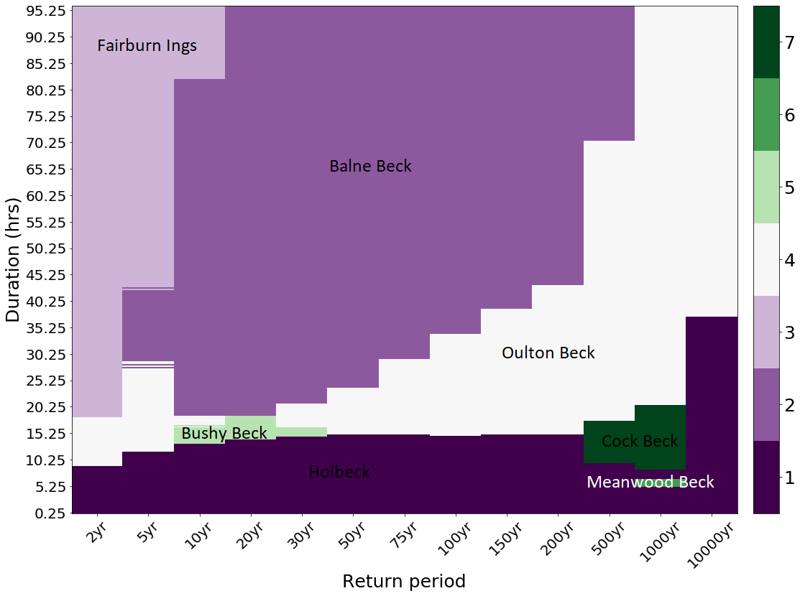

 Figure 10. Displays the catchment with the maximum (left) and minimum (right) annual precipitation accumulation associated with each duration at each return period 

The rainfall values for some return period and duration combinations are displayed below.

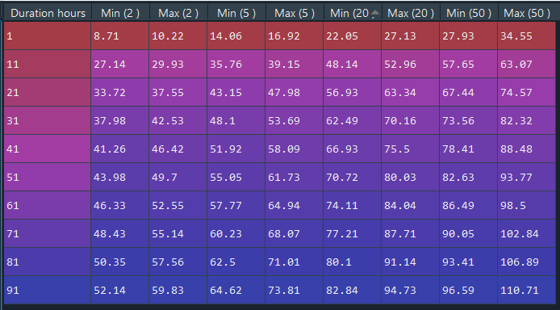

 

### Relationship between annual maximum rainfall accumulation and catchment descriptors

Catchment rainfall accumulations are influenced by the catchment's geographic location, primarily because in Leeds altitude has a strong spatial component, with the highest values found in the north west. The animations below display the relationship beween catchment annual precipitation accumulations and northing, easting, altitude and standard average areal rainfall values. Each frame in the animation shows the relationship for one duration, and they cycle between 0.25h and 95.25h at hourly intervals. The plot on the left is for a 2 year return period, and on the right for a 10 year return period.  

#### Northing

  
  

#### Easting

  
  

#### Altitude (ALTBAR)

  
    

#### Standard  Average Areal Rainfall (SAAR)

  
  

#### Area

   
  

A similar pattern is found in the relationship between SAAR, mean catchment altitude, easting and northing, and FEH13 precipitation values at various durations. This follows, considering the strong positive relationship between altitude and SAAR (Figure 8) and altitude and easting and northing (Figure 3). This pattern is that at the shorter durations (~ <10 hrs) there is no clear relationships seen; however, during this time a clear relationship develops. 

TO BE COMPLETED

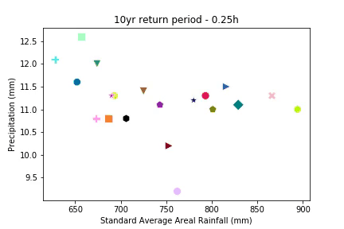
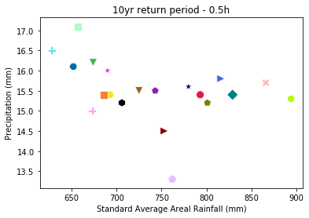
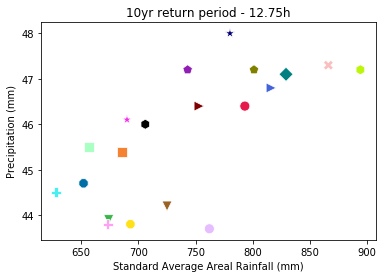

  ... 

Two groups are notable:  
* Group1: FEH13 rainfall is higher than other catchments at very short durations, but is lower than other catchments at longer durations (generally catchments with low SAAR, low altitude and which are further east and south).  
* Group2: FEH13 rainfall is lower than other catchments at very short durations, but is higher than other catchments at longer durations (generally catchments with high SAAR, high altitude and which are further west and north).  

To determine the catchments in each group, the precipitation value for each catchment is normalised for 96h and 1h durations. For group 1, the 96h normalised precipitation is lower than the 1h value, and for group 2 it is larger. This difference in normalised precipitation can be plotted against different catchment descriptors to investigar the relationship.

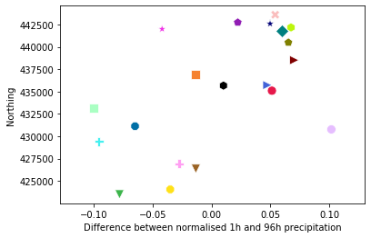
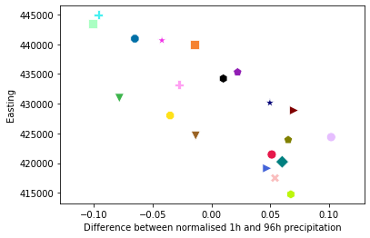
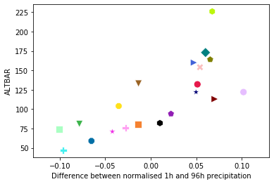
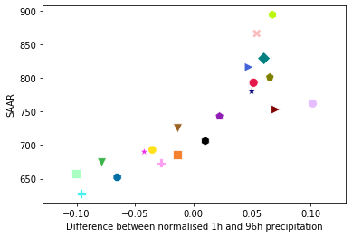  

 ..  

## Catchment runoff

### ReFH2: Calculating catchment runoff
The ReFH2 rainfall runoff model translates the rainfall depths derived from the FEH13 DDF model into runoff. FEH13 calculates pre-defined return period/duration combinations and so to calculate other combinations a non-linear interpolation procedure is invoked. The final design rainfall depth in ReFH2 is calculated as the product of the FEH DDF rainfall depths, the areal reduction factor, and the seasonal correction factor (SCF). The SCF converts an annual maximum rainfall depth to a seasonal maximum depth and is calculated based upon location, season, duration and selected return period [NB: the total rainfall given in ReFH2 can be calculated by multiplying the values provided in the csv file of catchment rainfalls exported from FEH web server by the SCF given in ReFH2]. 

The storm seasonality (summer or winter) can be selected in ReFH2 manually, or alternatively a default seasonality is adopted based on urban extent and BFIHOST19, and summer storms are selected by default if:  
* URBEXT2000 is ≥ 0.30, or  
*	0.15 ≤ URBEXT2000 < 0.30 and BFIHOST19 is ≥ 0.65.
Winter storms are selected by default in all other cases.

Out of the 20 Leeds catchments, only 4 (Wyke Beck, Bagley Beck, Meanwood Beck, Carr Beck) use a summer storm profile by default. 

ReFH2 uses data on initial catchment conditions and model parameters that are estimated from catchment descriptors to convert rainfall into runoff, and the rainfall depth is scaled accordingly to reflect that season in order to produce summer and winter hyetographs. Additionally, in ReFH2 rainfall hyetographs are available as both rural and urbanised scenarios. The ReFH2 model has both a rural catchment model component and an urban catchment model component. In rural scenarios, the whole catchment is modelled using the rural catchment model, whereas in urbanised scenarios the catchment area which is urban is first delineated, and then this urban area is run through the urban model, and the remainder of the catchment is modelled as rural.  

### ReFH2 outputs: peak flow and direct runoff
ReFH2 allows the user to define a duration of rainfall and then calculates the associated peak flow (m3/s) and total direct runoff (ml) in both rural and urbanised scenarios for return periods of 1, 2, 5, 10, 30, 50, 75, 100, 200 and 1000 years. The direct runoff is the total cumulative amount of runoff during that rainfall event, and as such the longer duration the storm the higher that value becomes. Contrastingly, the storm duration associated with the highest peak flow (known as the critical storm duration) is not generally the longest storm duration, and will be dependent on catchment characteristics. This is seen in Figure 11, where the greatest runoff volume is found at the longest duration, whereas the greatest peak flow value varies between catchments but generally occurs at a shorter duration.  

  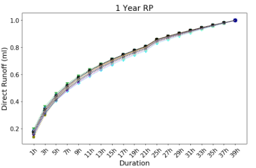    
  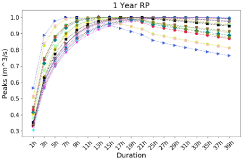  

 Figure 11. Direct runoff in ml (left) and peak flow in m3/s (right) for a 1 year return period event in summer using an urbanised scenario 

### Variation in peak flow with rurality and seasonality 
The maximum peak flow is generally associated with the widest flood extent and is of great importance for surface water flooding. The peak flows found in Leeds catchments for various durations across both urbanised and rural scenarios, and for both winter and summer storm profiles, at a ten year return period, are shown in Figure 12. This shows that the relationship between peak flow and rainfall event duration varies extensively between different catchments. There is also clear variation between catchments in how much this relationship differs from summer to winter, and between urbanised and rural scenarios. Across all catchments, using a summer storm profile results in higher peak flows than a winter storm profile. In almost all catchments the model including the urban component has higher peak flows than the model with no urban component. However, in Gill Beck (Aire) which is one of the catchments with the lowest urban extent, there is practically no difference between the two. 

  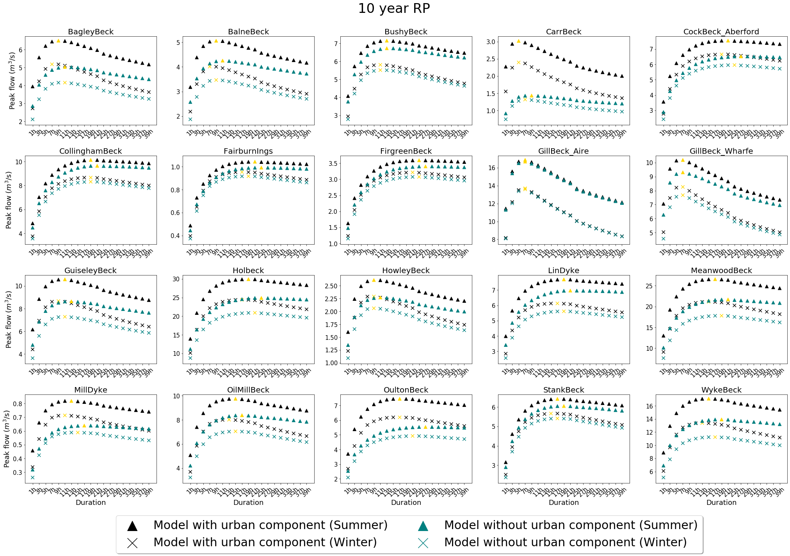    

 Figure 12. Peak flows in Leeds catchments for various durations across both urbanised and rural scenarios, and for both winter and summer storm profiles, at a ten year return period 

The plots in the section below help understand more about which catchment characteristics influence the variation in catchment response to summer and winter storms and to modelling with or without an urban component. The mean difference across all return periods between the critical duration in summer and winter (for a model both with and without an urban component) and between the peak flow using a model with an urban component and the model without an urban component (for both summer and winter storm profiles), is plotted against the value for various catchment descriptors for each catchment.

#### Altitude

  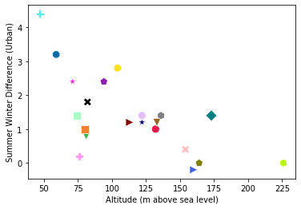    
  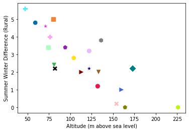    
  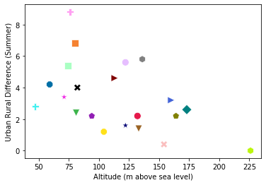
  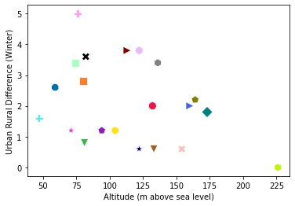      

  

There is a strong negative correlation between the difference in peak flow between summer and winter and altitude, for models both with and without and urban component. This means that the higher the catchment altitude, the smaller the difference between peak flow from summer and winter storms.
There is a weaker negative correlation between the difference in peak flow between a model with and without and urban component, for both summer and winter storm profiles.

#### BFIHOST

  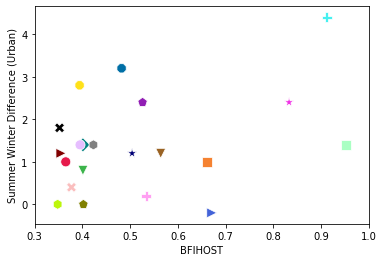    
  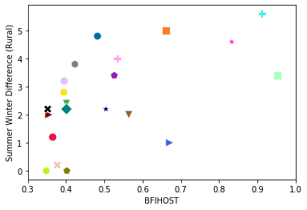    
  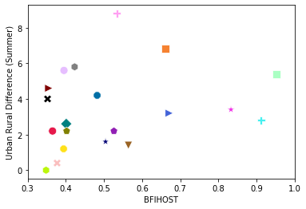
  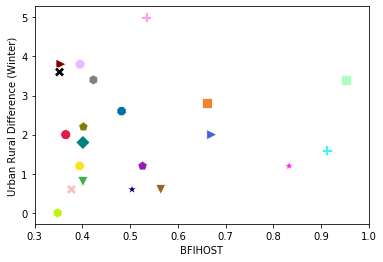      

  

There is a weak positive correlation between the difference in peak flow between summer and winter and BFIHOST, for models both with and without and urban component. This means that catchments with a higher BFIHOST value (e.g. more permeable) have a greater difference between peak flow from summer and winter storms. There is no clear correlation between BFIHOST and the difference in peak flow between a model with and without and urban component.

#### Steepness

  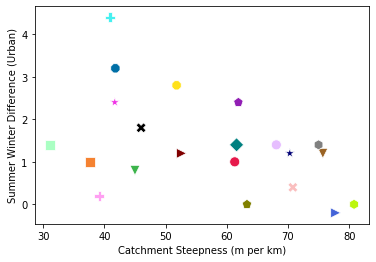    
  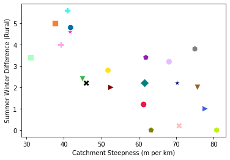    
  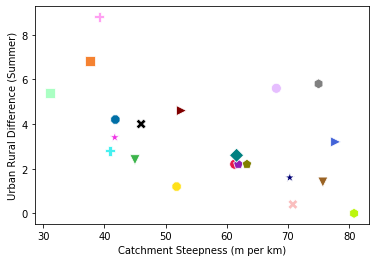
  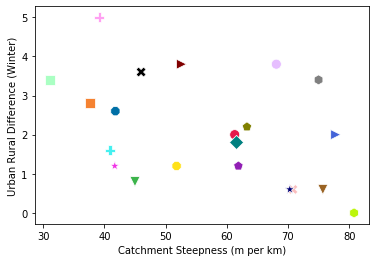      

  

There is a weak negative correlation between the difference in peak flow between summer and winter and steepness, for models both with and without and urban component, and between the difference in peak flow between a model with and without and urban component and steepnes, for both summer and winter storm profiles.

#### Standard Average Areal Rainfall

      
      
  
        

  

  
#### Urban Extent

  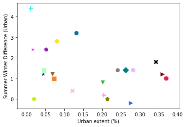    
  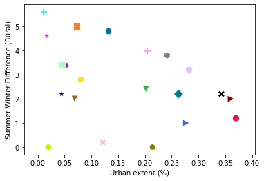    
  
  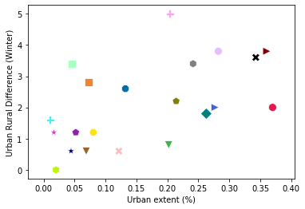      

  

Weak negative correlation between the difference in peak flow between summer and winter and urban extent, for models both with and without and urban component. Surprisingly, there is little correlation evident between the urban extent and the difference in peak flow between a model with and without and urban component, for both summer and winter storm profiles.

#### Area

  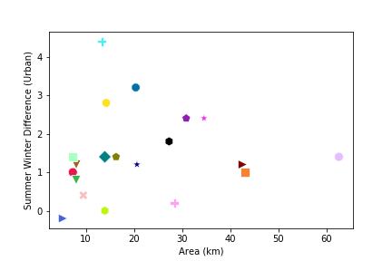    
  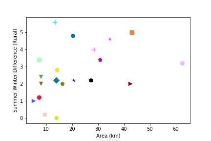    
  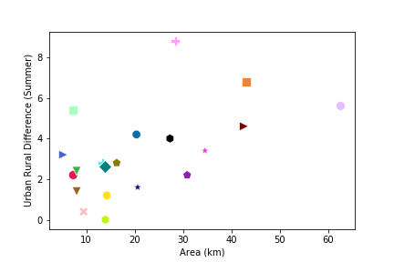
  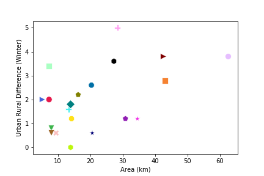      

  

### Variation in peak flow between catchments 

  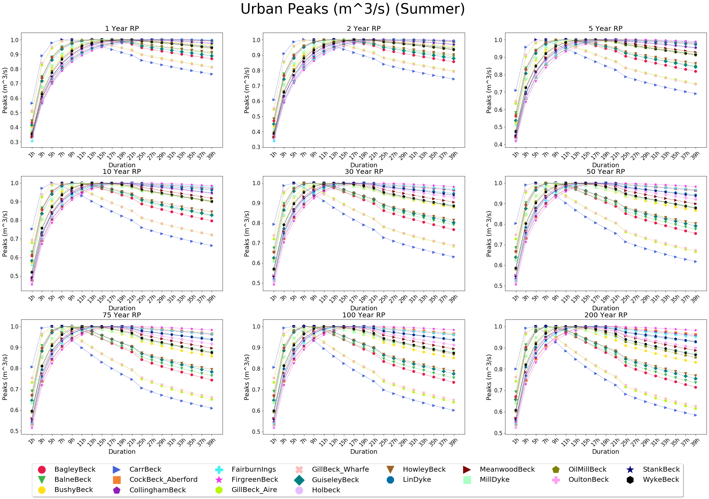    

 Figure 13. Normalised peak flows in Leeds catchments for durations between 1 and 39h, for various return periods 

The shape of the relationship between duration and peak flow varies between catchments. To explore this, the peak flow at durations between 1 and 39 hours are plottted for each catchment, for several return periods, in Figure 13. This focuses on a summer storm profile, using a model including an urban component.

  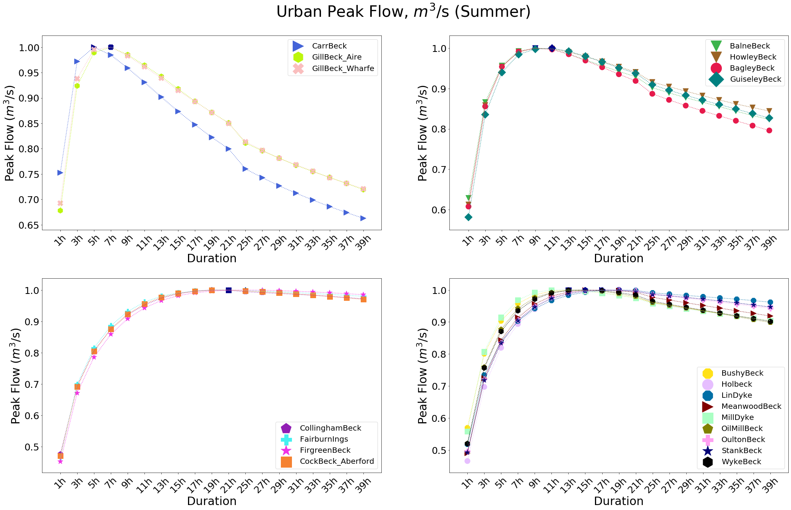    

 Figure 14. Normalised peak flows in Leeds catchments for durations between 1 and 39h, for 10 year return period 

  
From Figure 13 it is apparent that the shape of the relationship between duration and peak flow varies between catchments. Four predominant response shapes can be picked out in the plots in Figure 13. To illustrate this further, in Figure 14 for a 10 year return period, these grouped are manually identified and the response curves for each group are plotted seperately. 

ANYTHING TO LINK TOGETHER THE GROUPS?

## Critical storm duration 
The critical storm duration (duration with highest peak flow) is generally associated with the widest flood extent and is of great importance for surface water flooding. Understanding a catchment's critical storm duration is important in order to understand the kinds of storms which are most likely to lead to surface water flooding in the catchment. In Figure 15 the critical storm duration at each return period for each catchment is plotted. 

  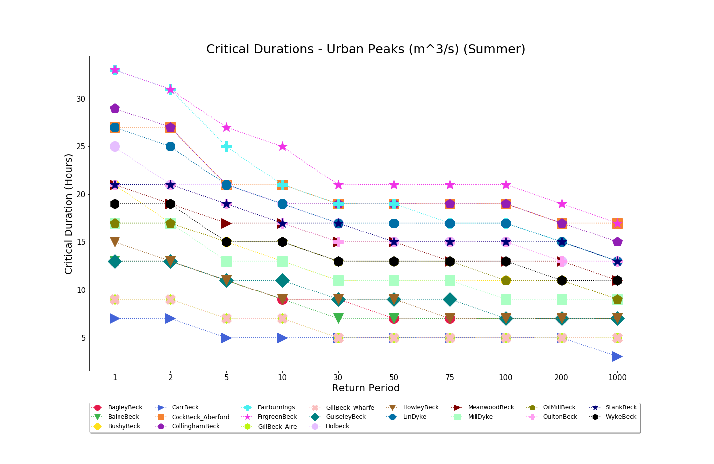    

 Figure 15. Critical durations for each catchment and return period, for a summer storm profile and model including urban component 

## Relationship between critical storm durations and catchment descriptors

Critical storm durations are likely to be influenced by catchment characteristics. To investigate this, the plots below display the relationship between catchment critical duration and various catchment descriptors. Each frame in the animation shows the relationship for one return period, with a seperate plot for summer and winter storm profiles, and models including and excluding an urban component.

### Altitude

  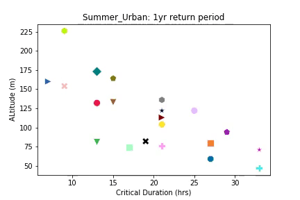
  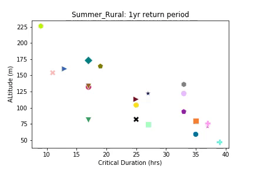
  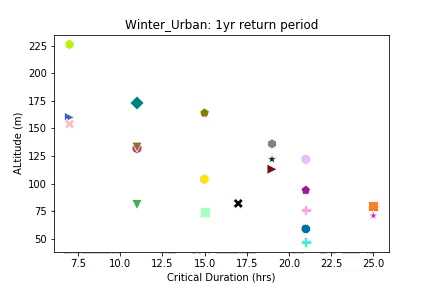
  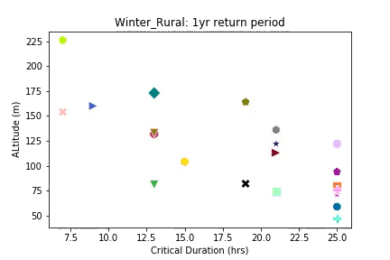  

Across all return periods, there is a negative correlation between catchment altitude and critical duration. This means that the higher the elevation of the catchment, the shorter the critical storm duration. 

### Area

  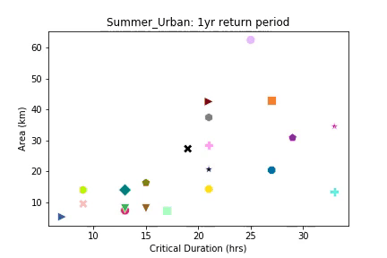
  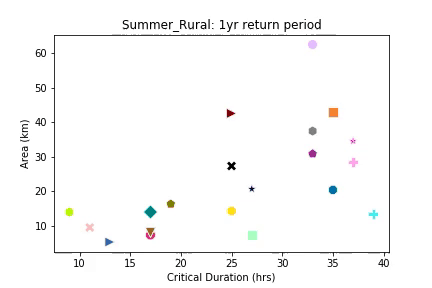
  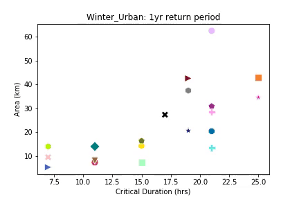
  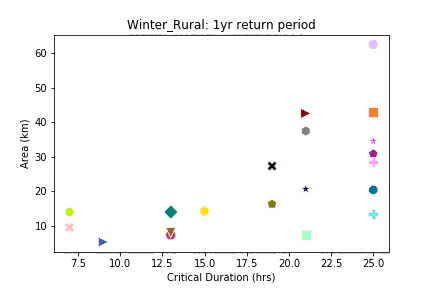  

### BFIHOST

  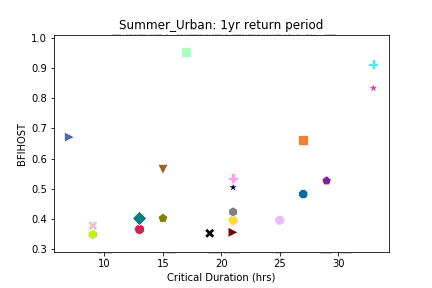
  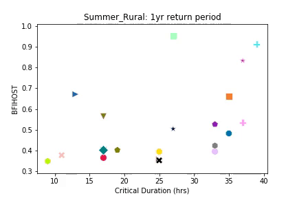
  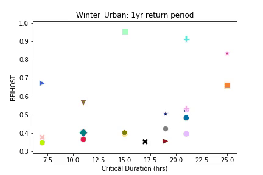
  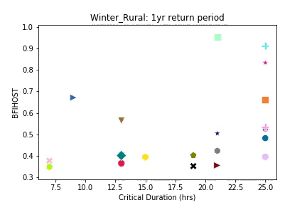  

### DPSBAR

  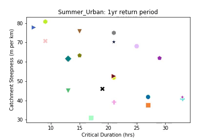
  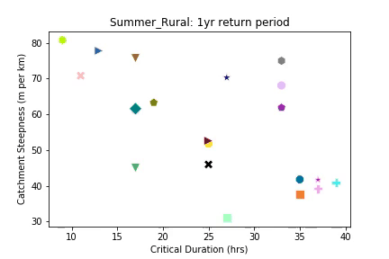
  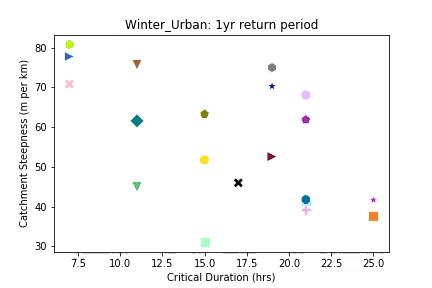
  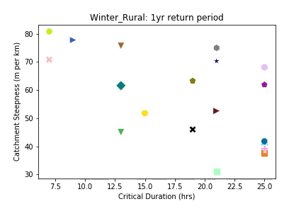  

### LDP

  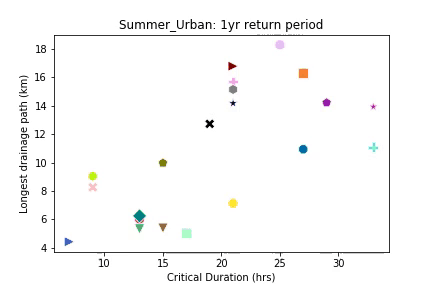
  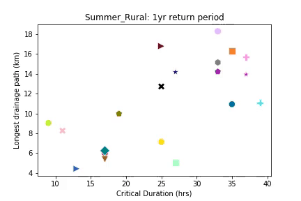
  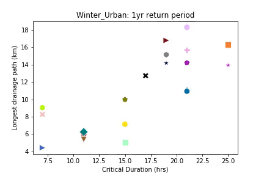
  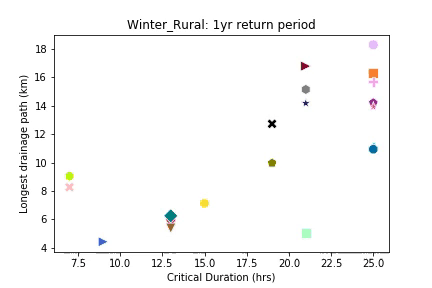  

### URBEXT200

  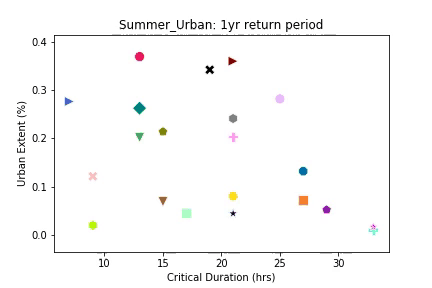
  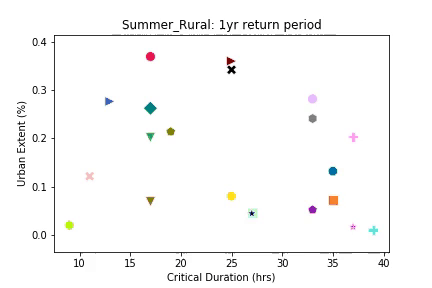
  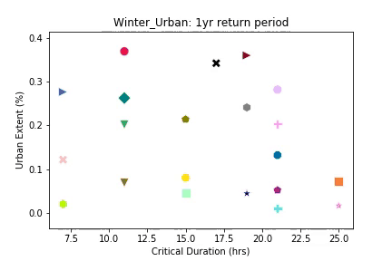
  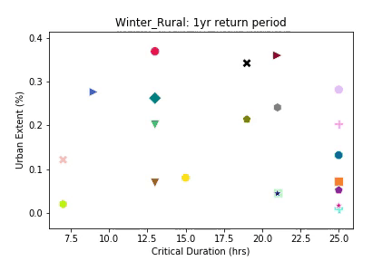  

