# Leeds Urban Catchments

Leeds City Council (LCC) have defined 46 urban catchments in Leeds. The boundaries of these catchments are defined in blue in Figure 1.

    

 Figure 1. Urban catchments defined by LCC (blue outlines), and catchment boundaries from FEH web server (filled in with green if ReFH2 data has been downlaoded, and red if it has not) 

The FEH web service identifies the catchment area upstream of a catchment outlet point. For each catchment it generates:
* The catchment boundaries as a shapefile;
* Design rainfall depths for pre-defined return period/duration combinations;  
* Catchment descriptors based on the Integrated Hydrological Digital Terrain Model (IHDTM).

Using the FEH web service, 21 catchments with boundaries closely matching those identified by LCC have been identified and are shown on Figure 1. The LCC catchments which couldn't be generated in the FEH web service are sub-catchments of major rivers (Aire, Wharfe, Nidd and Calder). The area of these 21 catchments range between 5km2 and 71km2.

  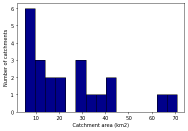  

 Figure 1. Histogram of catchment area (km2) 

### Catchment Descriptors
The catchment descriptors file generated by the FEH webservice contains various metrics related to the climate, drainage characteristics and soils in the catchment. Some characteristics that are likely to cause sensitivity to high intensity rainfall and to influence pluvial flood risk are:

* ALTBAR: Mean catchment altitude (m above sea level), derived from the IHDTM.
* BFIHOST: Catchment Average Base Flow Index. This is measure of catchment responsiveness derived using the 29-class Hydrology Of Soil Types (HOST) classification. Values over 0.65 represent permeability, and those below 0.65 represent an impermeable catchment.
* SAAR: Average annual rainfall in the standard period (1961-1990) in millimetres.
* URBEXT2000: Index of urban and suburban land cover in 1990 / 2000 expressed as a fraction. A value of less than 0.3 represents a rural catchment, and more than 0.3 an urban catchment.

In Figures 2-5, a histogram and a chloropleth map are plotted of the values of each of the metrics across the 21 catchments.

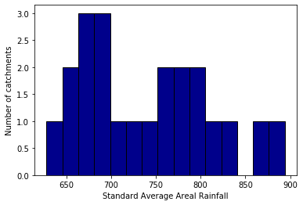
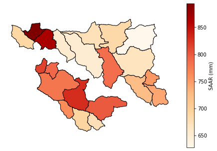   

 Figure 2. Standard Average Areal Rainfall (mm) 

   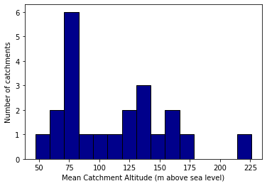
   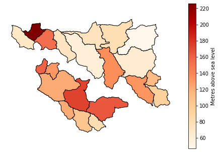    

 Figure 3. Mean Catchment Altitude (m) 

   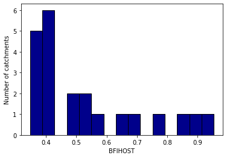
   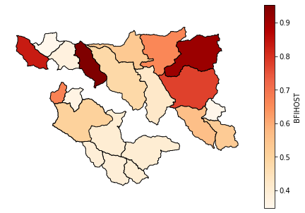    

 Figure 4. Base Flow Index 

   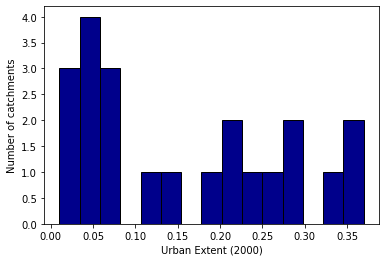
   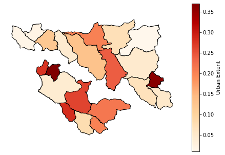    

 Figure 5. URBEXT 

In Figure 6 a (weak?) negative relationship is seen between increasing urban extent and base flow index. Higher base flow indices are associated with permeability and so it follows that the highest values of BFIHOST would be associated with the lowest urban extent. In Figure 7 a positive relationship is seen between catchment altitude and average areal rainfall.

  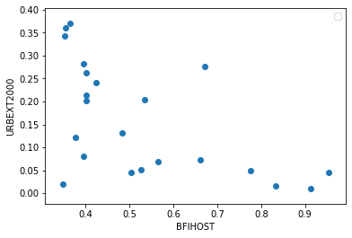  
  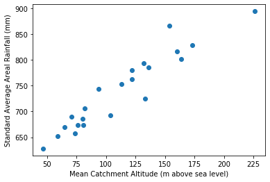  

 Figure 6 and 7. 

### Catchment design rainfall
The FEH uses a depth-duration-frequency (DDF) model, based on complex statistical analysis of datasets of annual and seasonal maximum precipitation values, to estimate the total event rainfall of particular durations and corresponding to certain return periods. FEH DDF design rainfall is supplied through the FEH web service.

ReFH2's rainfall-runoff model imports the outputs from the FEH DDF model and uses them as a design storm input.
A standard set of DDF values is provided for FEH13; a non-linear interpolation procedure is invoked to estimate specific depths and frequencies for the selected design durations. Additionally, the final design rainfall depth in ReFH2 is calculated as the product of the FEH DDF rainfall depths, the areal reduction factor, and the seasonal correction factor (SCF). The SCF converts an annual maximum rainfall depth to a seasonal maximum depth and is calculated based upon location, season, duration and selected return period.

The default seasonality is adopted based on urban extent and BFIHOST19, and summer storms are selected by default if:  
* URBEXT2000 is ≥ 0.30, or  
*	0.15 ≤ URBEXT2000 < 0.30 and BFIHOST19 is ≥ 0.65.
Winter storms are selected by default in all other cases.

As such, out of the 21 Leeds catchments, only 4 (Wyke Beck, Bagley Beck, Meanwood Beck, Carr Beck) use a summer storm profile by default.

The ReFH2 software generates hyetographs based on Flood Studies Report (FSR)/FEH approaches.

### Catchment peak flow

    

 Figure 8. 

    

 Figure 9. 

