# Leeds Urban Catchments

This file contains analysis of 20 urban catchments within Leeds. 

## Table of contents

1. [ Catchment locations. ](#loc)
2. [ Catchment descriptors. ](#descriptors)
3. [ Catchment rainfall from FEH. ](#rainfall)  
  a. [ Relationship with catchment descriptors. ](#rainfallvsdescriptors)
4. [ Catchment runoff. ](#runoff)

## Catchment Locations

  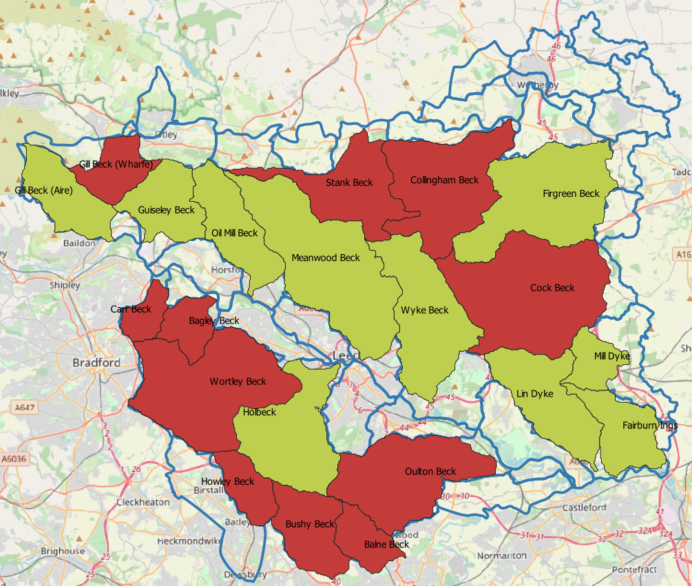  

 Figure 1. Urban catchments defined by LCC (blue outlines), and catchment boundaries from FEH web server (green fill) 

Leeds City Council (LCC) defined the boundaries of 46 urban catchments in Leeds, shown in blue in Figure 1. Using the FEH web service, 20 catchments with boundaries closely matching those identified by LCC have been identified and are shown in green on Figure 1.  The area of these 20 catchments range between 5km2 and 71km2.  The LCC catchments which couldn't be generated in the FEH web service are sub-catchments of major rivers (Aire, Wharfe, Nidd and Calder).

  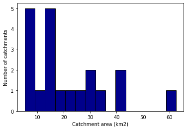

 Figure 2. Histogram of catchment area (km2) 

The FEH web service identifies the catchment area upstream of a catchment outlet point. For each catchment it generates:
* The catchment boundaries as a shapefile;
* Design rainfall depths for pre-defined return period/duration combinations;  
* Catchment descriptors based on the Integrated Hydrological Digital Terrain Model (IHDTM).

This data is analysed in more depth below.

## Catchment Descriptors
The catchment descriptors file generated by the FEH webservice contains various metrics related to the climate, drainage characteristics and soils in the catchment. Some characteristics that are likely to cause sensitivity to high intensity rainfall and to influence pluvial flood risk are:

* ALTBAR: Mean catchment altitude (m above sea level), derived from the IHDTM.
* BFIHOST: Catchment Average Base Flow Index. This is measure of catchment responsiveness derived using the 29-class Hydrology Of Soil Types (HOST) classification. Values over 0.65 represent permeability, and those below 0.65 represent an impermeable catchment.
* DPSBAR: This landform descriptor (mean Drainage Path Slope) provides an index of overall catchment steepness. It was developed for the Flood Estimation Handbook and is calculated as the mean of all inter-nodal slopes (derived using the IHDTM) for the catchment. The index is expressed in metres per kilometre with values ranging from >300 in mountainous terrain to <25 in the flattest parts of the country.
* SAAR: Average annual rainfall in the standard period (1961-1990) in millimetres.
* URBEXT2000: Index of urban and suburban land cover in 1990 / 2000 expressed as a fraction. A value of less than 0.3 represents a rural catchment, and more than 0.3 an urban catchment.
* LDP: Longest drainage path (in kilometres), defined by recording the greatest distance from a catchment node to the defined outlet.

For each of these catchment descriptors the spread of values across the 20 catchments is plotted in a histogram. To understand the geographic spread in these values a heat map of the catchments is plotted, and additionally the values are plotted on a scatter plot against both the easting and northing of the central point of the catchments. For descriptors other than altitude, the value are also plotted on a scatter plot against altitude.

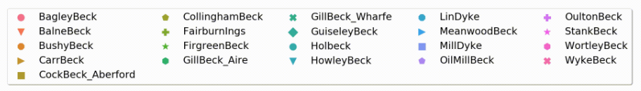

### Altitude (m above sea level)

  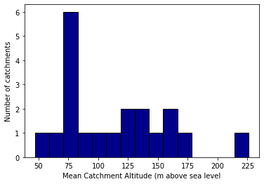
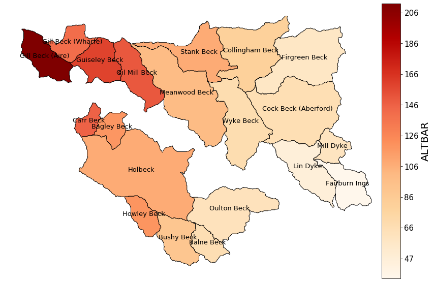    

  
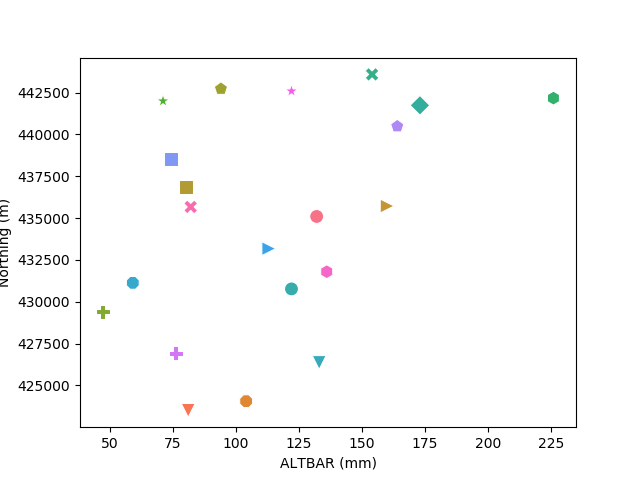
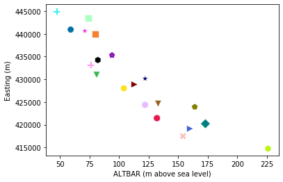    

 Figure 3. Mean Catchment Altitude (m above sea level) 

The altitude of the catchments vary between 47m and 226m above sea level. The highest catchment is Gill Beck (Aire) in the north west. There is a strong negative relationship between catchment altitude and easting (meaning the further west you go, the higher the altitude) and a weaker positive relationship between altitude and northing.

### Catchment Steepness (m per km)

  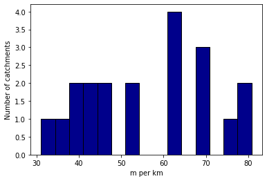
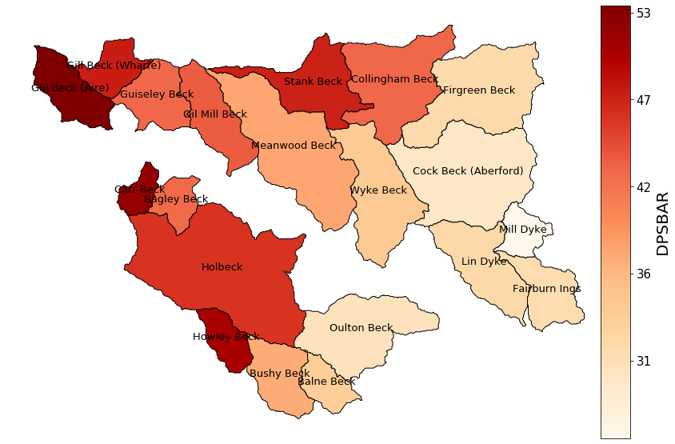    

  
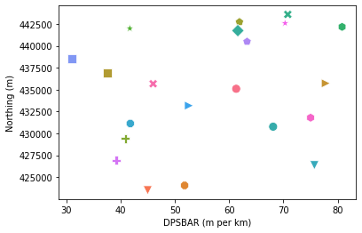
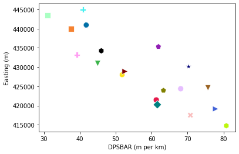  
  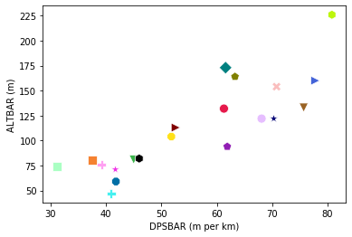  

 Figure 4. Catchment steepness (Metres per km)) 

The steepness of the catchments varies between 31.1 and 80.8 m per km. Catchments with a higher mean catchment altitude tend to have a higher catchment steepness; however, the relationship with easting and northing are not as clear as they are for altitude. 

### Longest Drainage Path (km)

  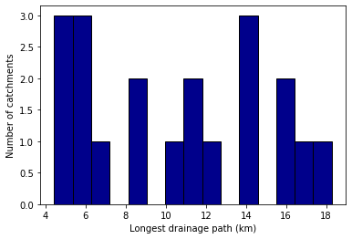
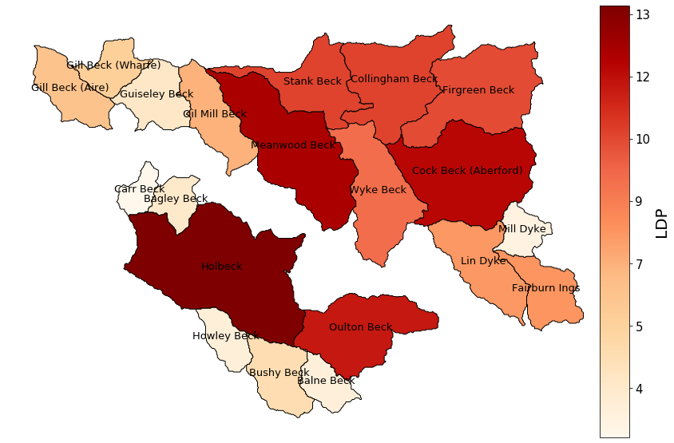    

  
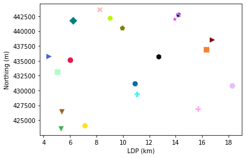
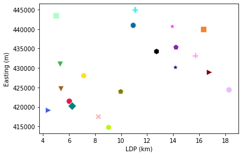  
  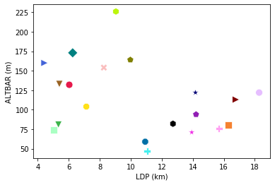  

 Figure 5. Longest drainage path (km)) 

  
The longest drainage path is 18.3km in Holbeck, and the shortest is Carr Beck at 4.5km. There is no clear relationship between a catchment's longest drainage path and its easting, northing or altitude.

### Urban Extent (%)

  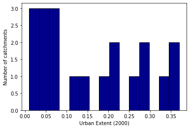
    

  
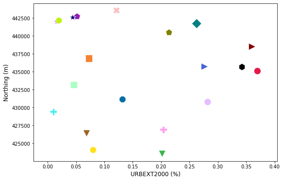
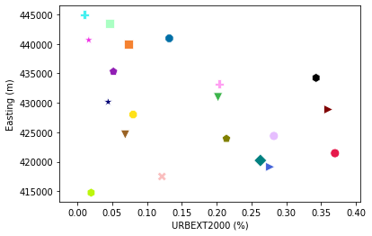  
  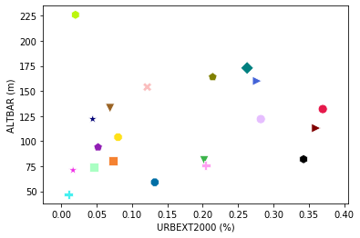  

 Figure 6. URBEXT (%) 

The urban extent in the catchments also has no correlation with easting, northing or altitude. Rather the catchments with the greatest urban extent are in the middle of the catchment in the area proximate to Leeds City Centre. Bagley Beck, Meanwood Beck and Wyke Beck are the only catchments with > 0.3% urban extent and therefore classified as urban.

### Base Flow Index

  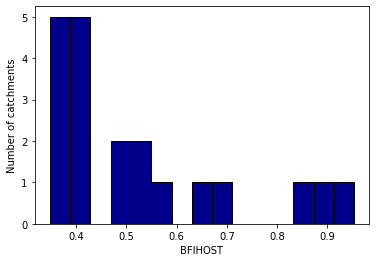
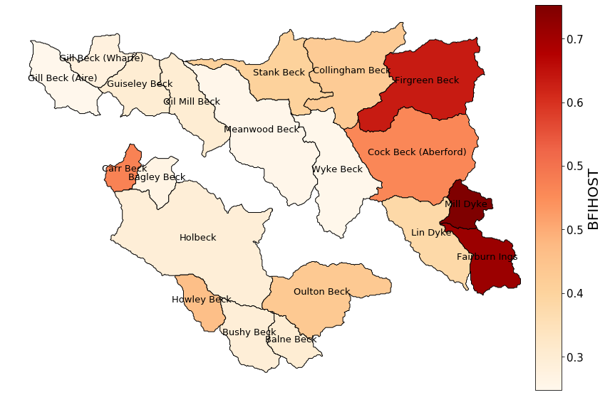    

  
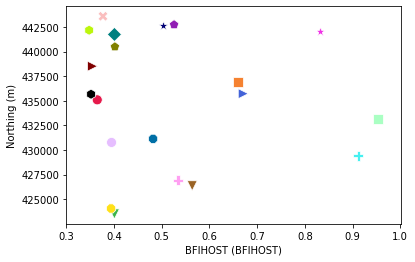
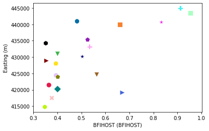  
  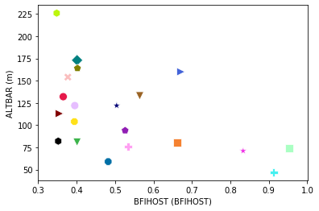  

 Figure 7. BFIHOST 

The Base Flow Index has a weak positive relationship with easting, and a negative relationship with altitude, with the highest values generally found in catchments in the east.
Cock Beck, Firgreen Beck, Fairburn Ings and Mill Dyke have values over 0.65, which represents that they are permeable catchments. The rest of the catchments have values below 0.65, so are classed as impermeable.

### Standard Average Areal Rainfall (mm)

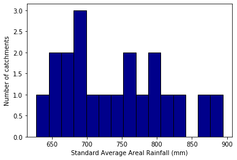
   

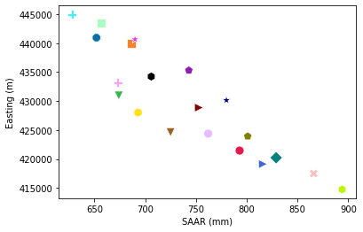   
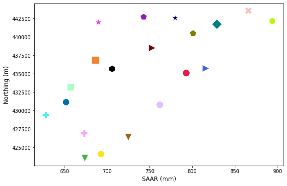     
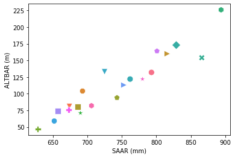       

 Figure 8. Standard Average Areal Rainfall (mm) 

SAAR is strongly postively related to altitude, and consequently negatively related to easting. There is a weaker positive relationship with northing. 

## Catchment design rainfall
The FEH uses a depth-duration-frequency (DDF) model, based on complex statistical analysis of datasets of annual and seasonal maximum precipitation values, to estimate the annual maximum rainfall for events of particular durations and corresponding to certain return periods. FEH DDF design rainfall is supplied through the FEH web service.

In Figure 9, the annual maximum rainfall accumualtions within the specified durations (between 0.25 and 96 hours, at 0.25h intervals) are shown for each return period, with a line for each catchment.

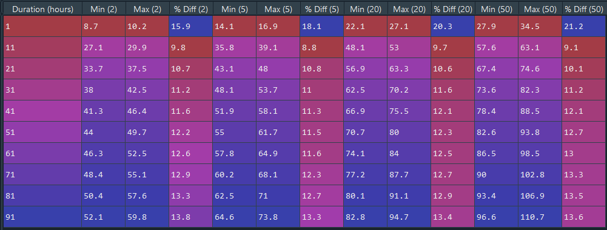

 Figure 9. Annual maximum rainfall accumulations within the specified durations, over a range of return periods. Each line represents a different catchment 

Figure 10 helps to visualise the catchments which have the maximum and minimum precipitation values associated with certain durations and return periods, and to assess how much variation there is in this. 

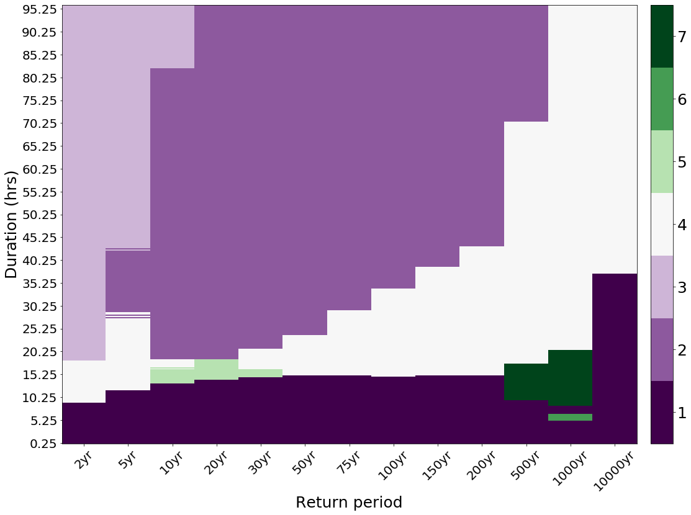

 Figure 10. Displays the catchment with the maximum (left) and minimum (right) annual precipitation accumulation associated with each duration at each return period 

### Relationship between annual maximum rainfall accumulation and catchment descriptors

Catchment rainfall accumulations are influenced by the catchment's geographic location, primarily because in Leeds altitude has a strong spatial component, with the highest values found in the north west. The animations below display the relationship beween catchment annual precipitation accumulations and northing, easting, altitude and standard average areal rainfall values. Each frame in the animation shows the relationship for one duration, and they cycle between 0.25h and 95.25h at hourly intervals. The plot on the left is for a 2 year return period, and on the right for a 10 year return period.  

#### Northing

#### Easting

#### Altitude (ALTBAR)

#### Standard  Average Areal Rainfall (SAAR)
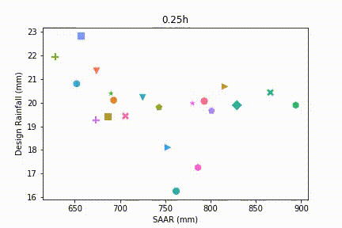

A similar pattern is found in the relationship between the annual precipitation values at various durations and the mean catchment altitude. This follows, considering the strong positive relationship between ALTBAR and SAAR, seen in Figure 8.

The SAAR is the average annual rainfall in the standard period (1961-1990) in millimetres. The above plots show that the catchments with the highest annual precipitation accumulations at low durations (~<8h), are those with low SAAR values. At longer durations (>~8h), the catchments with the highest annual precipitation accumulations for that duration, also have higher SAAR values.

## Catchment runoff
#### Calculating catchment runoff
The ReFH2 rainfall runoff model translates the rainfall depths derived from the FEH13 DDF model into runoff. FEH13 calculates pre-defined return period/duration combinations and so to calculate other combinations a non-linear interpolation procedure is invoked. The final design rainfall depth in ReFH2 is calculated as the product of the FEH DDF rainfall depths, the areal reduction factor, and the seasonal correction factor (SCF). The SCF converts an annual maximum rainfall depth to a seasonal maximum depth and is calculated based upon location, season, duration and selected return period [NB: the total rainfall given in ReFH2 can be calculated by multiplying the values provided in the csv file of catchment rainfalls exported from FEH web server by the SCF]. The storm seasonality (summer or winter) can be selected in ReFH2 manually, or alternatively a default seasonality is adopted based on urban extent and BFIHOST19, and summer storms are selected by default if:  
* URBEXT2000 is ≥ 0.30, or  
*	0.15 ≤ URBEXT2000 < 0.30 and BFIHOST19 is ≥ 0.65.
Winter storms are selected by default in all other cases.

Out of the 20 Leeds catchments, only 4 (Wyke Beck, Bagley Beck, Meanwood Beck, Carr Beck) use a summer storm profile by default. 

ReFH2 uses data on initial catchment conditions and model parameters that are estimated from catchment descriptors to convert rainfall into runoff, and the rainfall depth is scaled accordingly to reflect that season in order to produce summer and winter hyetographs. Additionally, in ReFH2 rainfall hyetographs are available as both rural and urbanised scenarios. The ReFH2 model has both a rural catchment model component and an urban catchment model. In rural scenarios, the whole catchment is modelled using the rural catchment model, wheras in urbanised scenarios the catchment area which is urban is first delineated, and then this urban area is run through the urban model, and the remainder of the catchment is modelled as rural.  

#### ReFH2 outputs: peak flow and direct runoff
ReFH2 allows the user to define a duration of rainfall and then calculates the associated peak flow (m^3/s) and total direct runoff (ml) in both rural and urbanised scenarios for return periods of 1, 2, 5, 10, 30, 50, 75, 100, 200 and 1000 years. The direct runoff is the total cumulative amount of runoff during that rainfall event, and as such the longer duration the storm the higher that value becomes. Contrastingly, the storm duration associated with the highest peak flow (known as the critical storm duration) is not generally the longest storm duration, and will be dependent on catchment characteristics. This is seen in Figure 8, where the greatest runoff volume is found at the longest duration, whereas the greatest peak flow value varies between catchments but generally occurs at a shorter duration.  

  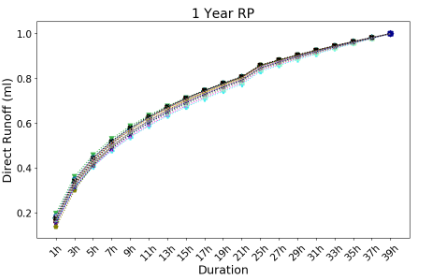    
  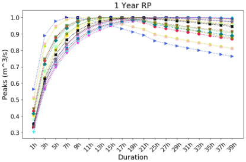  

 Figure 8. Direct runoff in ml (left) and peak flow in m^3/s (right) for a 1 year return period event in summer using an urbanised scenario 

#### Peak flow by duration and return period

The critical storm duration (duration with highest peak flow) is generally associated with the widest flood extent and is of great importance for surface water flooding. Understanding a catchment's critical storm duration is important in order to understand the kinds of storms which are most likely to lead to surface water flooding in the catchment. 

The peak flows found in Leeds catchments for various durations and return periods are explored in Figure 9, across both urbanised and rural scenarios, and for both winter and summer storm profiles. The peak flows have been normalised to allow comparison between catchments. 

  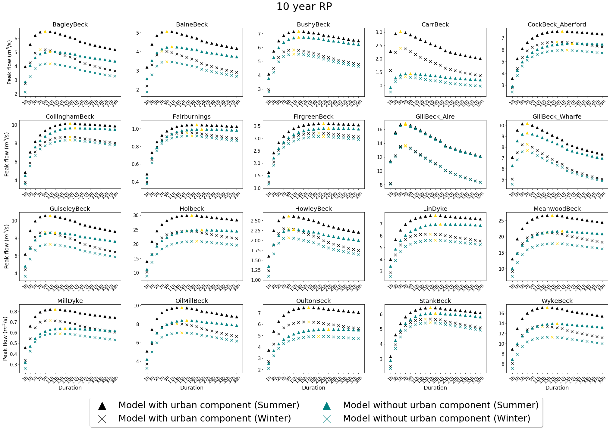    

  

  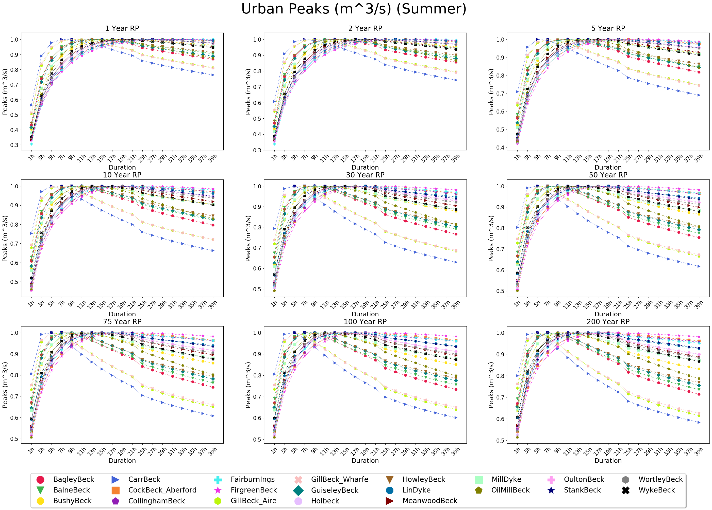    
  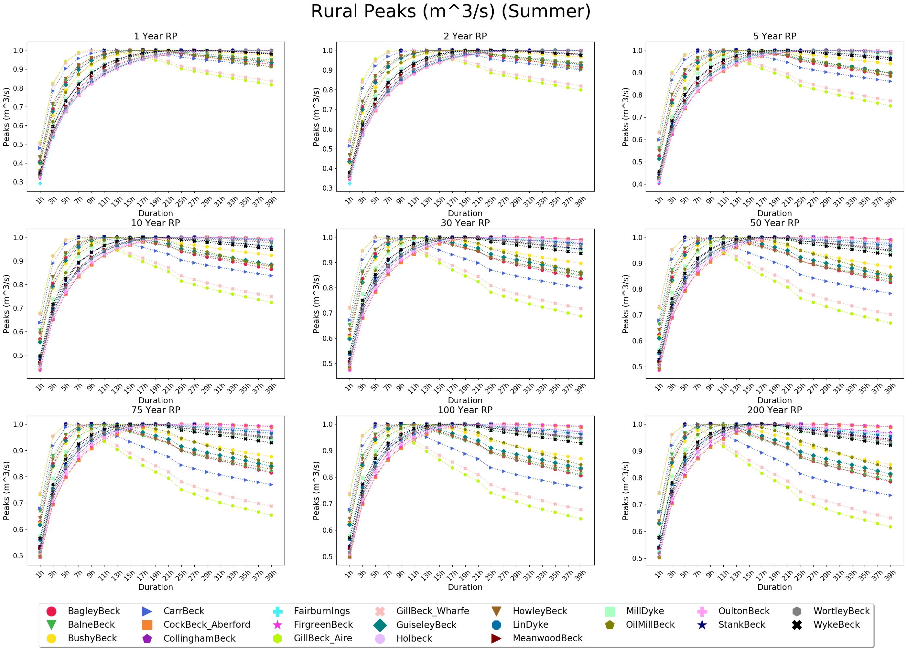  
  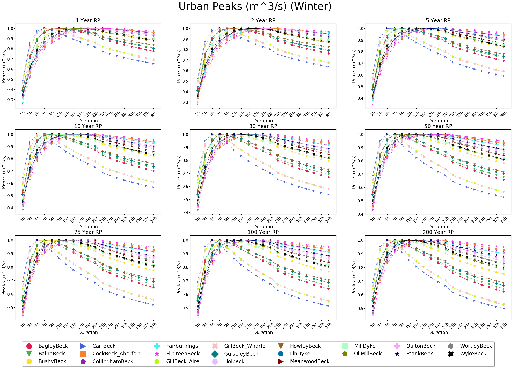    
  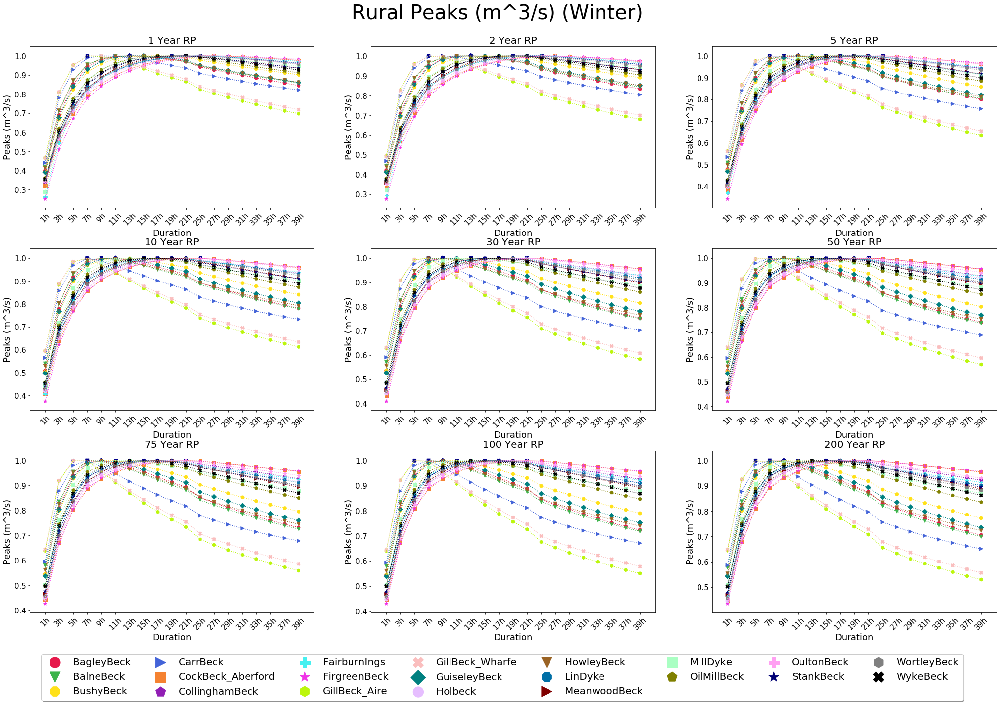    

 Figure 10. Normalised peak flows in Leeds catchments for durations between 1 and 39h, for various return periods 

Difference between summer and winter - maybe its not very easy to compare between these whilst the plots are normalised?

Urban peak flow, winter

  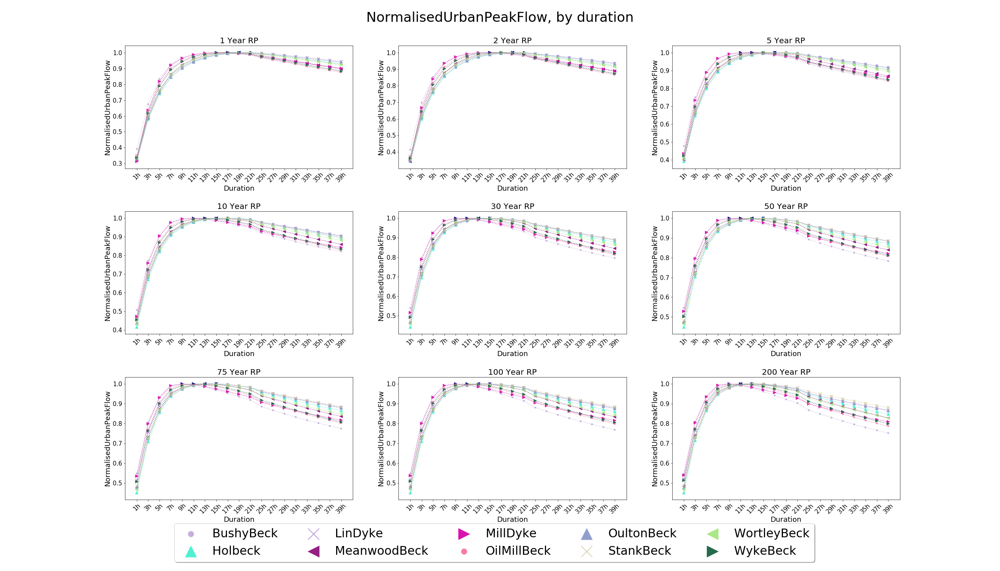    
  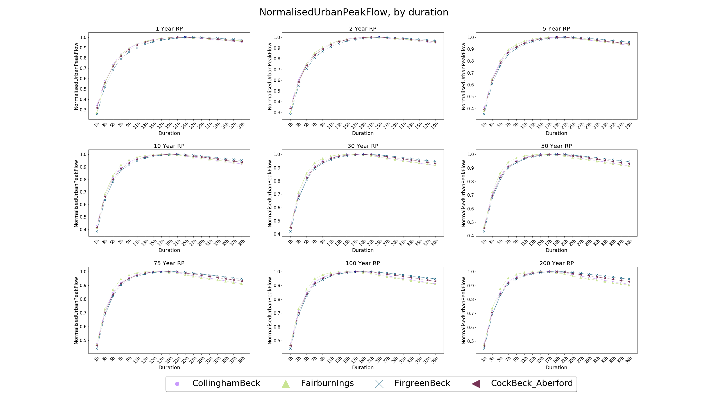    
  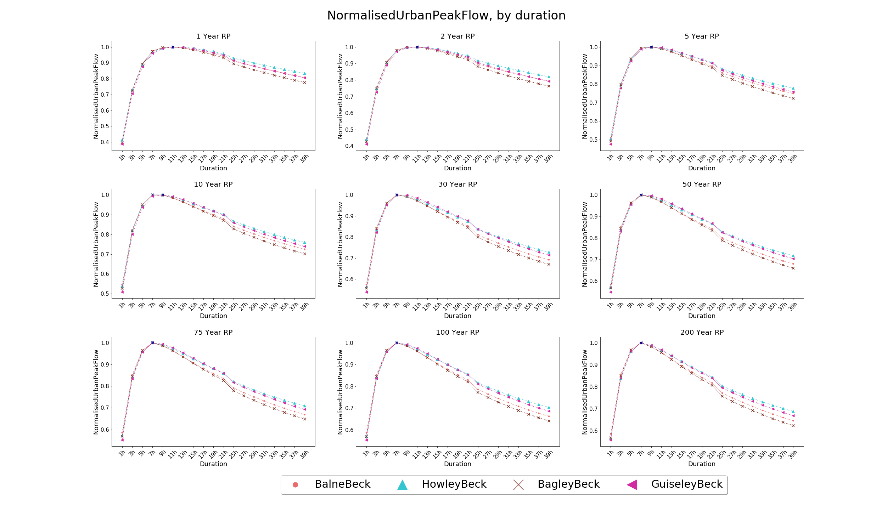     
  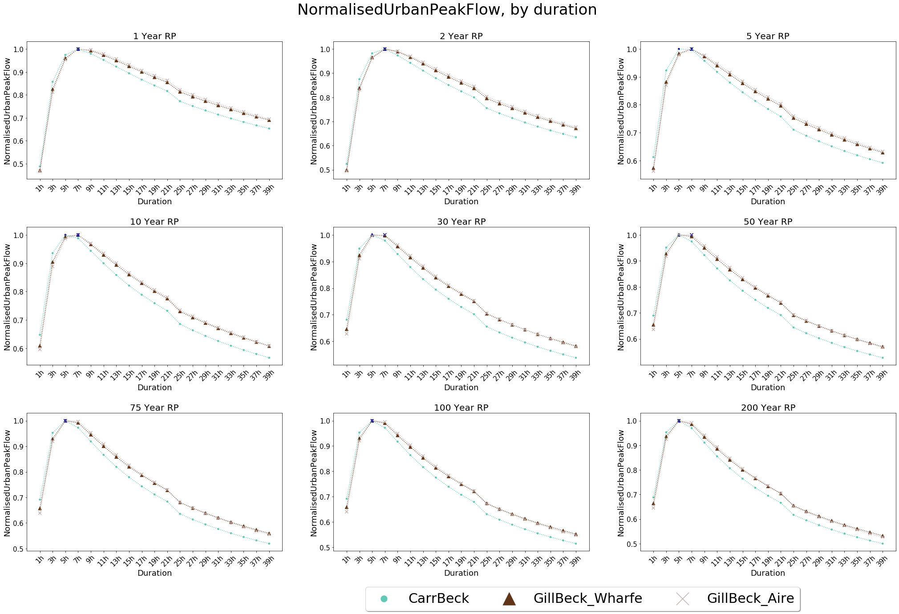   

#### Catchment critical durations

## Altitude

  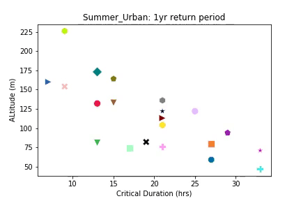
  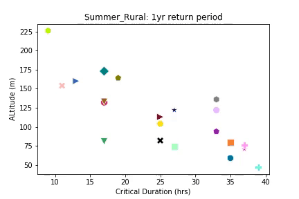
  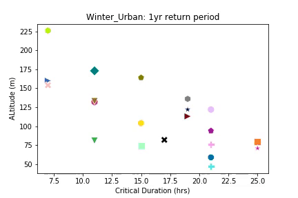
  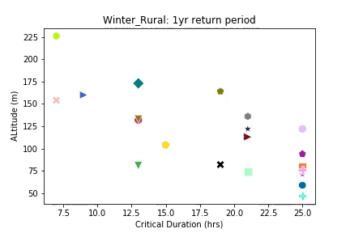

  ## AREA

  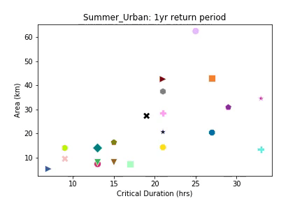
  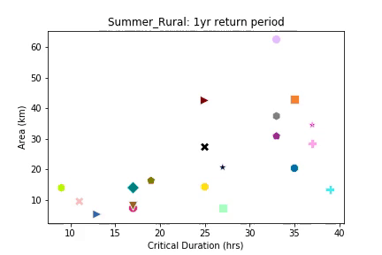
  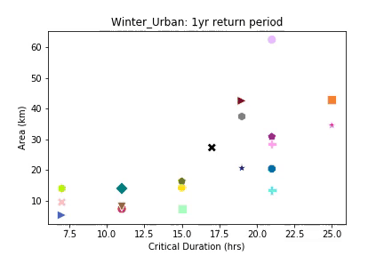
  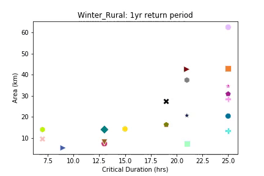

  ## BFIHOST

  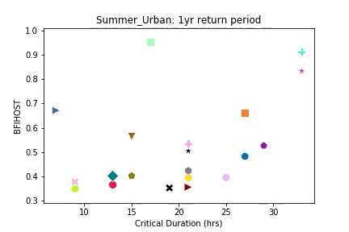
  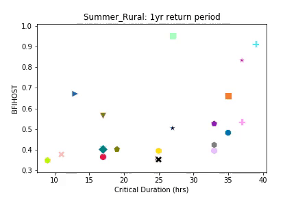
  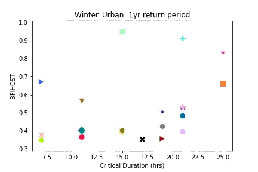
  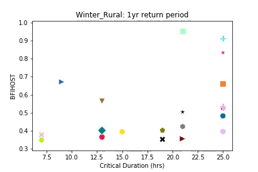

  ## DPSBAR

  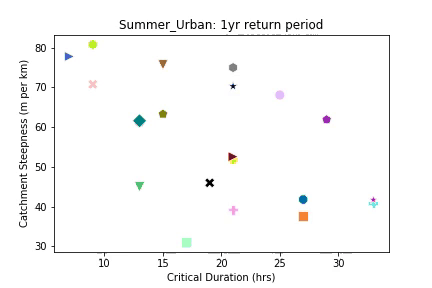
  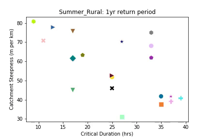
  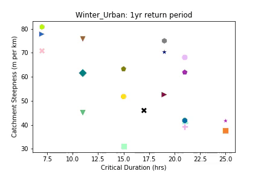
  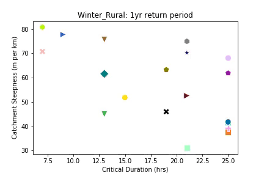

  ## LDP

  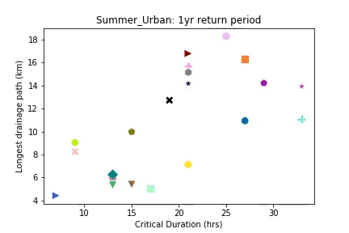
  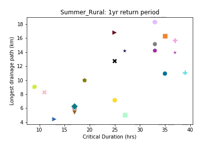
  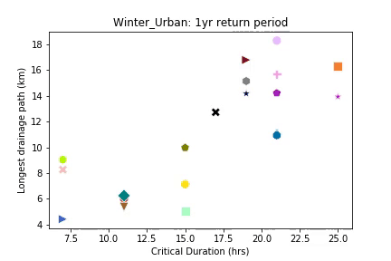
  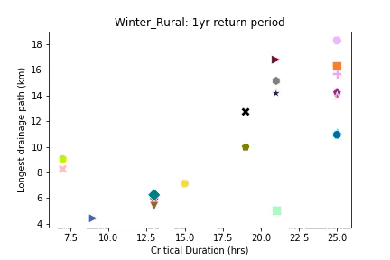

  ## URBEXT200

  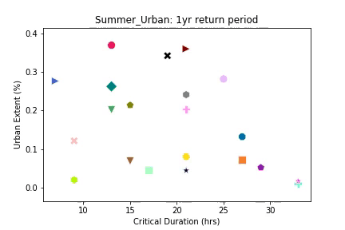
  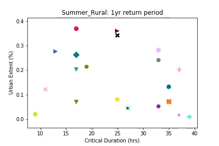
  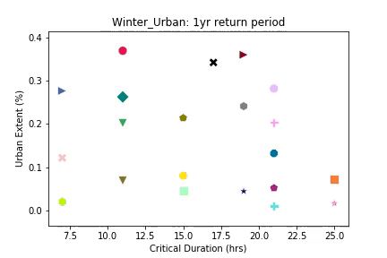
  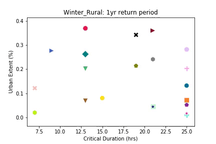  
