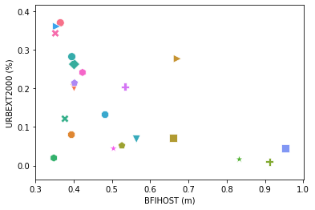

# Leeds Urban Catchments

Leeds City Council (LCC) have defined 46 urban catchments in Leeds. The boundaries of these catchments are defined in blue in Figure 1.

    

 Figure 1. Urban catchments defined by LCC (blue outlines), and catchment boundaries from FEH web server (filled in with green if ReFH2 data has been downloaded, and red if it has not) 

The FEH web service identifies the catchment area upstream of a catchment outlet point. For each catchment it generates:
* The catchment boundaries as a shapefile;
* Design rainfall depths for pre-defined return period/duration combinations;  
* Catchment descriptors based on the Integrated Hydrological Digital Terrain Model (IHDTM).

Using the FEH web service, 21 catchments with boundaries closely matching those identified by LCC have been identified and are shown on Figure 1. The LCC catchments which couldn't be generated in the FEH web service are sub-catchments of major rivers (Aire, Wharfe, Nidd and Calder). The area of these 21 catchments range between 5km2 and 71km2.

  

 Figure 1. Histogram of catchment area (km2) 

## Catchment Descriptors
The catchment descriptors file generated by the FEH webservice contains various metrics related to the climate, drainage characteristics and soils in the catchment. Some characteristics that are likely to cause sensitivity to high intensity rainfall and to influence pluvial flood risk are:

* ALTBAR: Mean catchment altitude (m above sea level), derived from the IHDTM.
* BFIHOST: Catchment Average Base Flow Index. This is measure of catchment responsiveness derived using the 29-class Hydrology Of Soil Types (HOST) classification. Values over 0.65 represent permeability, and those below 0.65 represent an impermeable catchment.
* DPSBAR: This landform descriptor (mean Drainage Path Slope) provides an index of overall catchment steepness. It was developed for the Flood Estimation Handbook and is calculated as the mean of all inter-nodal slopes (derived using the IHDTM) for the catchment. The index is expressed in metres per kilometre with values ranging from >300 in mountainous terrain to <25 in the flattest parts of the country.
* SAAR: Average annual rainfall in the standard period (1961-1990) in millimetres.
* URBEXT2000: Index of urban and suburban land cover in 1990 / 2000 expressed as a fraction. A value of less than 0.3 represents a rural catchment, and more than 0.3 an urban catchment.
* LDP: Longest drainage path (in kilometres), defined by recording the greatest distance from a catchment node to the defined outlet.

In Figures 2-5, a histogram and a chloropleth map are plotted of the values of each of the metrics across the 21 catchments.

### Standard Average Areal Rainfall (mm)

   

   
     
       

 Figure 2. Standard Average Areal Rainfall (mm) 

### Altitude (m above sea level)

  
    

  

    

 Figure 3. Mean Catchment Altitude (m) 

### Base Flow Index

  
    

  

  
    

 Figure 4. BFIHOST 

### Urban Extent (%)

  
    

  

  
    

 Figure 5. URBEXT 

### Catchment Steepness (m per km)

  
    

  

  
    

 Figure 6. Catchment steepness (Metres per km)) 

### Longest Drainage Path (km)

  
    

  

  
    

 Figure 7. Longest drainage path (km)) 

In Figure 8 a (weak?) negative relationship is seen between increasing urban extent and base flow index. Higher base flow indices are associated with permeability and so it follows that the highest values of BFIHOST would be associated with the lowest urban extent. In Figure 9 a positive relationship is seen between catchment altitude and average areal rainfall.

    
    
      

 Figure 8 and 9. 

  

## Catchment design rainfall
The FEH uses a depth-duration-frequency (DDF) model, based on complex statistical analysis of datasets of annual and seasonal maximum precipitation values, to estimate the annual maximum rainfall for events of particular durations and corresponding to certain return periods. FEH DDF design rainfall is supplied through the FEH web service.

 Figure 10. Annual maximum rainfall accumulations within the specified durations, over a range of return periods. Each line represents a different catchment 

Figure 9 helps to visualise the catchments which have the maximum and minimum precipitation values associated with certain durations and return periods, and to assess how much variation there is in this.

 Figure 11. Displays the catchment with the maximum (left) and minimum (right) annual precipitation accumulation associated with each duration at each return period 

### Relationship between design rainfall and catchment descriptors

The animations below track the relationship between catchment descriptors and the annual maximum rainfall accumulations at various durations.

#### Standard Average Areal Rainfall (SAAR)

The SAAR is the average annual rainfall in the standard period (1961-1990) in millimetres. The above plots show that the catchments with the highest annual precipitation accumulations at low durations (~<8h), are those with low SAAR values. At longer durations (>~8h), the catchments with the highest annual precipitation accumulations for that duration, also have higher SAAR values.

#### Altitude (ALTBAR)

A similar pattern is found in the relationship between the annual precipitation values at various durations and the mean catchment altitude. This follows, considering the strong positive relationship between ALTBAR and SAAR, seen in Figure 8.

ReFH2's rainfall-runoff model imports the outputs from the FEH DDF model and uses them as a design storm input. FEH13 calculates
pre-defined return period/duration combinations and so to calculate other combinations a non-linear interpolation procedure is invoked. The final design rainfall depth in ReFH2 is calculated as the product of the FEH DDF rainfall depths, the areal reduction factor, and the seasonal correction factor (SCF). The SCF converts an annual maximum rainfall depth to a seasonal maximum depth and is calculated based upon location, season, duration and selected return period [NB: the total rainfall given in ReFH2 can be calculated by multiplying the values provided in the csv file of catchment rainfalls exported from FEH web server by the SCF].

The default seasonality is adopted based on urban extent and BFIHOST19, and summer storms are selected by default if:  
* URBEXT2000 is ≥ 0.30, or  
*	0.15 ≤ URBEXT2000 < 0.30 and BFIHOST19 is ≥ 0.65.
Winter storms are selected by default in all other cases.

Out of the 21 Leeds catchments, only 4 (Wyke Beck, Bagley Beck, Meanwood Beck, Carr Beck) use a summer storm profile by default.

The ReFH2 software generates hyetographs based on Flood Studies Report (FSR)/FEH approaches, and again depending on whether a winter or summer storm profile is selected.

Ref: https://wiki.tuflow.com/index.php?title=Using_ReFH2_to_Generate_TUFLOW_Boundary_Inputs

### Catchment runoff

The ReFH2 Model is comprised of a rural catchment model component and an urban catchment model.

The rainfall hyetographs and runoff are available as rural and urbanised scenarios.

Urban Catchments
ReFH2 methodology improves on ReFH1 methodology for flood estimation in urban
catchments, with the urban and rural components of the hydrograph being calculated
separately.

ReFH2 is of particular importance in the UK, as it is the latest version of the ReFH method (Kjeldsen, 2007), which is widely used for design flood estimation in the UK. It addresses some criticisms of the original ReFH model (Faulkner & Barber, 2009) through: (a) explicit separation of urban and rural fractions within the model structure, (b) a far larger data set of calibration catchments, including more permeable catchments, and (c) an updated design rainfall model (Stewart, Vesuviano, Morris, & Prosdocimi, 2014).

      
    
      
      

 Figure 8. 

      
    
      
      

 Figure 8. 

Urban peak flow, winter

      
      
       
     

## Altitude

  
  
  
  

  ## AREA

  
  
  
  

  ## BFIHOST

  
  
  
  

  ## DPSBAR

  
  
  
  

  ## LDP

  
  
  
  

  ## URBEXT200

  
  
  
    
