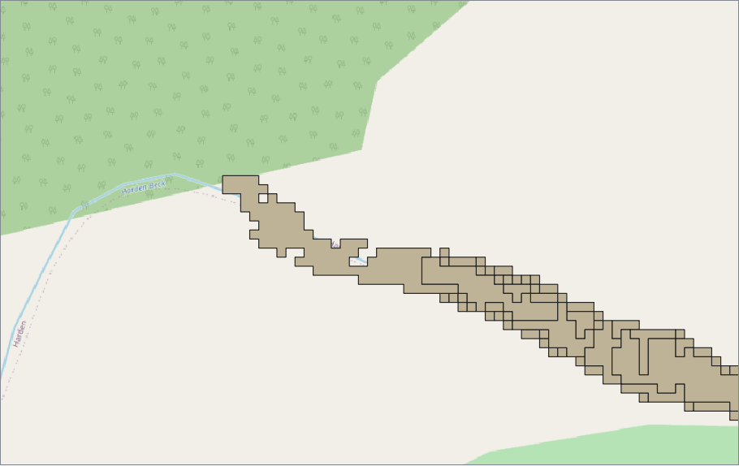
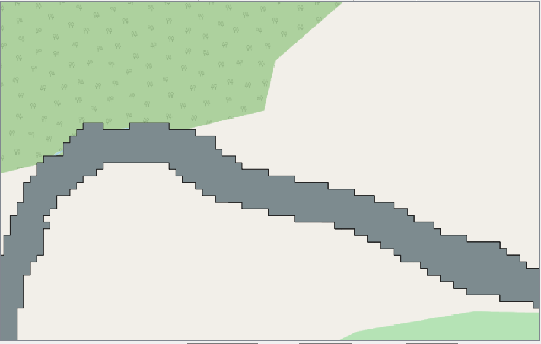
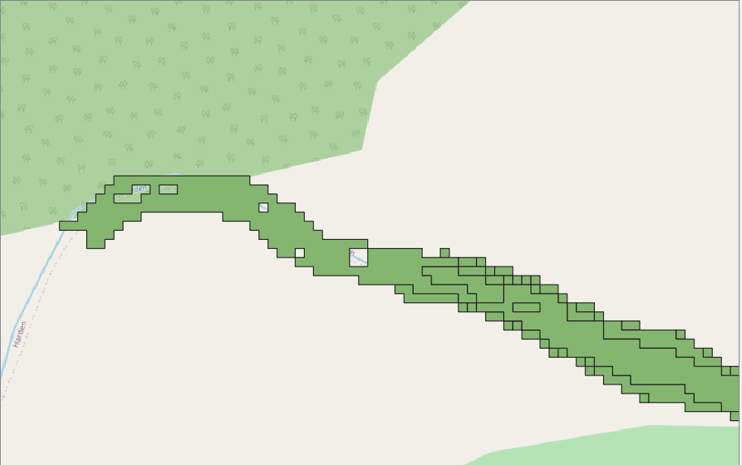
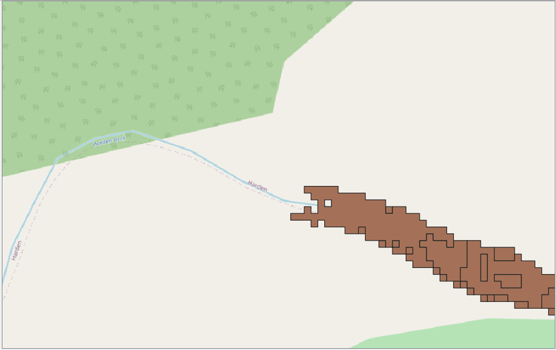
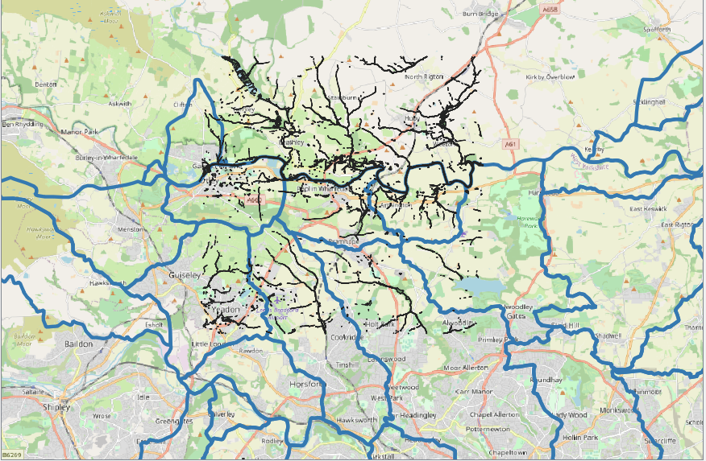
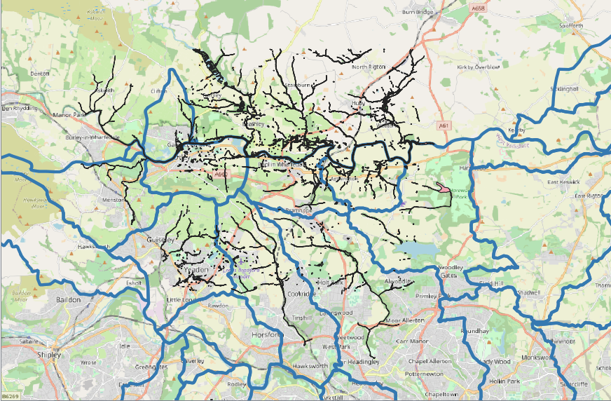
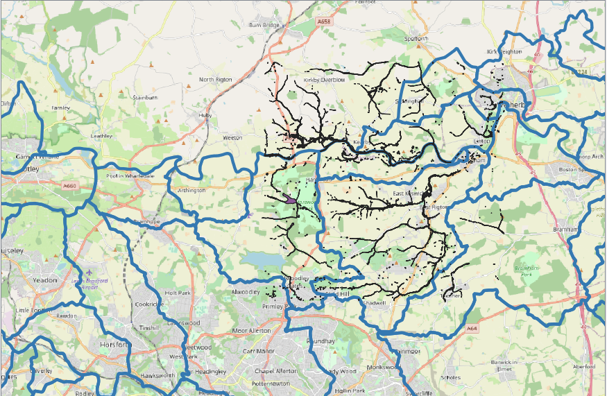
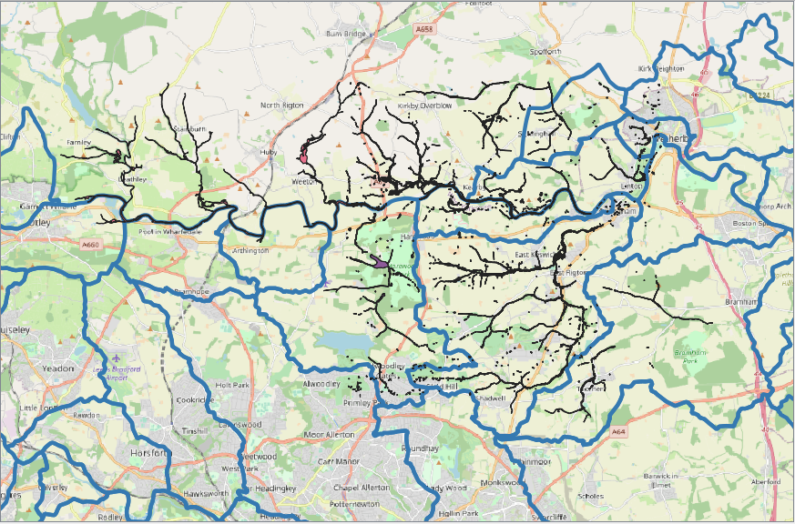
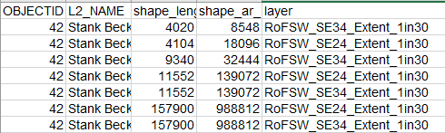

## The Risk of Flooding from Surface Water Map

The Risk of Flooding from Surface Water information assesses flooding scenarios as a
result of rainfall with the following chance of occurring in any given year
* 3.3 % (1 in 30)
* 1% (1 in 100)
* 0.1% (1 in 1000)  

It provides the following data for each flooding scenario:
* Extent
* Depth
* Velocity (including flow direction at maximum velocity)
* Hazard (as a function of depth and velocity)

For some reason, these 4 variables don't seem to have the same flood footprints.

    
  
    
      

  

### Processing Data
#### Downloading data for chosen area
1. Go to https://environment.data.gov.uk/DefraDataDownload/?Mode=rofsw
2. Draw an area and select the relevant tiles
3. Click 'Get Available Tiles' and it downloads a Zip file containing shp files for all return periods, and with depth, extent, hazard, speed etc.

#### Processing data (QGIS)
1. Merge the tiles which cover the area of Leeds, using Vector -> Data Management Tools -> Merge Vector Layers
2. Cut the files to the boundary of the Leeds catchments area, using Vector -> Geoprocessing Tools -> Intersection (NB: this seems to be much faster in ArcMap).
3. Count the number of cells within each catchment boundary, using Processing Toolbox -> Vector Analysis
 -> Statistics by Categories

<em> Issues </em>  
The 'Extent' tiles extend outside the tile boundaries. This happens for multiple tiles, and means that some flooded extents are captured in multiple tiles. For instance, the lake area by Harewood House is present in both SE24 and SE34.

    
  
    
      

  

This leads to double counting of these areas after  the intersection.

    

  

Using 'Delete Duplicate Geometries' from the Processing Toolbox, removes the doubled up areas which can be seen above. However, the extent seems to still not match with the other variables. This can be seen blow where the number of flooded cells is plotted for the extent , depth, velocity and hazard. The left hand image is before cleaning by deleting the duplicates, and the right is after.

    
    

  

Another idea would be to use 'Extract Layer Extent' to extract the extent of e.g. the depth tile, and use this to clip the extent tiles before all of the other stages.

### Which catchments have the highest risk of surface water flooding?
The number of flooded cells per km2 of catchment area is calculated for each RP. The five catchments with the greatest number of flooded cells per km2 for each return period are:
* 30 years: Bagley Beck, Gill Beck (Wharfe) and Wyke Beck, Guiseley Beck, Lin Dyke
* 100 years: Wyke Beck, Bagley Beck, Gill Beck (Wharfe), Guiseley Beck, Meanwood Beck
* 1000 years: Gill Beck (Aire), Wyke Beck, Gill Beck (Wharfe), Bagley Beck, Meanwood Beck

Tried to calculate the area of catchment exposed to surface water flood risk as a proportion of the total area. This was based on each cell having an area of 4m2. But this gave a figure of 11.8% for Bagley Beck, for a 30 year RP, which seems unrealistic.

    
    
        

  

How can we analyse this further for different depths/velocities etc?

### Relationship between RoFSW flood extent and catchment descriptors

| 30 year RP |   | 10 year RP |   | 1000 year RP |   |
|-------------|-------|-------------|-------|-------------|-------|
| BFIHOST     | -0.81 | BFIHOST     | -0.79 | BFIHOST     | -0.8  |
| Easting     | -0.64 | URBEXT2000  | 0.74  | SAAR        | 0.73  |
| SAAR        | 0.6   | Easting     | -0.6  | Easting     | -0.7  |
| URBEXT2000  | 0.58  | SAAR        | 0.56  | ALTBAR      | 0.66  |
| DPSBAR      | 0.49  | ALTBAR      | 0.43  | URBEXT2000  | 0.54  |
| ALTBAR      | 0.48  | DPSBAR      | 0.4   | DPSBAR      | 0.53  |
| Northing    | 0.3   | Northing    | 0.28  | PROPWET     | 0.51  |
| PROPWET     | 0.28  | PROPWET     | 0.22  | Northing    | 0.4   |
| FARL        | -0.1  | AREA        | 0.07  | FARL        | -0.16 |
| LDP         | -0.02 | LDP         | 0.03  | LDP         | 0.02  |
| AREA        | -0.01 | FARL        | 0.02  | AREA        | 0.0   |

Try and do multi variate statistics???

### Relationship between RoFSW flood extent and FEH13 rainfall
The strongest correlation is between 0.5h duration rainfall and the number of flooded cells for all return periods, except the 2 year return period, where the strongest correlation is with 0.75 hour duration rainfall. The strongest correlation between rainfall and the number of flooded cells is for the 2 year return period.

THIS IS ONLY FOR ONE RETURN PERIOD FOR THE ROFSW

| Return Period (yrs)     | Max correlation |  Duration at which max correlation found |
|-------|----------|---|
| 2     | 0.924742 | 0.75h   |
| 5     | 0.900282 | 0.5h  |
| 10    | 0.848642 | 0.5h  |
| 20    | 0.836808 |  0.5h  |
| 30    | 0.831064 | 0.5h  |
| 50    | 0.827897 | 0.5h  |
| 75    | 0.838716 | 0.5h  |
| 100   | 0.850998 | 0.5h  |
| 150   | 0.865160 |  0.5h  |
| 200   | 0.873252 |  0.5h  |
| 500   | 0.888731 | 0.5h  |
| 1000  | 0.888235 |  0.5h  |
| 10000 | 0.854924 |  0.5h  |

### Relationship between RoFSW flood extent and ReFH2 Runoff
Results suggest that as the duration gets longer the correlation with RoFSW flood extent increases linearly and monotonically. Does this make any sense?

I.e. the longer the duration, the greater the correlation between peak flow for that duration and the extent of RoFSW flood extent.

But would maybe expect that there would be a greater correlation for shorter duration events?
