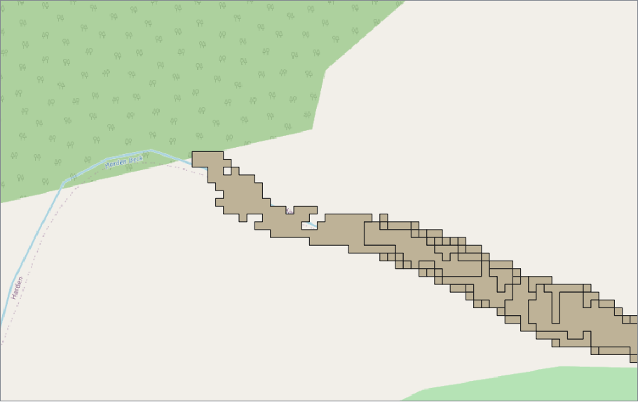
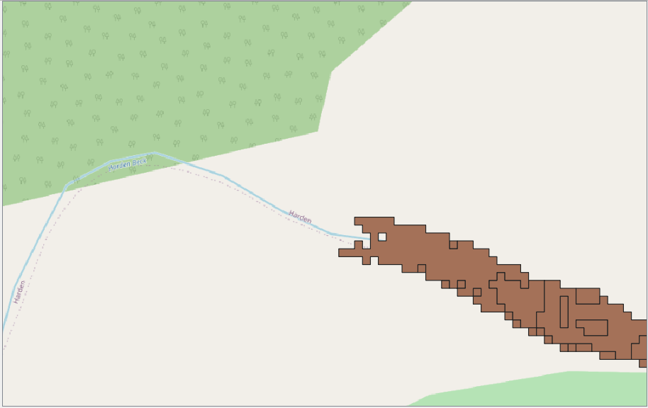
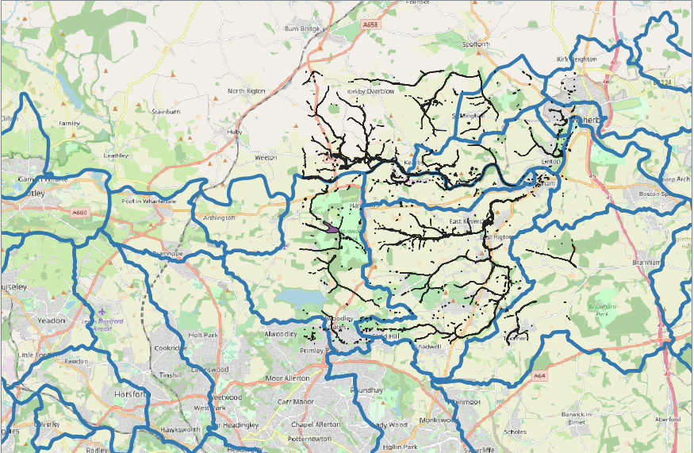

## The Risk of Flooding from Surface Water Map

The Risk of Flooding from Surface Water information assesses flooding scenarios as a
result of rainfall with the following chance of occurring in any given year
* 3.3 % (1 in 30)
* 1% (1 in 100)
* 0.1% (1 in 1000)  

It provides the following data for each flooding scenario:
* Extent
* Depth
* Velocity (including flow direction at maximum velocity)
* Hazard (as a function of depth and velocity)

For some reason, these 4 variables don't seem to have the same flood footprints.

    
  
    
      

  

### Processing Data
#### Downloading data for chosen area
1. Go to https://environment.data.gov.uk/DefraDataDownload/?Mode=rofsw
2. Draw an area and select the relevant tiles
3. Click 'Get Available Tiles' and it downloads a Zip file containing shp files for all return periods, and with depth, extent, hazard, speed etc.

#### Processing data (QGIS)
1. Merge the tiles which cover the area of Leeds, using Vector -> Data Management Tools -> Merge Vector Layers
2. Cut the files to the boundary of the Leeds catchments area, using Vector -> Geoprocessing Tools -> Intersection (NB: this seems to be much faster in ArcMap).
3. Count the number of cells within each catchment boundary, using Processing Toolbox -> Vector Analysis
 -> Statistics by Categories

<em> Issues </em>  
The 'Extent' tiles extend outside the tile boundaries. This happens for multiple tiles, and means that some flooded extents are captured in multiple tiles. For instance, the lake area by Harewood House is present in both SE24 and SE34.

    
  
    
      

  

This leads to double counting of these areas after  the intersection.

    

  

Using 'Delete Duplicate Geometries' from the Processing Toolbox, removes the doubled up areas which can be seen above. However, the extent seems to still not match with the other variables. This can be seen blow where the number of flooded cells is plotted for the extent , depth, velocity and hazard. The left hand image is before cleaning by deleting the duplicates, and the right is after.

    
    

  

Another idea would be to use 'Extract Layer Extent' to extract the extent of e.g. the depth tile, and use this to clip the extent tiles before all of the other stages.

### Which catchments have the highest risk of surface water flooding?
The number of flooded cells per km2 of catchment area is calculated for each RP. The five catchments with the greatest number of flooded cells per km2 for each return period are (from highest to lowest):
* 30 years: Bagley Beck, Gill Beck (Wharfe) and Wyke Beck, Guiseley Beck, Lin Dyke
* 100 years: Wyke Beck, Bagley Beck, Gill Beck (Wharfe), Guiseley Beck, Meanwood Beck
* 1000 years: Gill Beck (Aire), Wyke Beck, Gill Beck (Wharfe), Bagley Beck, Meanwood Beck

Tried to calculate the area of catchment exposed to surface water flood risk as a proportion of the total area. This was based on each cell having an area of 4m2. But this gave a figure of 11.8% for Bagley Beck, for a 30 year RP, which seems unrealistic.

    

  

### Which catchments have the highest risk of severe surface water flooding?
The figure below shows the number of cells per km2 with the most severe category of flood risk for each variable.

    

### Relationship between RoFSW flood extent and catchment descriptors

Pearson correlation coefficient between pairs of variables

"Correlation is a basic statistic that we can use to determine the relationship between two variables. A correlation coefficient—commonly written as  
r
 —gives a quantitative measure of how strongly related two variables are or are not. When we discuss correlation in this section, we will imagine that we are interested in the relationship between two variables, X and Y. X and Y can be negatively, zero, or positively correlated.

Here are what these three types of correlations mean:

Negative Correlation: As variable X increases, variable Y decreases
Zero Correlation: As variable X increases, we do not know what happens to variable Y.
Positive Correlation: As variable X increases, variable Y increases
The most common way in which correlation is calculated is called Pearson’s correlation or Pearson’s r. When we use correlation in this book, it will always refer to Pearson’s correlation unless otherwise specified. The terms r, correlation, and correlation coefficient are often used interchangeably; they all mean the same thing."

The other technique that is often used in these circumstances is regression, which involves estimating the best straight line to summarise the association.

Correlation describes the strength of an association between two variables, and is completely symmetrical, the correlation between A and B is the same as the correlation between B and A. However, if the two variables are related it means that when one changes by a certain amount the other changes on an average by a certain amount. For instance, in the children described earlier greater height is associated, on average, with greater anatomical dead Space. If y represents the dependent variable and x the independent variable, this relationship is described as the regression of y on x.
The relationship can be represented by a simple equation called the regression equation. In this context “regression” (the term is a historical anomaly) simply means that the average value of y is a “function” of x, that is, it changes with x.

1) Nature isn't always simple. In fact, most phenomena (outcome) we study depend on multiple variables, and in a complex manner. An inferential model based on one variable at a time will most likely have a high bias.

Univariate models are the simplest model you can build, by definition. It's fine if you are investigating a problem for the first time, and you want to grasp its single, most essential feature. But if you want a deeper understanding of it, an understanding you can actually leverage because you trust what you are doing, you would use multivariate analyses. And among the multivariate ones, you should prefer the ones that do understand correlation patterns, if you care about model accuracy.

It is quite common to begin by presenting a table of correlations, followed by multiple regressions. The point of the regressions is to show the effect of each variable in the equation, after controlling for all the other variables in the equation -- as opposed to correlations, which only examine the relationship between a pair variables at a time.

correlation and regression analysis are basically the same. More precisely, if you assume a linear relationship between 2 variables and use the Pearson correlation coefficient R, the "explained variance" R2 of the regression analysis is simply the square of R.

Correlation is a statistical measure that indicates the extent to which two or more variables move together¹

Multiple Correlation - Correlation with one dependent variable and two or more independent variables. Measures the combined influences of the independent variables on the dependent. gives the proportion of the variance in the dependent variable that can be explained by the action of all the independent variables taken together.

Multiple Regression, Multiple Linear Regression - A method of regression analysis that uses more than one independent (explanatory) variable(s) to predict a single dependent (response) variable. Note: The coefficients for any particular explanatory variable is an estimate of the effect that variable has on the response variable while holding constant the effects of the other predictor variables. “Multiple” means two or more independent variables. Unless specified otherwise, “Multiple Regression” generally refers to “Linear” Multiple Regression. """

So as an example, If I have a huge data set and a response variable (like the height of a storm), and tons of explanatory variables (temperature, brightness temperature, dew point, pressure, wind speed, land vs ocean, etc), I want to see which combination of items provides the best relationship. If I do temperature only, the correlation might be .75, but If I do both temperature and pressure the correlation might shoot up to .80. Basically, I am trying to see what combination of information might best explain the height.

| 30 year RP |   | 10 year RP |   | 1000 year RP |   |
|-------------|-------|-------------|-------|-------------|-------|
| BFIHOST     | -0.81 | BFIHOST     | -0.79 | BFIHOST     | -0.8  |
| Easting     | -0.64 | URBEXT2000  | 0.74  | SAAR        | 0.73  |
| SAAR        | 0.6   | Easting     | -0.6  | Easting     | -0.7  |
| URBEXT2000  | 0.58  | SAAR        | 0.56  | ALTBAR      | 0.66  |
| DPSBAR      | 0.49  | ALTBAR      | 0.43  | URBEXT2000  | 0.54  |
| ALTBAR      | 0.48  | DPSBAR      | 0.4   | DPSBAR      | 0.53  |
| Northing    | 0.3   | Northing    | 0.28  | PROPWET     | 0.51  |
| PROPWET     | 0.28  | PROPWET     | 0.22  | Northing    | 0.4   |
| FARL        | -0.1  | AREA        | 0.07  | FARL        | -0.16 |
| LDP         | -0.02 | LDP         | 0.03  | LDP         | 0.02  |
| AREA        | -0.01 | FARL        | 0.02  | AREA        | 0.0   |

Try and do multi variate statistics???

### Relationship between RoFSW flood extent and FEH13 rainfall
The strongest correlation is between 0.5h duration rainfall and the number of flooded cells for all return periods, except the 2 year return period, where the strongest correlation is with 0.75 hour duration rainfall. The strongest correlation between rainfall and the number of flooded cells is for the 2 year return period.

THIS IS ONLY FOR ONE RETURN PERIOD FOR THE ROFSW

| Return Period (yrs)     | Max correlation |  Duration at which max correlation found |
|-------|----------|---|
| 2     | 0.924742 | 0.75h   |
| 5     | 0.900282 | 0.5h  |
| 10    | 0.848642 | 0.5h  |
| 20    | 0.836808 |  0.5h  |
| 30    | 0.831064 | 0.5h  |
| 50    | 0.827897 | 0.5h  |
| 75    | 0.838716 | 0.5h  |
| 100   | 0.850998 | 0.5h  |
| 150   | 0.865160 |  0.5h  |
| 200   | 0.873252 |  0.5h  |
| 500   | 0.888731 | 0.5h  |
| 1000  | 0.888235 |  0.5h  |
| 10000 | 0.854924 |  0.5h  |

### Relationship between RoFSW flood extent and ReFH2 Runoff
Results suggest that as the duration gets longer the correlation with RoFSW flood extent increases linearly and monotonically. Does this make any sense?

I.e. the longer the duration, the greater the correlation between peak flow for that duration and the extent of RoFSW flood extent.

But would maybe expect that there would be a greater correlation for shorter duration events?
