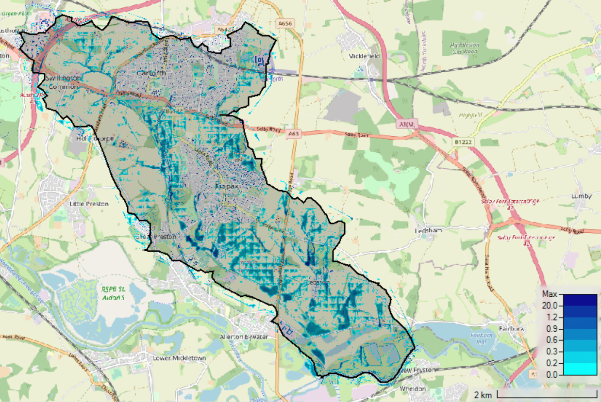
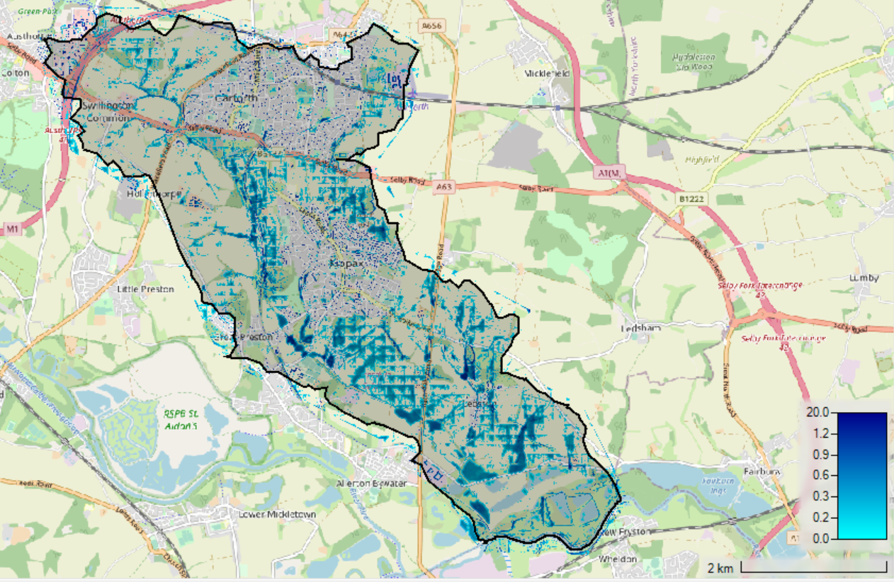
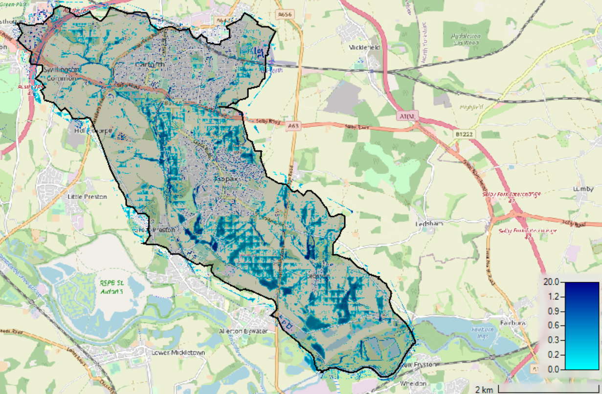
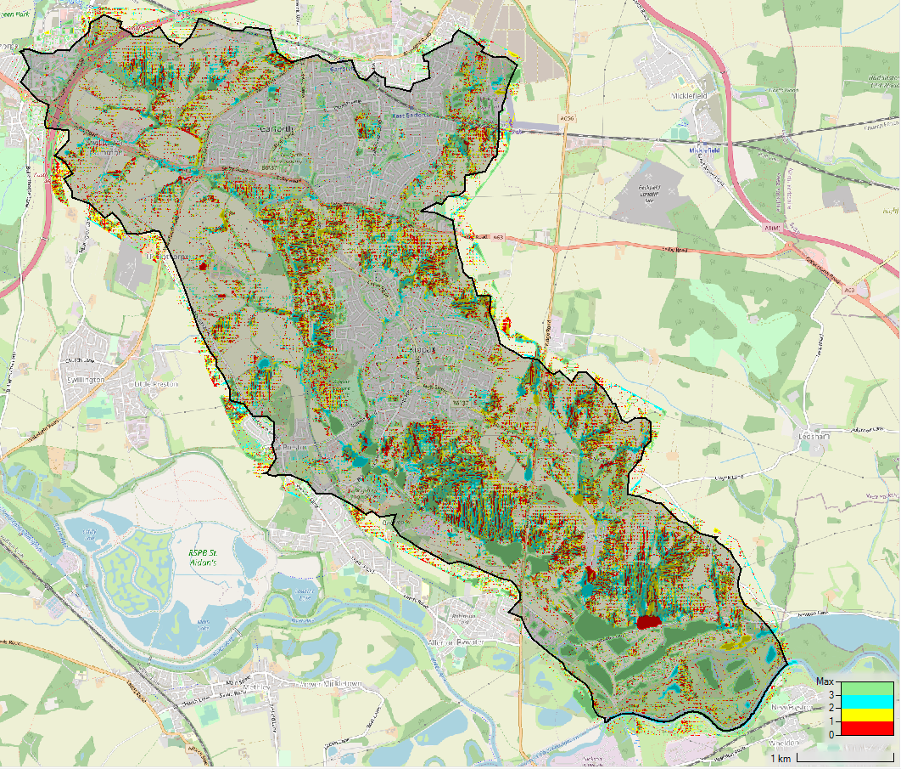
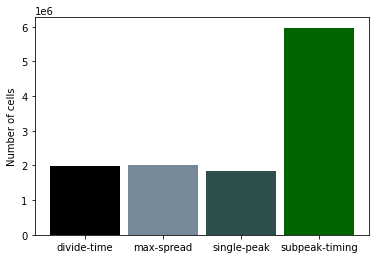

# Run model with synthetic rainfall events

## Table of contents

1. [ Processing methodology](#processing)  
  a.  [ Run model in Hec-Ras. ](#runmodel)   
  b. [ Post process model outputs in Hec-Ras. ](#postprocess)  
  c. [ Process outputs in QGIS](#qgis)   
  d. [ Plot results in Python](#python)   
2. [ Run model in Hec-Ras. ](#results)  

## 1. Processing Methodology
  
  ### a. Run model in Hec-Ras

  The Lin Dyke model is ran for a 6hr duration storm using the four different methods of distributing the rainfall over the event duration. The details of the four methods are in https://github.com/masher92/UKCP18/tree/master/CatchmentAnalysis/CreateSyntheticRainfallEvents

  
  ### b. Post process model outputs in Hec-Ras Mapper

  The results of running the Hec-Ras model are then processed using Hec-Ras mapper. 
  Currently, the data is processed in three ways: 
  1. Filtering out cells with flood depths of less than 0.1m (setting the value of these cells to NoData), and rounding the remaining depth values to 2 decimal places;
  2. Categorising the cells according to which of the following flood depth categories they are in 0.1-0.3m, 0.3-0.6m, 0.6-1.2m, 1.2m+
  3. Finding the method for each cell which resulted in the greatest flood depth 

  In each case, this involves the following stages:
  * Tools -> Create calculated layer -> + Layer -> Map Type: 'Depth', Animation Behaviour: 'Fixed Profile', Profile: 'Max' -> Change variable name to depth
  * Open scripts (to select an existing script, alternatively  write one from scratch)
  * Layer created under 'Map layers' heading
  * Save layer as a raster:
    * Right click -> Export layer -> Export as raster   
  * Move the layer above OpenStreetMaps in the ordering (otherwise won't see it)
  * Image display properties:
      * Right click layer and select image display properties
      * Double click on colour bar and change colour ramp to ‘Depth’
        * For (1): Change number of values to 7, and change values to 0, 0.15, 0.3, 0.6, 0.9, 1.20, 20
        * For (2): Change number of values to 3, and change values to 0 (0.1-0.3m), 1 (0.3-0.6m), 2 (0.6-1.2m), 3 (1.2m+)
        * For (3): Change number of values to 3, and change values to 0 (divide-time), 1 (maximum spread), 2 (single peak), 3 (sub-peak timing)

   
  ### c. Process outputs in QGIS

  QGIS is used to count the number of cells of each depth within the Lin Dyke area. This involves the following stages:
  * Layer -> Add Layer -> Add Raster Layer
  * Processing -> Toolbox -> Raster layer unique values report -> Define a location to save the 'unique values table' to

  This outputs csv files containing depth values, a count of the number of cells with that value, and the area of the cells covered by that depth

  
  ### d. Plot results in Python

  Python is used to process and plot the results with the script:        https://github.com/masher92/UKCP18/blob/master/CatchmentAnalysis/RunModelWithSyntheticRainfall/Processing.py

## 2. Results
### <ins> Flood extent and depth </ins>

The distribution of flooded cells (>0.1m) for each method plotted in Hec-Ras mapper are shown below  

 

<!-- 
 Figure 1. The spatial distribution of flooded cells for each method  
         -->

The number of flooded cells (>0.1m) which result from running the Lin Dyke model with the four different methods for producing a 6hr duration rainfall event are plotted below.

<!-- 
 Figure 2. The total number of cells with a flood depth >0.1m for each method 
 -->
    
This shows that there is not a massive variation in the number of flooded cells between the four methods. The most flooded cells are found using the subpeak-timing method, which has around 6.5% more flooded cells than the single-peak method, which has the lowest value. 
 
The depths are split into categories and the number of flooded cells in each depth category, as well as the proportion of all flooded cells in each depth category, are also plotted. 
  

Each cell is coloured according to the method which resulted in the deepest floowing in that cell (0 = divide-time, 1 = maximum spread, 2 = single peak, 3 = subpeak-timing). The number of cells within each of the methods is also plotted.

 

 
### <ins> Flood velocity </ins>
                                                                                                                         
                                                                                                                              

 
                                                                                                                         
