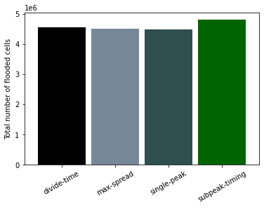
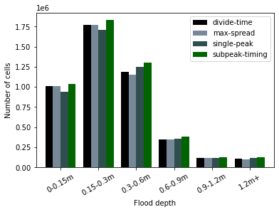
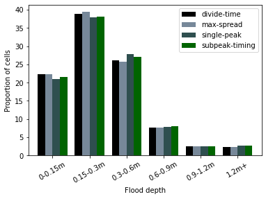

# Run model with synthetic rainfall events

## Table of contents

1. [ Run model in Hec-Ras. ](#runmodel)
2. [ Post process model outputs in Hec-Ras. ](#postprocess)
3. [ Generating synthetic storms](#synthetic_storms)  
  a. [ Overview of methodology. ](#method_overview)  
  b. [ Details on options for multi peaked storms ](#details_options)  
  c. [ Defining antecedent conditions ](#antecedent_conditions)    
  d. [ Removing losses with ReFH2](#loss_removal)  

<a name="runmodel"></a>
### 1. Run model in Hec-Ras

The Lin Dyke model is ran for a 6hr duration storm using the four different methods of distributing the rainfall over the event duration. 

<a name="postprocess"></a>
### 2. Post process model outputs in Hec-Ras Ras Mapper

The results of running the Hec-Ras model are then 


```Tools -> Create calculated layer -> + Layer -> Map Type: 'Depth', Animation Behaviour: 'Fixed Profile', Profile: 'Max' -> Change variable name to depth ```
``` Open scripts (to select an existing script) ```
``` Layer created under 'map layers' heading ```

### 3. Process outputs in QGIS

```Layer -> Add Layer -> Add Raster Layer```
``` Processing -> Toolbox -> Raster layer unique values report ```

The outputs 

### 4. Plot results in Python

<p align="center">

<p align="center"> Figure 1. <p align="center">
                                              
                                              
<p align="center">


<p align="center"> Figure 3. Shows the synthetic rainfall events (pre loss removal) produced using the four methods (1= single peak, 2=divide-time, 3=max-spread, 4=sub-peak timing), for 1hr (left), 3hr (middle) and 6hr (right).  <p align="center">                                              
