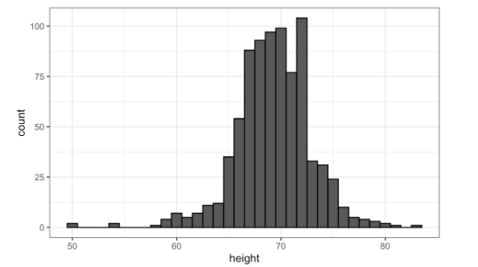
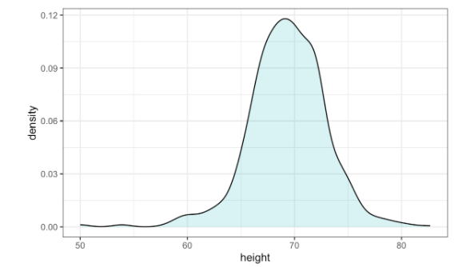

## Visualising data distributions

Histogram:
* Divide the data range into non-overlapping bins of same size
* For each bin, count the number of values that fall into that interval

Smoothed density plot:

  
  

 Figure 1. Layout of 1km observations grid (model) and 2.2km model grid (right) 

