## Probability Density Functions
A probability distribution maps the possible outcomes of a data generating process and their associated probabilities. For small distributions with few possible outcomes these can be written in a table; however, the possible outcomes of larger distributions must be summarised with a function. For continuous random variables these functions are known as probability density functions (PDFs).  

According to a PDF the probability of a random variable being equal to a specific outcome is always 0 and so PDFs can be only be used usefully to calculate the probability that a variable will fall within a range. This can be calculated as the integral of the PDF, or the area under the curve, between the upper and lower bounding values. The area under the whole PDF encompasses the sum of the probabilities of all possible outcomes of the event and is therefore equal to one.

The shape of the probability density function is the probability distribution of the random variable. Some probability distributions are common and have names, for instance normal, gamma or exponential distributions. Generally the form of the probability distribution of a random variable is unknown. Probability density estimation is the process of estimating the underlying probability distribution of a population from a sample. 

Histograms with density plotted on the y-axis are the simplest non-parametric (i.e. making no assumption that the data follows a specific distirbution) density estimators, i.e. they don't assume the data to follow a specific distribution. They are advantageous as they are easy to implement, visualise and interpret. A curve can be constructed from a histogram by joining the midpoint of each bin (when associated with the frequency histogram this is known as a frequency polygon; can find no mention of doing this with a density histogram). However, histograms are not smooth and they are very sensitive to both the bin width and the choice of the start point of each bin. 

### Kernel Density Estimation
Kernel Density Estimation (KDE) is the most commonly applied non-parametric density estimator and produces a smooth PDF estimate which can be used to evaluate any point in the parameter space. For each data point in the sample, the KDE constructs a density function centred on that point and then averages these functions across all the points, ensuring the area under curve is equal to one, to produce a density function for the entire dataset (see Figure 1). This has advantages compared to using a histogram as the dependence on the end-point of the bins is removed. The KDE parameters include the kernel which specifies the shape of the distribution used at each data point (a gaussian distribution is used most commonly) and the bandwidth which specifies the size of the kernel used at each point, with larger bandwidths resulting in more smoothing of the distribution. Whilst parametric distributions are used in KDE, it is a non-parametric approach which makes no assumptions about the shape of the underlying distribution.  

  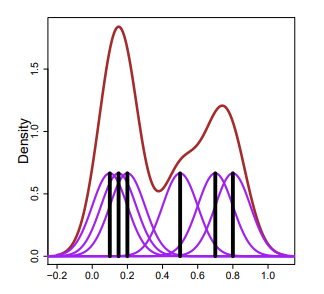

 Figure 1. Kernel Density Estimation process using a gaussian kernel. Data points marked with black lines, gaussian kernels around each data point are marked in purple and the resulting distribution curve is in red. 

KDE fits a distribution at each data point and consequently the generated distribution can extend beyond the bounds of the sample dataset used to fit it. The density at these points is likely to be comparatively low, implying that although possible these values are not probable. This behaviour often leads to biases at the edge of the distribution. Using a KDE can be problematic where the data has natural range restrictions, e.g. non-negativity, as it gives positive densities to impossible values. Where the data is considerably skewed, KDE is not a good method for estimating the PDF. However, there are some approaches to getting around this, for instance transforming the data before applying KDE.

### Comparing KDE and Histogram for UKCP18 data

Figure \ref{fig:PDF_1990_1992} compares the two methods of probability density estimation for precipitation projections of ensemble member 4 of the UKCP18 2.2km model simulation. Figures \ref{fig:PDF_1990_1992_a} and \ref{fig:PDF_1990_1992_b} are for 1980-1997 and figures \ref{fig:PDF_1990_1992_c} and \ref{fig:PDF_1990_1992_d} for 1990-1992. This shows that for this distribution which should have a lower bound at 0.1, the KDE produces a distribution which extends below this. However, the distribution fitted with the histogram method could be considered to be overfitting the data.

  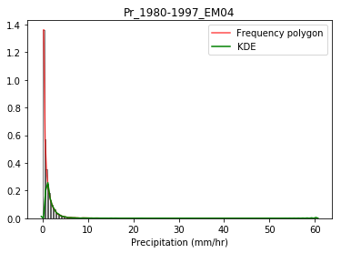
  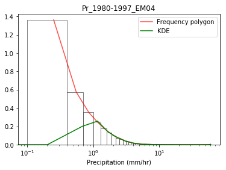
   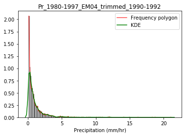
   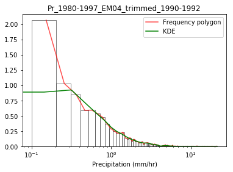

 Figure 2. PDFs for 1990-1992 for observations and two ensemble members of UKCP18 2.2km projections. The KDE is calculated using a gaussian kernel and the frequency polygon uses the method of connecting the midpoint of the histogram bins. NB: using the log scale the fitted line no longer matches up to the mid-point of the bin (should this be calculated in a different order so that it does?) 

### Comparing projections and observations - KDE
The PDFs of precipitation projections from two ensemble members of UKPC18 and observations from CEH-GEAR are estimated using KDE and plotted in Figure \ref{fig:KDE_plots}. 

  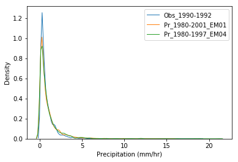
  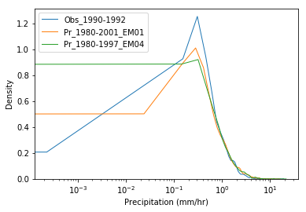
   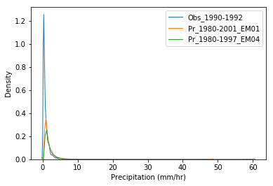
   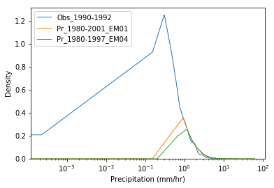

 Figure 3. PDFs for 1990-1992 for observations and two ensemble members of UKCP18 2.2km projections.  

### Comparing projections and observations - Frequency Polygon method
The PDFs of precipitation projections from two ensemble members of UKPC18 and observations from CEH-GEAR are estimated using the frequency polygon method (i.e. connecting the midpoint of histogram bins) based on 200 histogram bins and plotted in Figure \ref{fig:FP_plots}. 

  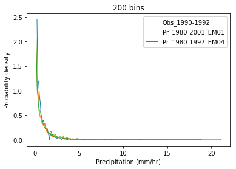
  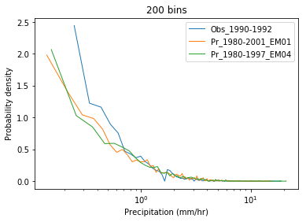
   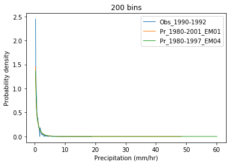
   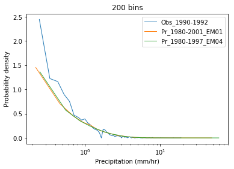

 Figure 4. PDFs for 1990-1992 for observations and two ensemble members of UKCP18 2.2km projections.  

## Code
Uses CSV files created in CreateTimeSeries.py to plot PDFs.  
Currently this includes plotting of individual PDFs, and a single plot with multiple PDFs included (e.g. observations, projections from different ensemble members).  
It also has the option to convert one/both axes to a log scale. 
