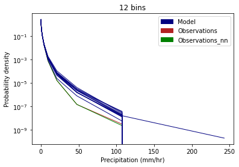
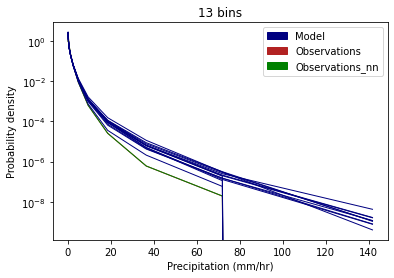
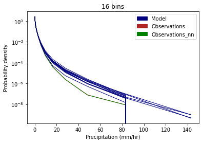
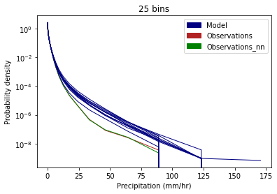
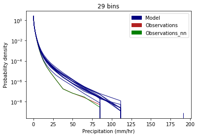
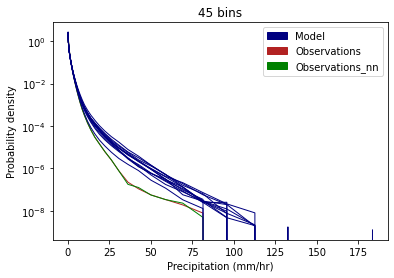
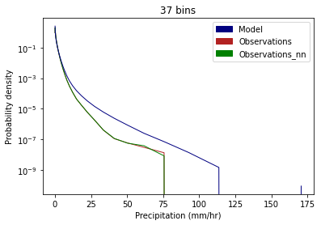

### PDFs of precipitation intensity

##### Observations vs 12 individual model ensemble members 
PDFs of precipitation intensity values across the whole of the Leeds area are plotted for the 1km observations, the regridded 2.2km observations and the twelve model ensemble members.  

  
  
    
    
    
  
      

 Figure 1. PDF of precipitation intensity across the Leeds area 

##### Observations vs combined model data across twelve ensemble members
PDFs of precipitation intensity values across the whole of the Leeds area are plotted for the 1km observations, the regridded 2.2km observations and the combined data from the twelve model ensemble members.  

  
  
  
  

 Figure 2. PDF of precipitation intensity across the Leeds area 

