### PDFs of precipitation intensity

PDFs of precipitation intensity are plotted using data from across all cells in the "Leeds-at-centre" region.  

In "CombineAllYearsDataAcrossregion.py", for each ensemble member:
* For each cell in this 'leeds-at-centre' region a numpy array is saved which contains the precipitation values across the full 1980-2000 period
* An array is saved which contains all of the data from all of the cells stacked into one array   

One array is also saved which contains the time-stamps to which these precipitation values refer (this is the same across all ensemble members).  

The PDFs are plotted in "CompareModel_Obs_PDFs.py". PDFs are plotted using both:
1. All the model data (1980-2000) and all the observations data (1990-2014)
2. Just the model and observations data from within the overlapping time period.  

Extracting the data from within just the overlapping time period is complicated because the model uses a 360 day calendar (12 months of 30 days). This means that it is not possible to simply save the dates as datetime objects and to filter out dates not in the overlapping period. A method was devised to deal with this issue:
* The indices of the datetime values which are outside the overlapping time period were identified manually
* The values of these positions in the timestamps array were set to  '0'
* The timestamps array was stacked 1221 times on top of itself to create an array of timestamps to correspond with the array of precipitation values across the whole of the leeds-at-centre region (1221 cells)
* This timestamps array was joined to the precipitation values array
* Rows with a value of '0' in the timestamps column were removed.

The observations are not affected by the same problem with the 360 day calendar.  
Arrays of precipitation values for each cell in Leeds, and one array containing the data across all the cells stacked, have been created in the "RegriddingObservations/TestingRegridding/leeds-at-centre/CombineAllYearsDataAcrossRegion.py" directory, for both the regridded and the native observations. An array of the time stamps corresponding to one cell (and equivalent for all cells) is also saved. This timestamps array is stacked on top of itself 1221 times for the regridded observations (33 * 37 cells) and 6059 times (73 * 83 cells) for the native observations, and joined to the stacked precipitation values array. The dataframe of precipitation values and timsetamps is then filtered to contain only precipitation values from the overlapping time period.  

Sense checking the data:
* Overlapping time period is 01-01-1990 00:00:00 to 30-11-2000 23:00:00. This equates to 95,688 hours  
* Model: model data is in the 360 day format and so there are 94,320 hours within this overlapping time period. 94,320 (hours) * 1221 (cells) gives a length of 115,164,720 for the array containing precipitation values from across the whole of Leeds during the overlapping period.
* Observations (regridded): observations use normal calendar, so there are 95,688 hours in overlapping time period. 95,688 (hours) * 1221 (cells) gives a length of 116,833,827 for the array containing precipitation values from across the whole of Leeds during the overlapping period.
* Observations (native): observations use normal calendar, so there are 95,688 hours in overlapping time period. 95,688 (hours) * 6059 (cells) gives a length of 579,773,592 for the array containing precipitation values from across the whole of Leeds during the overlapping period.

  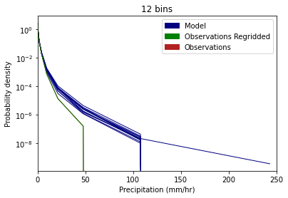  
  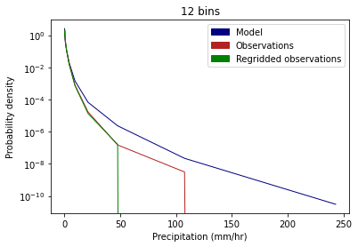
  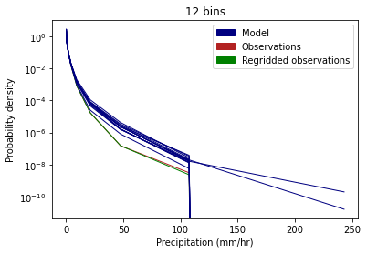  
  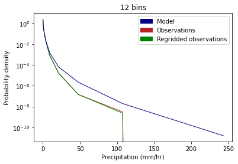

 Figure 1. PDF of precipitation intensity across the Leeds area 

### Using just overlapping time period (1990-2000)

##### Observations vs 12 individual model ensemble members 

    
  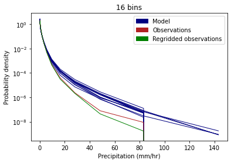
  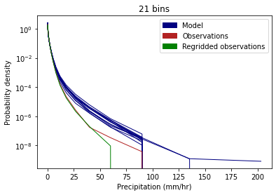
  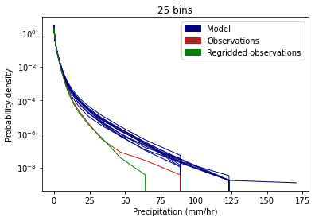
  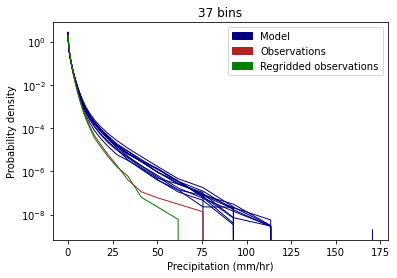

 Figure 1. PDF of precipitation intensity across the Leeds area 

##### Observations vs combined model data across twelve ensemble members

  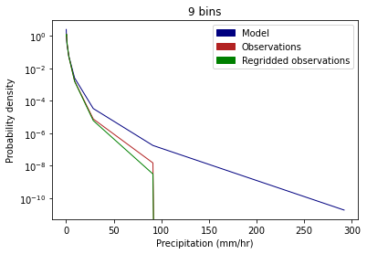  
  
  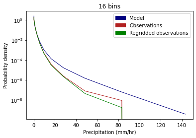
  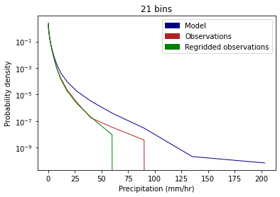
  
  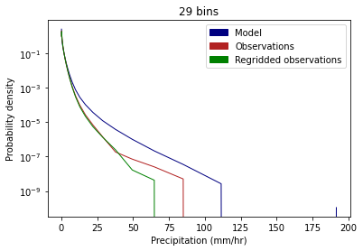  
  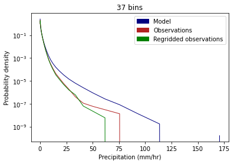

 Figure 1. PDF of precipitation intensity across the Leeds area 

Using only the overlapping time period means that there is less data available for the regridded observations than the native observations, which could explain why the regridded observations line is lower than the native observations and has a lower probablity of higher values and less extreme values. Alternatively, this could be because the regridding process results in smoothing of more extreme values. 

Both the native and regridded observations have lower probabilities of higher values, and the difference between model and observations appears to be greater here than when using the full time period (check with side by side plots). The observations are likely to be lower than the model values because they are interpolated from gauge values (although should check this with gauge data).  

When the data from across all the ensemble members is combined then the resulting line is much smoother at higher values. There is a small amount of spread between the ensemble members. 

### Using full time period available for both model (1980-2000) and observations (1990-2014)

NB: for code used to create this need to go to previous versions of files.

##### Observations vs 12 individual model ensemble members 
PDFs of precipitation intensity values across the whole of the Leeds area are plotted for the 1km observations, the regridded 2.2km observations and the twelve model ensemble members.  

    
  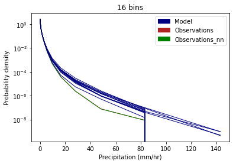   
  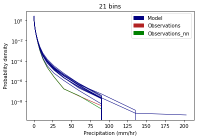  
       

 Figure 1. PDF of precipitation intensity across the Leeds area 

##### Observations vs combined model data across twelve ensemble members
PDFs of precipitation intensity values across the whole of the Leeds area are plotted for the 1km observations, the regridded 2.2km observations and the combined data from the twelve model ensemble members.  

  
  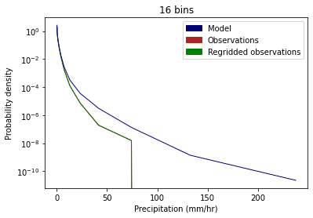
  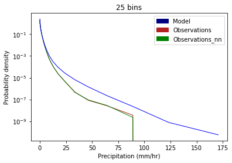
    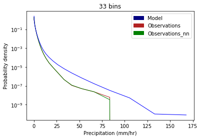
  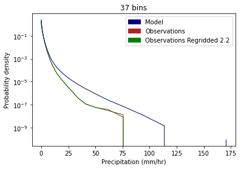  

 Figure 2. PDF of precipitation intensity across the Leeds area 

