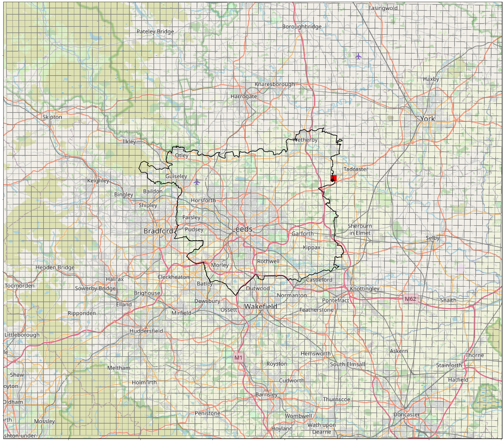
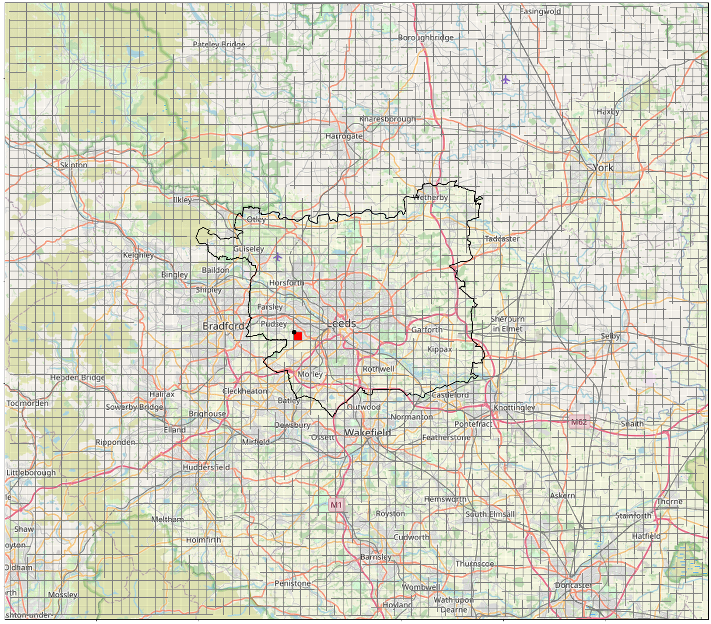

Main summary is here: https://www.overleaf.com/project/60b8e3e035af8467fa7f7c8d 

## Validating CEH-GEAR1hr gridded observations using quality-controlled gauge data

### Gauges in Leeds (leeds-at-centre) region
There are 42 quality-controlled gauges within the Leeds (leeds-at-centre) region. 

### Gauges within Leeds city boundaries
For the 6 rain gauges within the Leeds city boundary, the CEH-GEAR1hr grid cell within which the gauge is located is identified in a plot. PDFs of hourly precipitation intensity are plotted using the data from the gauge and the data from the grid cell. In each case, only the overlapping time period between the two datasets is used. NA values are filtered out after finding the overlapping time period, so data for some datetimes may be included in one dataset but not the other.

#### Bramham Logger - 01-01-1990 00:00:00 - 31-12-2014 23:00:00 

All months  

     
<!--- )    
  
   --> 
 
JJA 

     
<!---   
  
 -->

NA values in gauge data: 3253
NA values in CEH-GEAR grid cell data: 9

#### Knostrop Logger - 01-01-1990 00:00:00 - 31-12-2014 23:00:00

All months  

      <!---   
  
   -->
 
JJA 

     
<!---   
  
-->

NA values in gauge data: 14583
NA values in CEH-GEAR grid cell data: 9

#### Eccup Logger - 01-01-1990 00:00:00 - 31-12-2014 23:00:00

All months  

     
<!---     
  -->

JJA 

    
<!---   
  
-->

NA values in gauge data: 3480
NA values in CEH-GEAR grid cell data: 9
  
#### Farnley Hall Logger - 01-01-1990 00:00:00 - 31-12-2014 23:00:00

All months  

     
<!---   
  
  -->

JJA 

     
<!---   
  
-->

NA values in gauge data: 1436
NA values in CEH-GEAR grid cell data: 9

#### Headingley Logger - 25-01-1996 10:00:00 - 31-12-2014 23:00:00

All months  

      
<!---   
  
   -->

JJA 

     
<!---   
  
 -->

NA values in gauge data: 1078
NA values in CEH-GEAR grid cell data: 0 (because these first 9 dates are already removed in trimming to same time period as gauge)

#### Otley s.wks Logger - 01-01-1990 00:00:00 - 31-12-2014 23:00:00 

All months  

      
<!---   
  
   -->

JJA 

     
<!---   
  
 -->

NA values in gauge data: 13483
NA values in CEH-GEAR grid cell data: 9

### Analysis
For the Knostrop, Eccup and Farnely Hall gauges, hourly precipitation values of the same maximum intensity are found in both the gauge data and the CEH-GEAR data. For the Bramham and Otley gauges, higher maximum values are found in the CEH-GEAR grid cell data, and for the Headingley gauge, a higher maximum hourly precipitation intensity is recorded at the gauge.

#### Further analysis Knostrop gauge
For the Knostrop gauge, the top twenty values in the gauge were found, and the values for the same datetime were extracted from the CEH-GEAR data. This shows that often where a peak value occurs in the gauge, a peak value is not found in the CEH-GEAR data. To explore this further the two values before and after a peak value at the gauge are found for both the gauge and CEH-GEAR. This shows that whilst often the CEH-GEAR grid cell does not record a peak at the same time as the gauge there is generally a peak in one of the surrounding hours. Presumably this could be because it is drawing its data from a different grid cells (many of the   

#### Knostrop
| Datetime            | Gauge | CEH-GEAR |
|---------------------|-------------------------|-------------------------|
| 2004-08-09 12:00:00 | 22.4                    | 0.8                     |
| 2008-08-20 20:00:00 | 17.2                    | 6.3                     |
| 2009-06-15 12:00:00 | 16.6                    | 0.0                     |
| 2005-09-10 05:00:00 | 14.6                    | 7.4                     |
| 2004-08-10 14:00:00 | 13.2                    | 0.0                     |
| 2001-04-25 16:00:00 | 12.8                    | 0.0                     |
| 2007-07-01 12:00:00 | 12.0                    | 0.0                     |
| 2014-08-08 17:00:00 | 11.8                    | 0.9                     |
| 2000-09-19 22:00:00 | 11.6                    | 7.0                     |
| 2004-08-10 07:00:00 | 11.6                    | 2.5                     |
| 2012-07-07 19:00:00 | 11.6                    | 15.9                    |
| 2006-08-17 14:00:00 | 11.0                    | 0.0                     |
| 2011-09-16 17:00:00 | 11.0                    | 0.0                     |
| 2007-06-20 01:00:00 | 10.8                    | 0.4                     |
| 2006-09-02 11:00:00 | 10.4                    | 2.5                     |
| 1991-06-28 14:00:00 | 9.8                     | 0.0                     |
| 1997-08-31 15:00:00 | 9.8                     | 8.4                     |
| 2004-08-12 18:00:00 | 9.8                     | 5.1                     |
| 2013-07-28 03:00:00 | 9.8                     | 8.8                     |
| 2012-08-05 14:00:00 | 9.4                     | 0.0                     |

| Datetime            | Gauge    |CEH-GEAR|
|---------------------|----------|--------|
| 2004-08-09 10:00:00 | 0.2      | 0.3    |
| 2004-08-09 11:00:00 | 1.0      | 0.2    |
| 2004-08-09 12:00:00 | 22.4     | 0.8    |
| 2004-08-09 13:00:00 | 1.0      | 18.9   |
| 2004-08-09 14:00:00 | 0.2      | 0.8    |

| Datetime            | Gauge    |CEH-GEAR|
|---------------------|----------|--------|
| 2008-08-20 18:00:00 | 0.6      | 0.0   |
| 2008-08-20 19:00:00 | 5.6      | 0.6   |
| 2008-08-20 20:00:00 | 17.2     | 6.3   |
| 2008-08-20 21:00:00 | 2.8      | 9.4   |
| 2008-08-20 22:00:00 | 9.0      | 11.9  |

| Datetime            | Gauge    |CEH-GEAR|
|---------------------|----------|--------|
| 2009-06-15 10:00:00 | 0.0      | 0.0   |
| 2009-06-15 11:00:00 | 0.0      | 0.0   |
| 2009-06-15 12:00:00 | 16.6     | 0.0   |
| 2009-06-15 13:00:00 | 2.0      | 16.2  |
| 2009-06-15 14:00:00 | 0.0      | 2.0   |

| Datetime            | Gauge    |CEH-GEAR|
|---------------------|----------|--------|
| 2005-09-10 03:00:00 | 0.6      | 0.0   |
| 2005-09-10 04:00:00 | 6.8      | 0.7   |
| 2005-09-10 05:00:00 | 14.6     | 7.4   |
| 2005-09-10 06:00:00 | 5.6      | 16.0  |
| 2005-09-10 07:00:00 | 2.8      | 6.1   |
