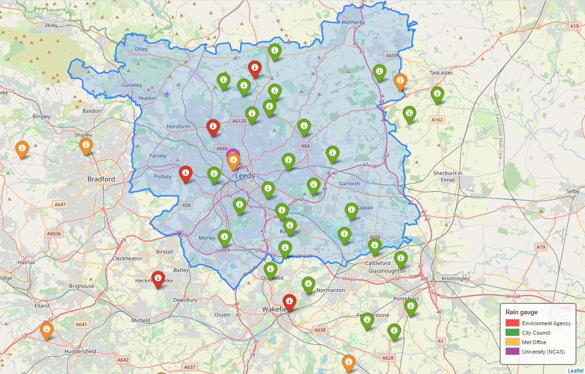

# Rainfall observations
## Rain Gauges
The location of rain gauges in and around the Leeds area which supply hourly rainfall measurements is shown in Figure 1, and further details of these are provided in Table 1. These gauges are operated by the Environment Agency, Met Office, University and City Council, and further details for each of these are provided below.

  

 Figure 1. Location of rain gauges in area surrounding Leeds 

#### City Council
The City Council have provided hourly rainfall data from 29 monitoring stations for 26/03/2014 - 22/11/2020. This rainfall data comes from the Met Office's radar product and is then processed by MAP rain into 1km grid squares using the Ordinance Survey Grid Reference system. Consequently, the rainfall at each monitoring point is an average of the underlying radar rainfall for the 1km grid square on which the monitoring point sits.  
The MAP (Meniscus Analytics Platform) was developed in 2014 and was partially funed by InnovateUK as a tool for delivering real-time Big Data Analytics (http://www.meniscus.co.uk/solutions-built-using-meniscus-analytics-platforms/map-rain-delivering-historic-and-predictive-rainfall-analytics).

DAILY rainfall data is also available from six rain gauges operated by LCC between 2014 and 2018 via Leeds Data Mill (https://datamillnorth.org/dataset/rain-gauge-rainfall-data)
15 minute rainfall accumulations are available at Pottery Fields from 2013-2016 (https://datamillnorth.org/dataset/pottery-fields-rain-gauge-rainfall-data).

#### Environment Agency
The Environment Agency are required to provide flood warning and water resource assessment at much higher resolution than Met Office rain gauge network is currently capable of and so they run their own network of automatic rain gauges across England. They have approximately 1000 rain gauges giving 15 minute readings.

Historical hourly rainfall data has been acquired for five rain gauges in the West Yorkshire region. Details of the gauge data is provided in Table 1.

Additionally, the most recent 100 readings (15 minute accumulations) from each rain gauge can be accessed through their Rainfall API demonstrator: https://environment.data.gov.uk/flood-monitoring/assets/demo/index.html. Historic rainfall data for the past 12 months is available to download from the Environment Agency archive: http://environment.data.gov.uk/flood-monitoring/archive. It is noted that none of this data is validated and thus could potentially contain errors due to faulty instruments or on-site maintenance.

 Table 1. Details of Environment Agency rain gauges in West Yorkshire 
  

| Rain Gauge      |Data period      | Comments on gauge and data     |
| :---        |    :-----------------:         |          :---: |
| Heckmondwike      | 07/06/1985 - 03/11/2020      | Data validated and checked since 05/01/2011.   1985-86 and June 1991- May 1992 no rainfall has been recorded.  Gauge has histry of freezing in cold months due exposure |
| Eccup (063518)   | 13/08/1986  - 02/11/2020        | Data validated since 21/12/2010. Some data missing in the 1990s   |
| Headingley (076413)  | 25/01/1996 -  03/11/2020   | Data validated since 01/01/11. Data mostly good quality except from chunks between 01/01/11 -02/02/2011 and 01/08/11 -30/09/11 which are marked as suspect    |
| Farnley Hall (076204)   | 10/12/1987 - 04/11/2020       | Data validated since 10/12/87. Data which has been checked has overall been marked as good quality      |
| Wakefield | 19/03/1985 - 03/11/2020        |  Data validated from 01/01/11. Data overall of good quality. Missing data -- 1st July - 5th July 1985; 10th May - 22nd May 1992; 31 January 1993 - 6th February 1993; 25th June 1993 - 2nd July 1993 (incomplete list). Data missing mostly in blocks of several hours or up to tens of days.  |

 Table 2. Details of Environment Agency rain gauges in West Yorkshire 
  
| Season     |Heckmondwike     | Eccup       | Headingley |  Farnley Hall | Wakefield    |
| :---     |    :--------:      |   :------: |:---------: |    :-------:  |    :-------: |
| MAM      |     51.3%          |   18.3%    | 92.8%      |    25.6%      |    36.3%     |
| JJA      |     34.5%          |   7.9%     | 2.1%       |    29.5%      |    28.4%     |
| SON      |     5.4%           |    54.2%   |  1.5%      |    36.3%      |    2.4%      |
| DJF      |     8.8%          |  19.6%     |  3.6%      |    8.6%       |    32.9%     |

 Table 2. Details of Environment Agency rain gauges in West Yorkshire 
  
| Rain gauge   | Proportion of data missing | MAM      | JJA        |  SON      | DJF          |
| :---         |    :----------------:      | :------: |:---------: | :------:  |    :-------: |
| Heckmondwike |     0.19%                  |  51.3%   |  34.5%     |    5.4%   |   8.8%       |
| Eccup        |     0.5%                   |  18.3%   |   7.9%     |   54.2%   |    19.6%     |
| Headingley   |     0.22%                  |  92.8%   |   2.1%     |    1.5%   |     3.6%     |
| Farnley Hall |    0.58%                   |  25.6%   |    29.5%   |    36.3%  |    8.6%      |
| Wakefield    |     0.33%                  |  36.3%   |    28.4%   |   2.4%    |    32.9%     |

#### Met Office
Met Office rain gauge data is available as part of the Met Office Integrated Data Arichive System (MIDAS) and is downloadable from CEDA (https://catalogue.ceda.ac.uk/uuid/5dd1ca58159640cf9c0f27d40f7062ec), although access to the data has to be first granted.

The location of MIDAS stations are mapped here: http://archive.ceda.ac.uk/cgi-bin/midas_stations/midas_googlemap.cgi and you can view MIDAS stations in West Yorkshire here: http://archive.ceda.ac.uk/cgi-bin/midas_stations/search_by_county.cgi.py?county=WEST+YORKSHIRE&minyear=&maxyear=. But it's not clear whether data is accessible for these stations anywhere (only those locations marked on the map in Figure 1 have data available on CEDA)

 Table 2. Details of rain gauges proximal to Leeds city region 

  

## Gridded observations data (CEH-GEAR1hr)
Gridded hourly precipitation values were produced by temporally disaggregating CEH-GEAR daily, a pre-existing validated and quality controlled gridded daily precipitation dataset. The CEH-GEAR daily dataset is produced using a natural neighbour interpolated method and using data solely from Met Office rain gauges (Lewis et al, 2018). They cover the period of 1990-2014.

CEH-GEAR daily was temporally disaggregated using a dataset of quality controlled data from hourly rainfall gauges. This dataset was originally compiled by Blenkinsop et al (2017), with data from some additional gauges being added by Lewis et al (2018), alongside application of some further quality control procedures. CEH-GEAR1hr uses data from 1903 quality controlled rain gauges compiled from three sources:  
*	UK MIDAS - 216 gauges  
*	UK Environment Agency - 1300 gauges  
*	SEPA - 141 gauges  
The data record at most of these gauges commenced in the early to mid-1990s, and most of the gauges have some missing data.

"Given the relatively high rainfall gauge network density in the UK, a simple nearest neighbour interpolation without height correction was used to preserve a real storm shape for every grid square. This was considered to be beneficial as it will preserve extreme hourly rainfall intensities whereas other interpolation methods will smooth these extremes out. A limitation of this approach is that convective events can be very small and therefore nearest neighbour may sometimes represent a convective storm over too large an area. How-ever, as it is the hourly rainfall fractions that are interpolated here, the actual rainfall total is modulated by the daily rainfall dataset, which is smoothed, meaning that this effect is reduced."  

  

 Figure 2. Location of hourly rain gauges used in construction of CEH-GEAR 

  

 Figure 3. Outline of Leeds city region, with location of Met Office gauges (orange) and Environment Agency gauges (red), and cells coloured by distance to the nearest rain gauge used in the CEH-GEAR1hr dataset production 

