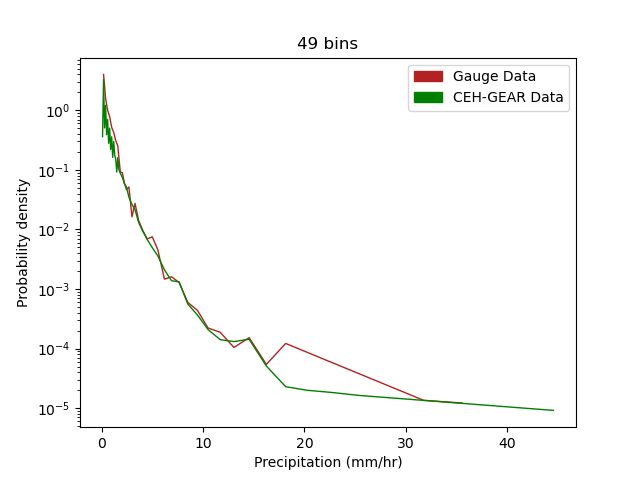
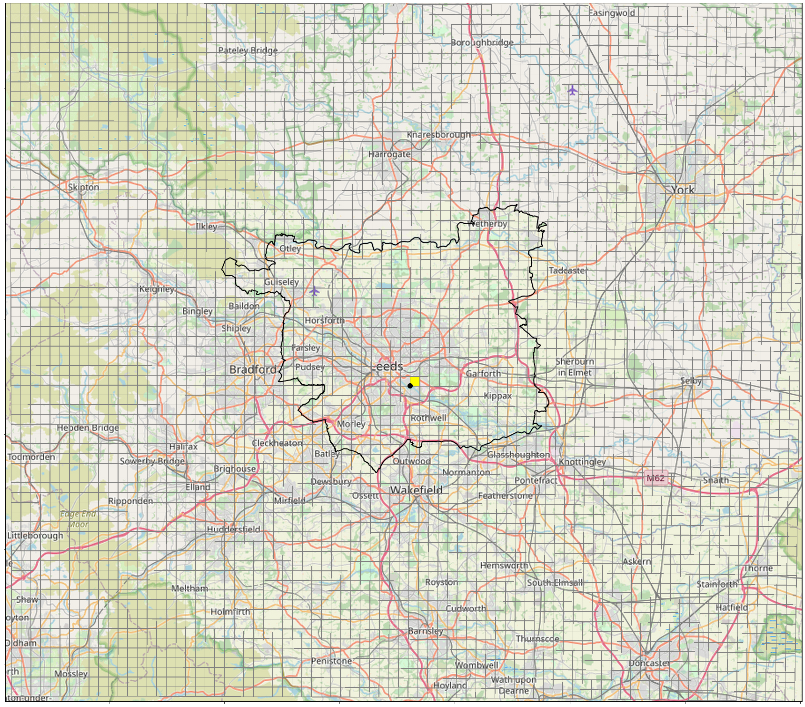
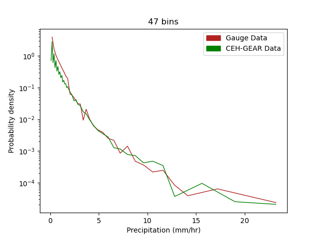
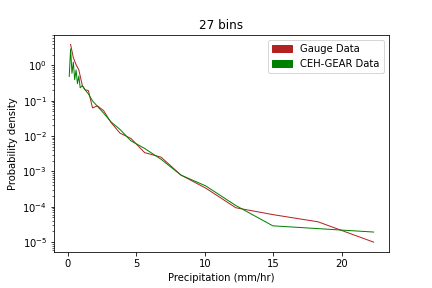
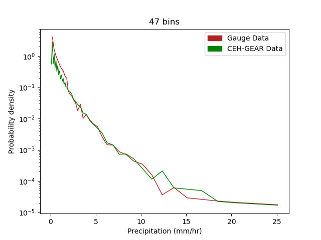
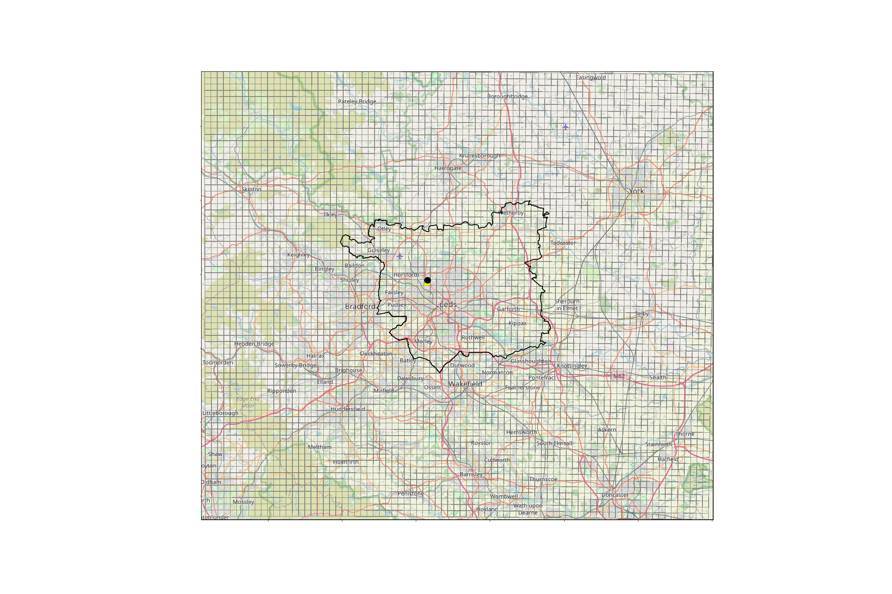
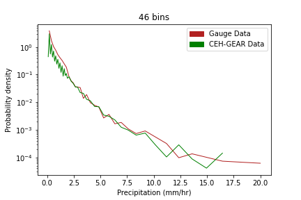

# Using Quality-Controlled Rain Gauge data to validate CEH-GEAR1hr gridded observations
## Rain Gauges

#### All hours

Figure 7. JJA Mean for all hours 

Figure 7. JJA Mean for all hours 
  

Figure 7. JJA Mean for all hours 
  
  

Figure 7. JJA Mean for all hours 
  
  
  

Figure 7. JJA Mean for all hours 
  
