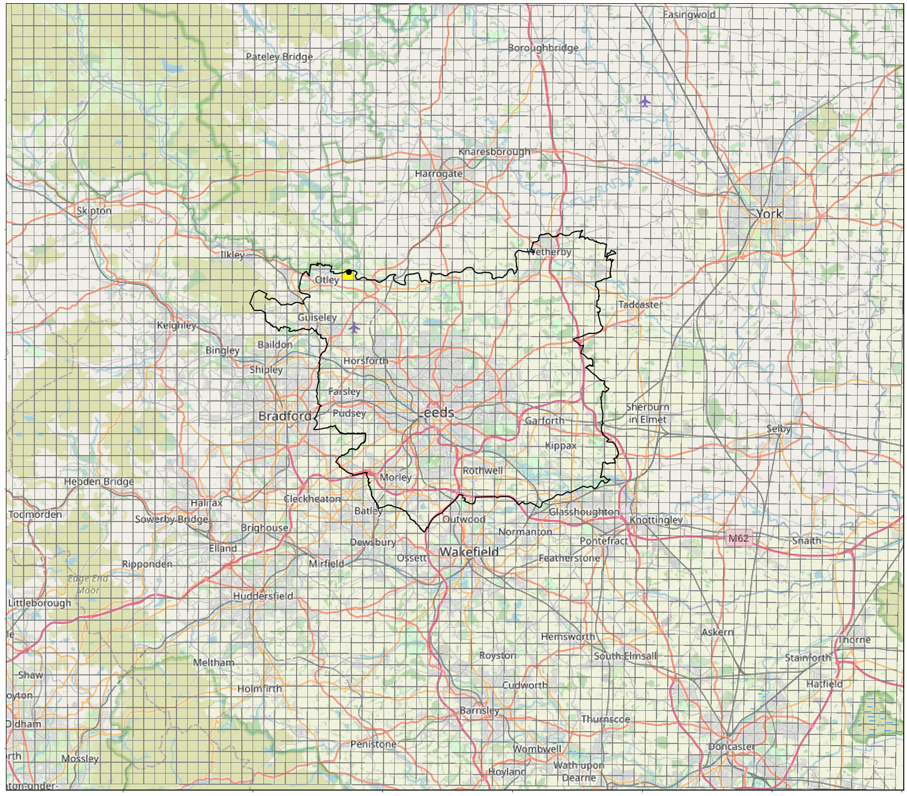
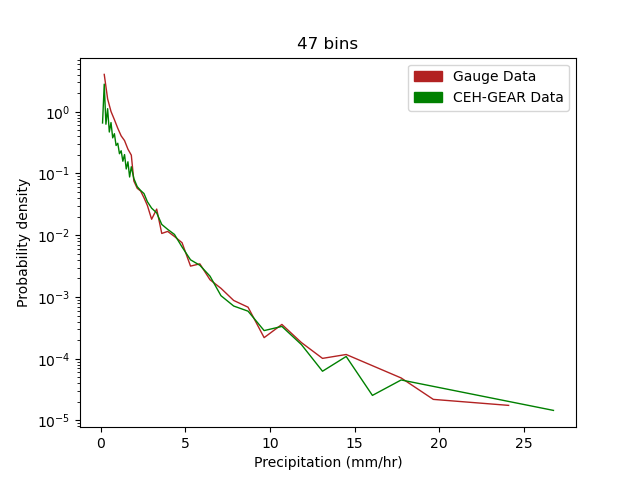

# Using Quality-Controlled Rain Gauge data to validate CEH-GEAR1hr gridded observations
## Rain Gauges

#### Bramham Logger

Figure 1. JJA Mean for all hours 

#### Knostrop Logger

Figure 2. JJA Mean for all hours 
  

#### Eccup Logger

Figure 3. JJA Mean for all hours 
  
 
#### Farnley Hall Logger

Figure 4. JJA Mean for all hours 
  
  
#### Headingley Logger  

Figure 5. JJA Mean for all hours 
  

#### Otley s.wks Logger  

Figure 6. JJA Mean for all hours 
  
