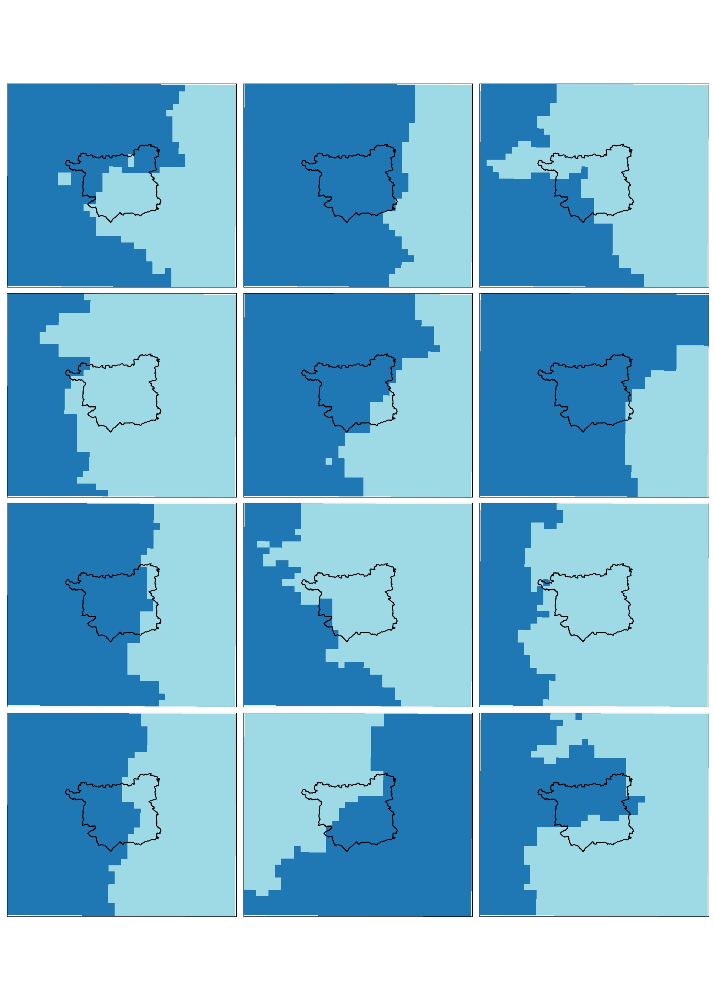
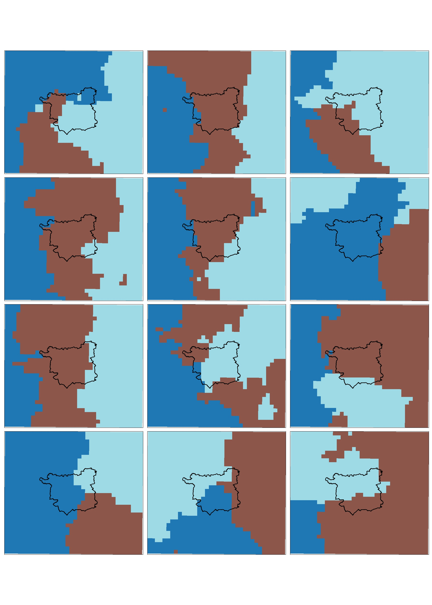
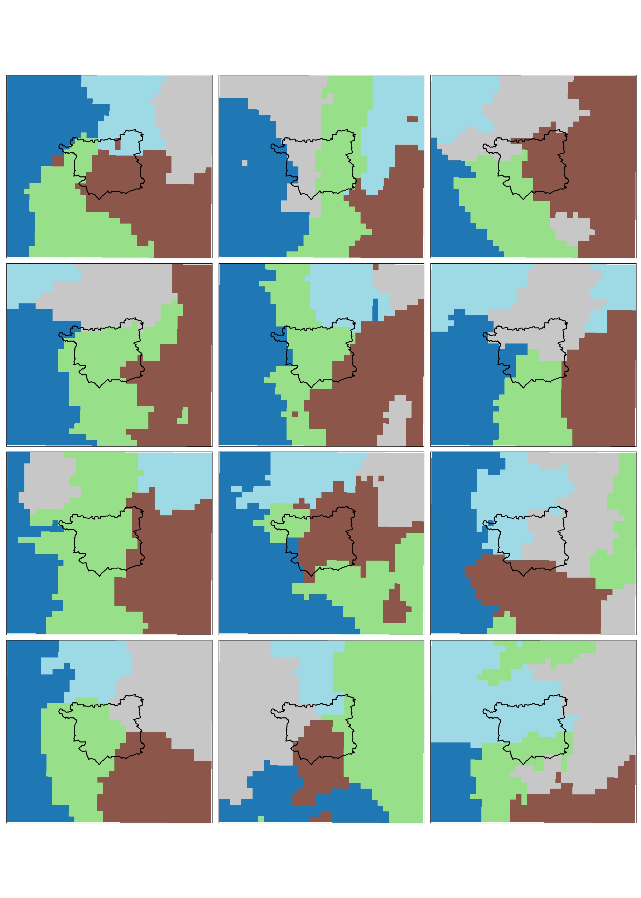
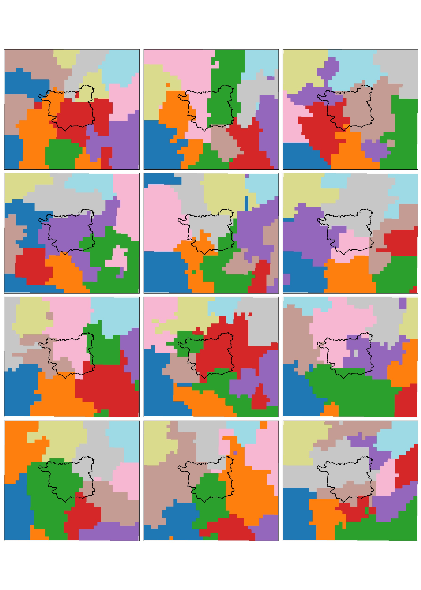
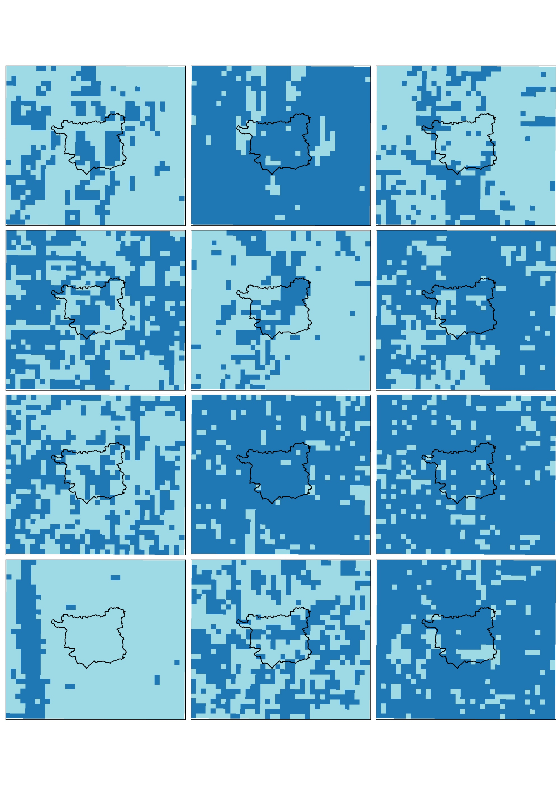
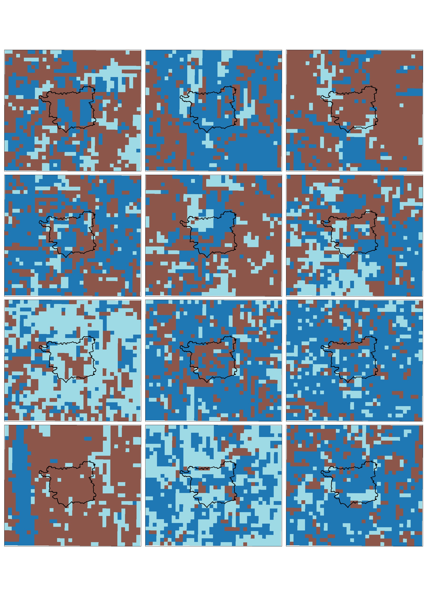
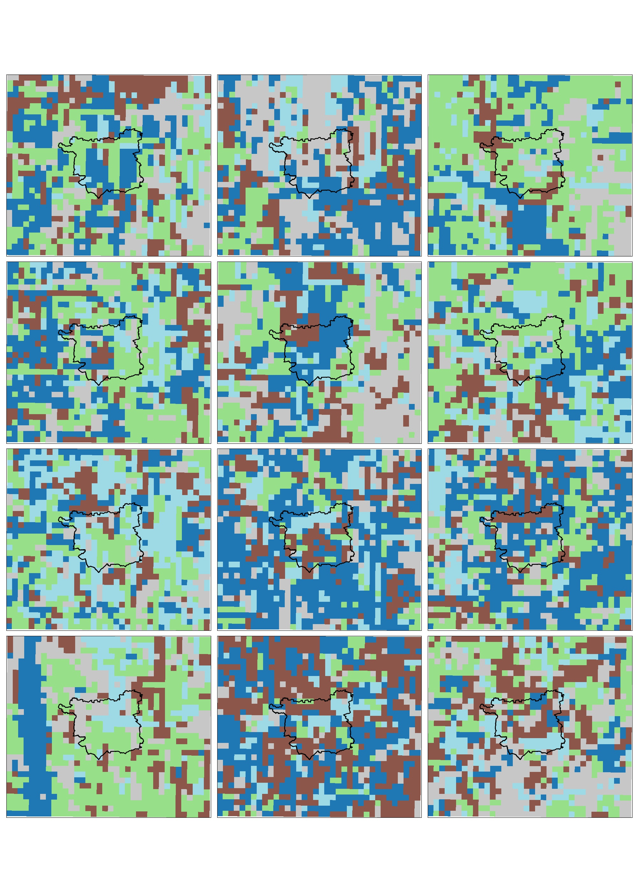
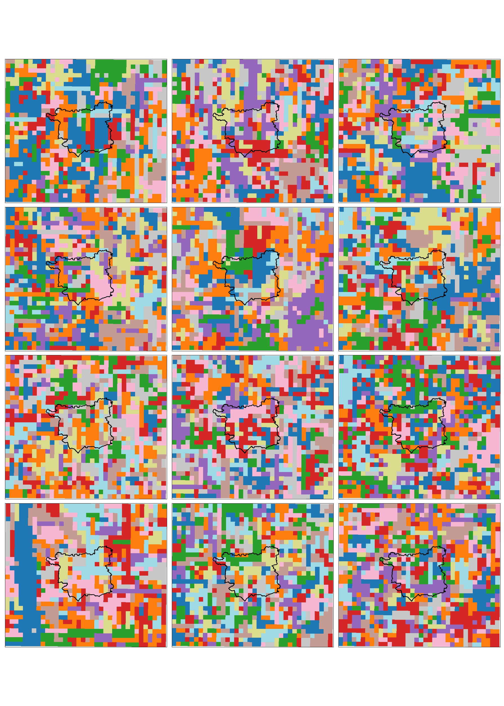

# Rainfall Regionalisation
Rainfall regionalisation is the process of dividing a study region into smaller regions which are homogenous in respect to a particular precipitation characteristic. This can be useful for a number of reasons. For instance, homogenous rainfall regions can be used to pool data for extreme value theory (EVT). Sufficient data is needed in EVT to produce reliable estimates of long return period events, and this is often not provided by observational records or model runs. Pooling data spatially can provide this extra data by trading space for time.

### Workflow
<ins> CalculateStatsForClustering </ins>
* Find statistics for all grid cells in a large region defined by the bounding box of the Northern England region (North East, North West and Yorkshire and the Humber).
* Convert these into the format required by the HiClimR package; this is a dataframe in which each row is a location with a lat and long coordinate, and the columns are the statistics for that point. Statistics are calculated over both all hours and only wet hours and include annual seasonal (June-July-August) values (i.e. one value for each year of data):
   * Max
   * Mean
   * Percentiles (95th, 97th, 99th, 99.5th, 99.75th and 99.9th)
* Trim these to some smaller regional areas - e.g. the outline of the Northern region, a square region with Leeds at the centre

NB: Previously, other statistics were calculated including: the greatest ten/twenty values in each year of data; statistic values over the whole time period (i.e. all years of data considered together); values over percentile (i.e. all values bigger than the Xth percentile). However, none of these produced good results in HiClimR so they are no longer included here.

<ins> MakeClustersFromStats </ins>
* The statistics are then used to regionalise the regions into clusters of specified sizes (2, 3, 4, 5, and 10 clusters) using the HiClimR R Package.
* These regions are then plotted in Python.

### Notes on problems encountered
* 30/09/20 - Noticed discrepancy between the maximum values found when creating table with max/min values etc in the HiCliMRRegions_meteorology script and the maximum values found when making the UK_stats plots (trimmed to Leeds area). Tried various ways of fixing this discrepancy and realised the following bugs which have now been fixed (and outputs regenerated):
  * The method for trimming to the region resulted in slightly different numbers of cells included
  * One was using the season_year whilst the other was using just the seasonal (don't think this actually made a difference as the code loops through the years one by one, so the two are essentially the same). For ValuesOver20Years need to use the season in aggregation
  * "FindStats.py" did not include data from the year 2000 (was cut off in the loop)  

* 28/09/20 - Significant issue in code whereby latitude and longitude were being included as variables in the regionalisation process and consequently significantly altering the results. This is now corrected and rerun.

## Results
### Leeds-at-centre
#### All hours

Figure 7. JJA Mean for all hours 

Figure 1. JJA 95th Percentile for all hours 

Figure 2. JJA 97th Percentile for all hours 

Figure 3. JJA 99th Percentile for all hours 

Figure 4. JJA 99.5th Percentile for all hours 

Figure 5. JJA 99.75th Percentile for all hours 

Figure 6. JJA 99.9th Percentile for all hours 

Figure 7. JJA Max for all hours 

#### Wet hours (>0.1mm/h precipitation)

Figure 7. JJA Mean for wet hours 

Figure 1. JJA 95th Percentile for wet hours 

Figure 2. JJA 97th Percentile for wet hours 

Figure 3. JJA 99th Percentile for wet hours 

Figure 4. JJA 99.5th Percentile for wet hours 

Figure 5. JJA 99.75th Percentile for wet hours 

Figure 6. JJA 99.9th Percentile for wet hours 

Figure 7. JJA Max for wet hours 

### All hours/ Wet Hours side by side
#### Mean

Figure 7. JJA Mean for all hours 

Figure 7. JJA Mean for wet hours 

#### 97th Percentile

Figure 2. JJA 97th Percentile for all hours 

Figure 2. JJA 97th Percentile for wet hours 

## Analysis
The regions are strongly influenced by the topography.

 

 Figure X. Topography 

For the leeds-at-centre region, with two clusters, there is generally an east-west split in the clusters. The first region includes mostly the elevated region of the Pennines to the west of Leeds; whilst the second region includes the flatter plains of the Vale of York to the east of Leeds.
