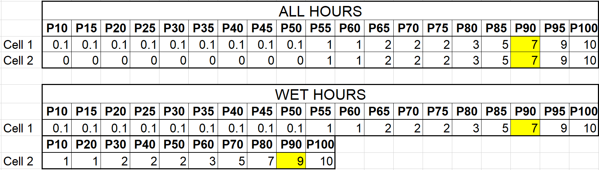
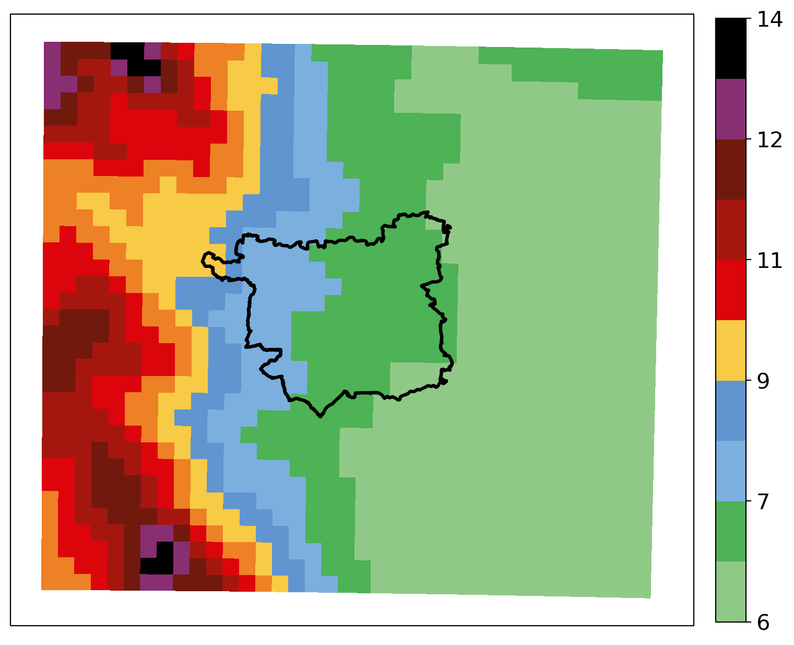
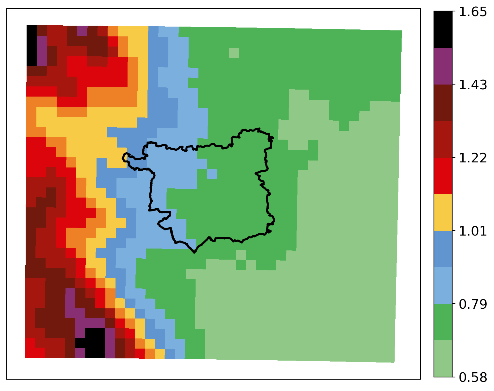
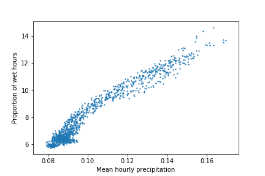
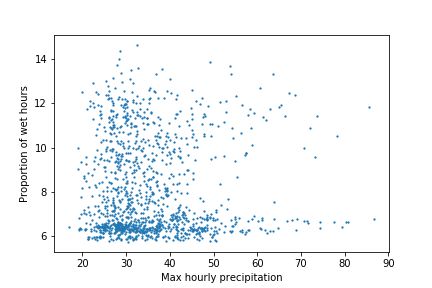

## Wet hour vs all hour percentile indices for describing extreme precipitation
(Extreme) precipitation statistics can be calculated using either:
* All hours of data  
* Only wet hours of data (generally classed as hours with > 0.1mm of precipitation)

This choice can produce very different results and thus it is important to consider carefully the impacts of each option.

For percentiles calculated from only wet hours, changes in these percentiles can mean either a change in the frequency of wet hours OR changes in precipitation intensity. Wet hour percentiles are affected by changes in the occurrence of weak precipitation events (e.g. drizzle). This can be understood through consideration of Fig. 1. Two cells, Cell 1 and Cell 2, are compared. The highest 50% of precipitation values in both cells is the same; however, in Cell 1 the bottom 50% of precipitation values are all 0.1, whislt in Cell 2 they are all 0. That is, in the hours where it is not raining intensely, in Cell 1 it is drizzly, whilst in Cell 2 it is dry. Consequently, when calculating the wet hour percentiles, for Cell 2 these bottom 50% of hours are all removed, and the percentiles are calculated using only the highest 50% of values, whereas in Cell 1 they are calculated using all the values. This results in e.g. the 90th Percentile precipitation value for Cell 1 being lower than for Cell 2, despite the intensity of rainfall experienced in both cells being the same.

 

Figure 1. 

Schar:
Statements that are conditional on occurrence of wet days are hard to interpret.
It doesn't seem logical to use indices that are sensitive (e.g. wet day percentiles) to occurrence of weak events (e.g. drizzle) when assessing intense events.

All day percentiles --> these are directly rlated to changes in heavy events with an absoloute frequency/RP. They relate to the absoloute frequency of occurrence of extremes.

Problms with wet day percentiles:
Changes in wet day frequency may dominate changes in precipitaton totals (changes in wet-day percentiles are affected by changes in both occurrence of wet hours AND their heaviness). E.g. it might look like heavy events have increased; however there has actually been a decrease in event intensity.

Alexander et al (2019)
A different issue is sensitivity to the sample from which the percentiles are calculated. If percentiles are calculated only from wet days (typically daily precipitation ≥1 mm), then changes in such indices (measuring the intensity of the percentiles or the frequency or precipitation amount of exceedances) may also be affected by changes in the frequency of wet days, and therefore cannot solely be attributed to precipitation intensity changes (e.g. Schär et al 2016). Analysis and interpretation of changes is more straight-forward if percentiles are calculated from all daily precipitation values including wet and dry days, as this approach ensures constant sample size and any changes would therefore be due to changes in intensity alone. A possible disadvantage of this approach, however, is that in some dry regions the large majority of days are dry days, and the distribution consists of 0 mm values beyond the 90th percentile (often considered as a moderately extreme threshold). In the case of changing wet-day frequency, changes of infinity will be analysed for percentile values that are dry in one period but wet in another. The definition of a wet day itself might also be problematic as there is often under-reporting of small precipitation amounts at manual sites, or conversely spurious small reports (e.g. from dew) at automatic sites (e.g. Hennessy et al 1999).

Pattern in mean and lower percentiles (95th, 97th, 99th) matches the pattern in the wet hour proportion.
But this isn't because the wet hour proportion influences these statistics...

Figure 2.  

 

Figure 3.  

### References
* Alexander, L.V., Fowler, H.J., Bador, M., Behrangi, A., Donat, M.G., Dunn, R., Funk, C., Goldie, J., Lewis, E., Rogé, M. and Seneviratne, S.I., 2019. On the use of indices to study extreme precipitation on sub-daily and daily timescales. Environmental Research Letters, 14(12), p.125008.  
* Schär, C., Ban, N., Fischer, E.M., Rajczak, J., Schmidli, J., Frei, C., Giorgi, F., Karl, T.R., Kendon, E.J., Tank, A.M.K. and O’Gorman, P.A., 2016. Percentile indices for assessing changes in heavy precipitation events. Climatic Change, 137(1-2), pp.201-216.
