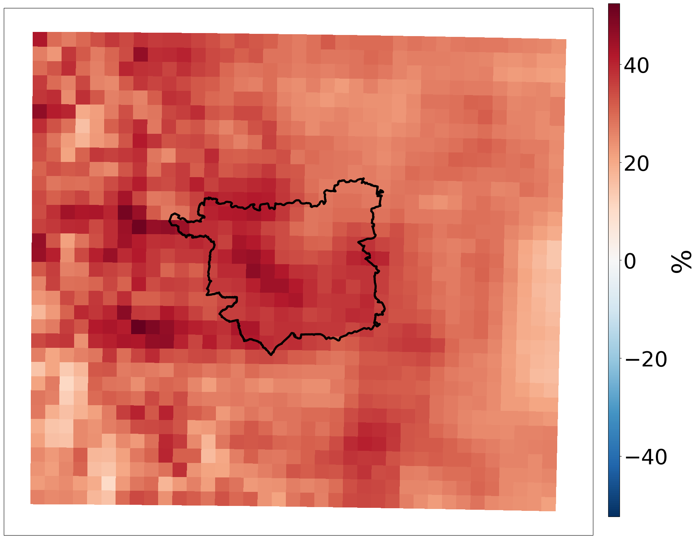
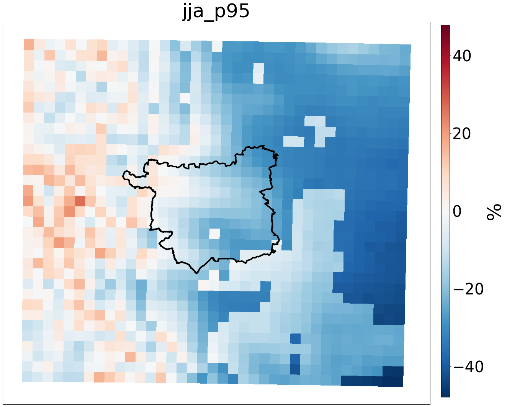
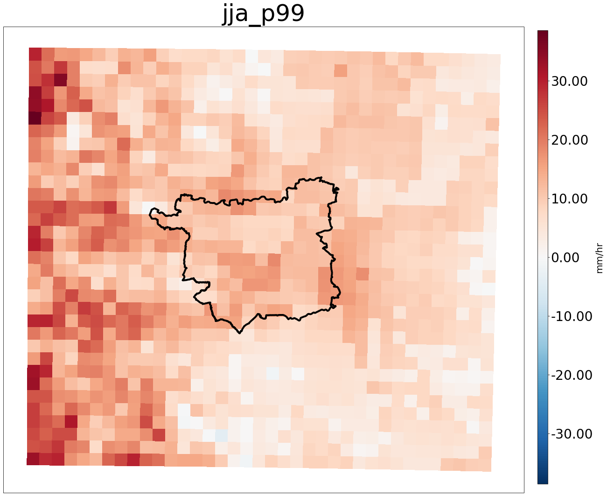
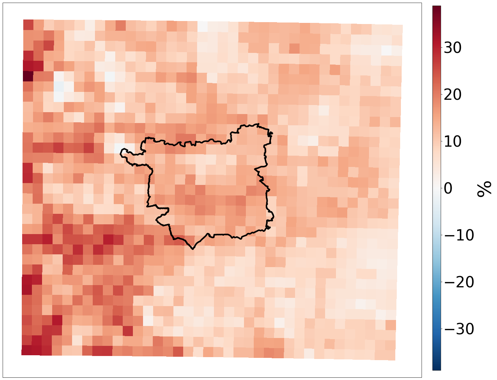
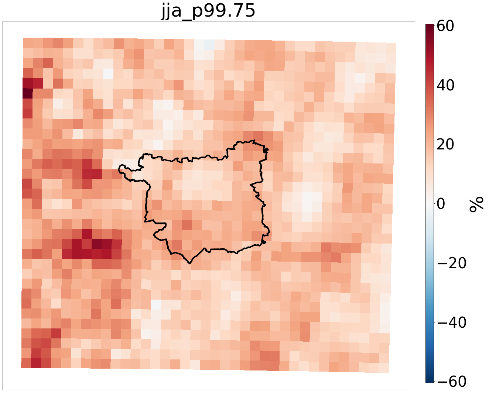
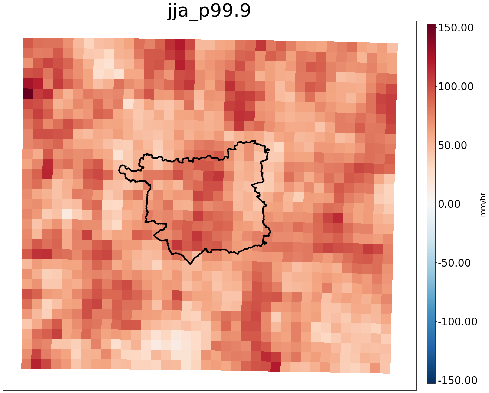
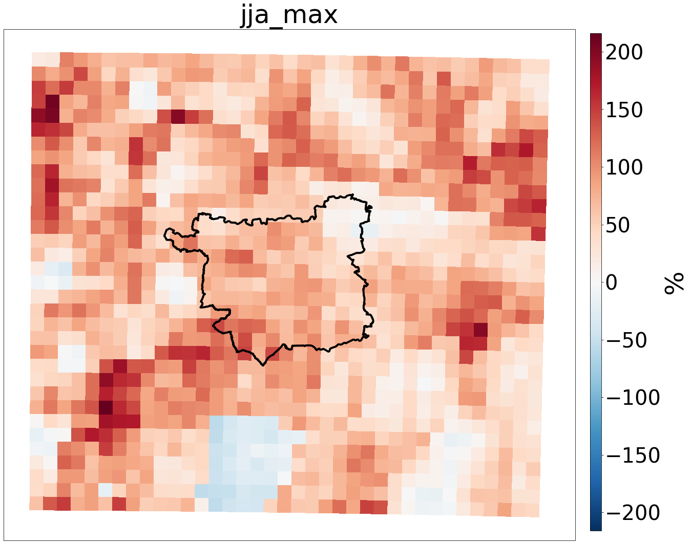
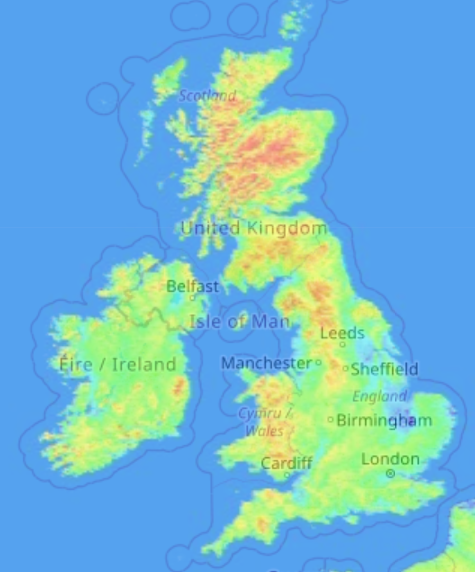
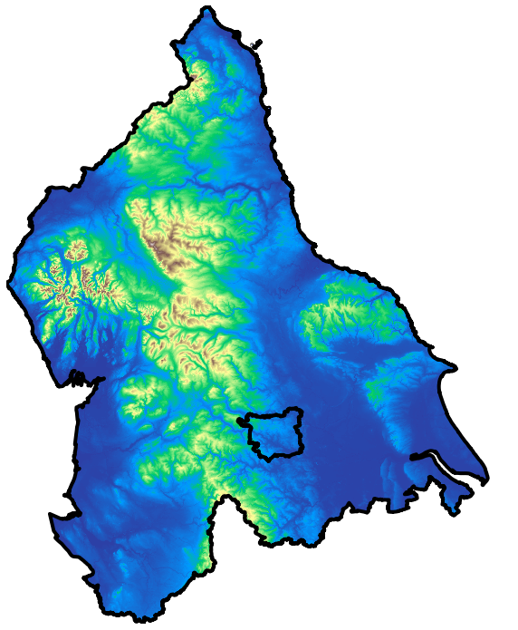
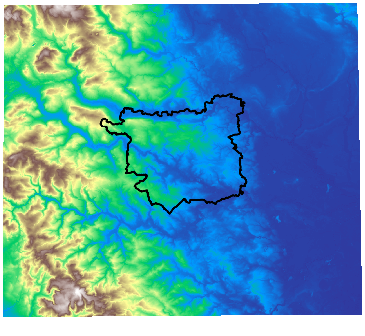

# Percentage difference between Model and Observations

Compare to what's in: https://www.metoffice.gov.uk/binaries/content/assets/metofficegovuk/pdf/research/ukcp/ukcp18_cpm_launch_kendon_sept19-20190926_with-notes.pdf
This looks at wet day frequency - could I calculate this?

The mean value across the twelve UKCP18 2.2km model ensemble members are calculated for various statistics of present day rainfall. The difference between these mean values and those found in the CEH-GEAR observations data, regridded to 2.2km, are then calculated to establish the presence of model bias.

RCMs -- have a tendency for light rainfall events to occur too often ('drizzle effect') and for extreme rainfall events to be under represented.
CPMs -- have a tendency to simulate heavy rainfall events as too intense

            
            
            
            
            
            
            
               

 Figure 1. The percentage difference between UKCP18 2.2km local and CEH-GEAR observations regridded to 2.2km for various precipitation statistics (model value - obs value/obs value) 

For the 99.5, 99.75th and 99.9th percentiles and the maximum precipitation intensities, the modelled values are higher than the observations across the whole country (check if some of the values are 0?). The maximum percentage difference between these values gets higher at higher percentiles, up to a maximum difference of 800% in the maximum values. The model gets the values of extremes too high. 
For the lower percentiles (95th, 97th, 99th) and the mean, there is a geographical divide in the difference between the model and the observations. The model overpredicts (compared to the observations) over the Pennines and Scottish hills; however, this same effect is not seen over the Welsh hills or in higher elevation areas in the South. This difference is surprising (would expect the model to be higher than the observations everywhere). The particularly high percentage difference between the model and observations over the mountains could be because there are less/no gauges in these areas and so the observations values in these areas are smoothed (check CEH-GEAR rain gauge map and plot distance to nearest gauge over whole of UK). It is also possible that the observations dataset is corrected to account for this factor. The map doesn't present as a map of rain gauges, so this is encouraging that the influence of the interpolation of the gauge data is not too significant.

There is a considerable difference in the spatial patterns between the maximum and the higher percentiles, and the mean and the lower percentiles. In some cases, for instance the area over Leeds (see Figure X) there is an opposite trend in the lower percentiles (P95 and P97) compared to the higher percentiles, specifically with the model underpredicting in the lower percentiles, and the model overpredicting in the higher percentiles.  

            
            
            
            
            
            
            
               

Figure 2. The difference between UKCP18 2.2km local and CEH-GEAR observations regridded to 2.2km for various precipitation statistics 

            
            
            
            
            
            
            
               

Figure 3. The difference between UKCP18 2.2km local and CEH-GEAR observations regridded to 2.2km for various precipitation statistics 

            
            
             

 Figure 1. The percentage difference between UKCP18 2.2km local and CEH-GEAR observations regridded to 2.2km for various precipitation statistics (model value - obs value/obs value) 

            

 Figure 1. The percentage difference between UKCP18 2.2km local and CEH-GEAR observations regridded to 2.2km for various precipitation statistics (model value - obs value/obs value) 

# Difference between Model and Observations

The mean value across the twelve UKCP18 2.2km model ensemble members are calculated for various statistics of present day rainfall. The difference between these mean values and those found in the CEH-GEAR observations data, regridded to 2.2km, are then calculated to establish the presence of model bias.

            
            
            
            
            
            
            
               

 Figure 1. The difference between UKCP18 2.2km local and CEH-GEAR observations regridded to 2.2km for various precipitation statistics  

            
            
            
            
            
            
            
               

Figure 2. The difference between UKCP18 2.2km local and CEH-GEAR observations regridded to 2.2km for various precipitation statistics 

            
            
            
            
            
            
            
               

Figure 3. The difference between UKCP18 2.2km local and CEH-GEAR observations regridded to 2.2km for various precipitation statistics 

