### Leeds

  

          
          

 Figure 1. JJA mean for all hours (left) and wet hours with >0.1mm/hr precipitation (right) 

            
            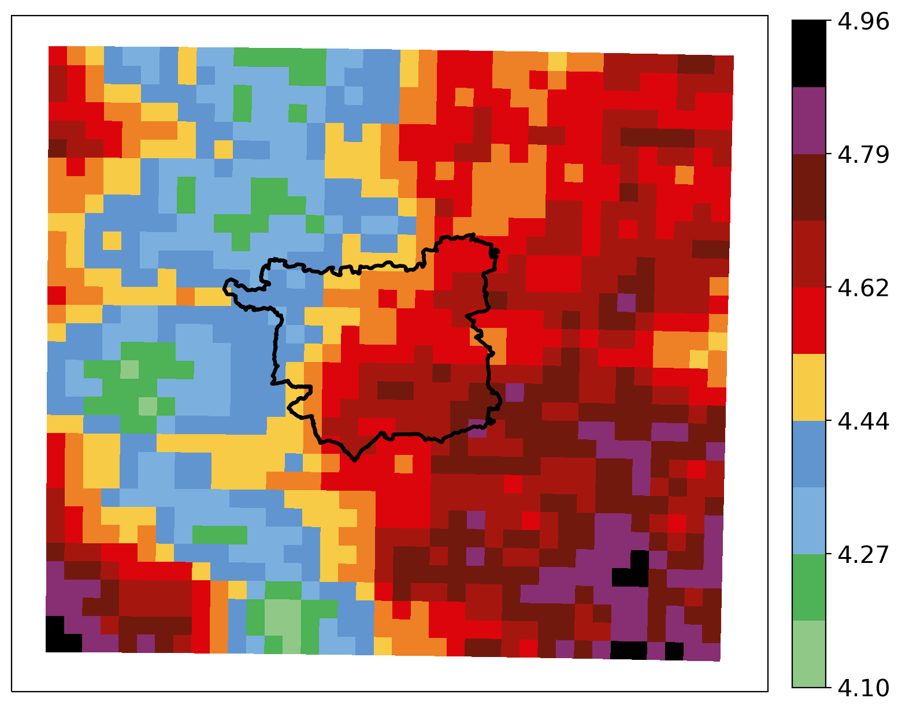
          

Figure 2. JJA 95th Percentile for all hours (left) and wet hours with >0.1mm/hr precipitation (right) 

            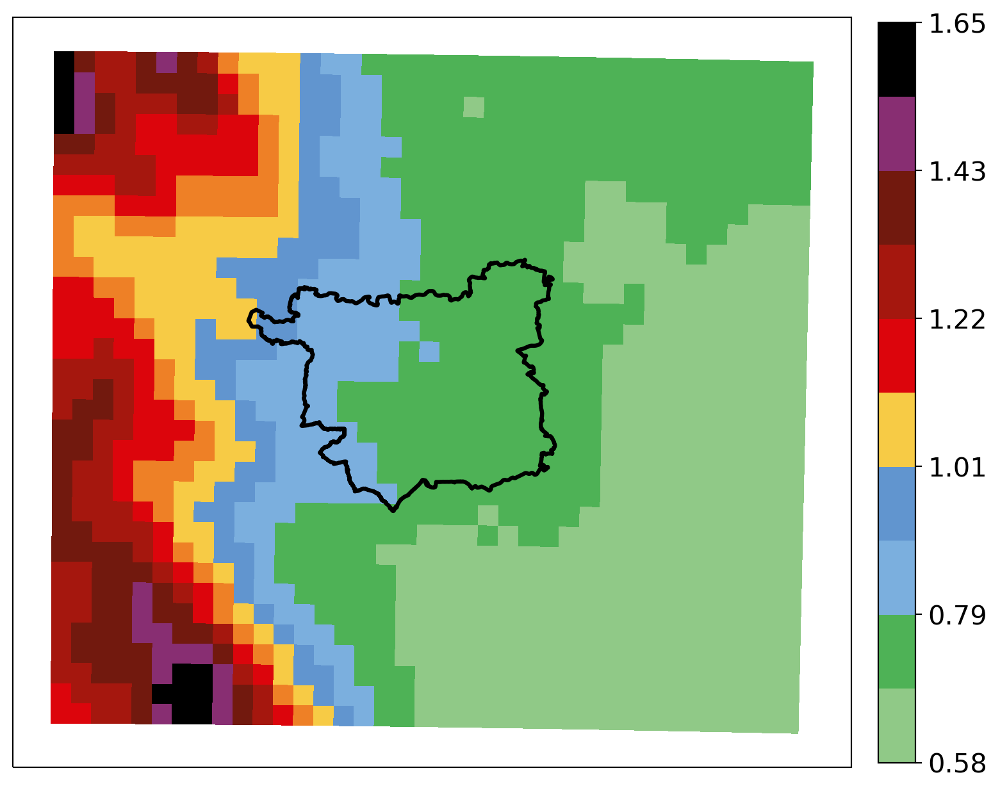
            
          

 Figure 3. JJA 97th Percentile for all hours (left) and wet hours with >0.1mm/hr precipitation (right) 

              
              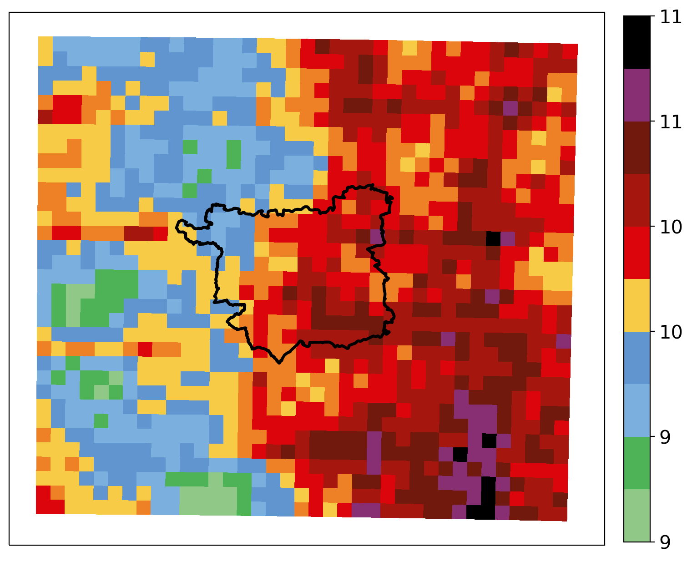
            

 Figure 4. JJA 99th Percentile for all hours (left) and wet hours with >0.1mm/hr precipitation (right) 

            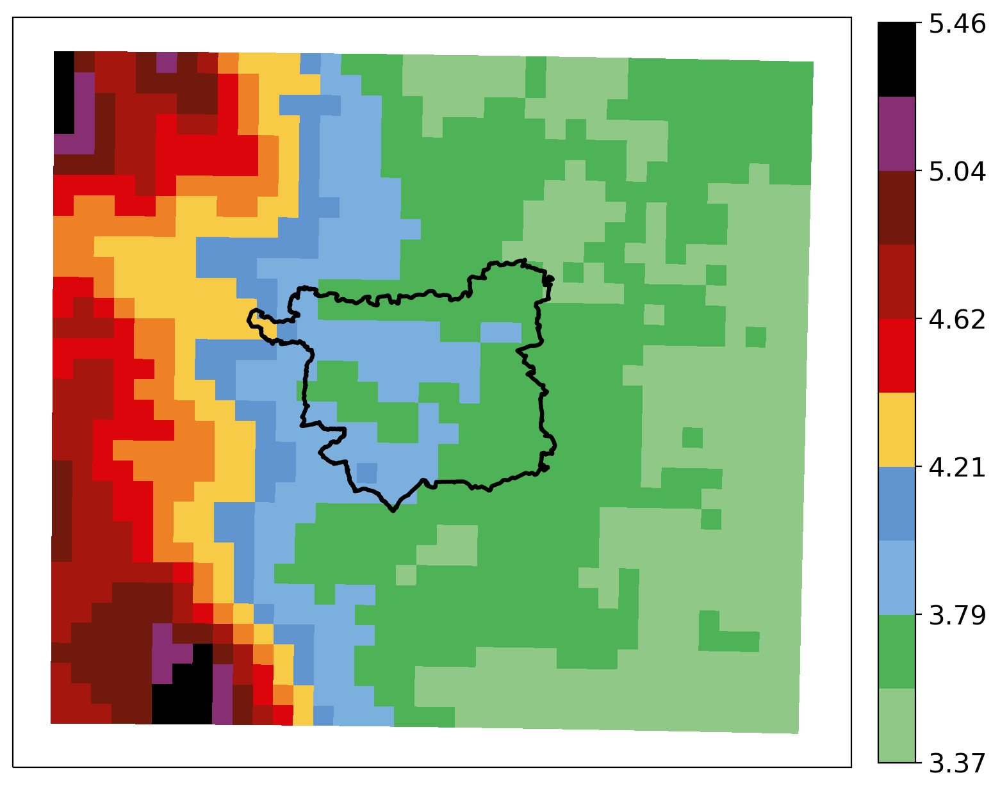
            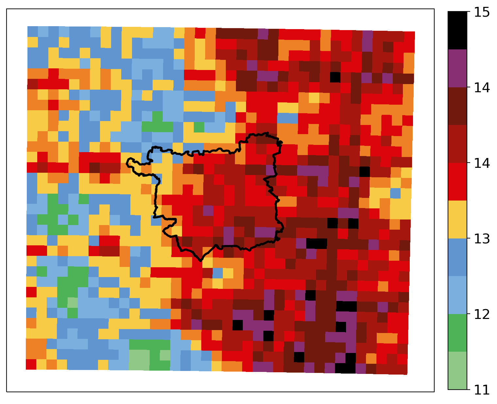
          

 Figure 5. JJA 99.5th Percentile for all hours (left) and wet hours with >0.1mm/hr precipitation (right) 

            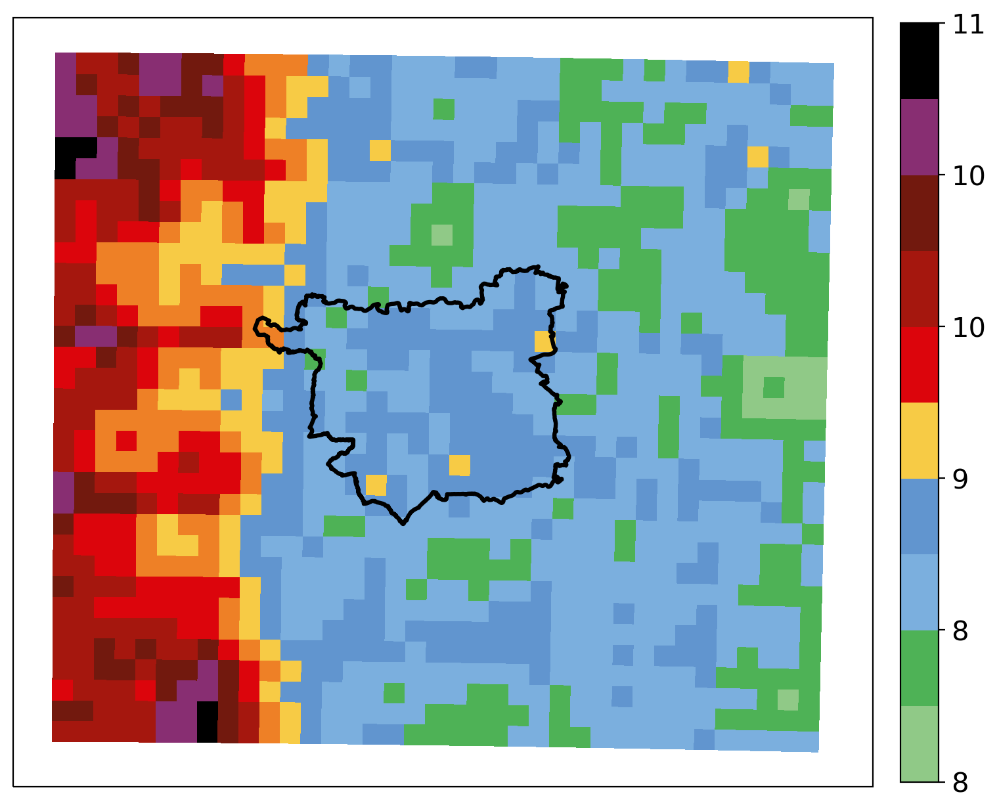
            
          

 Figure 6. JJA 99.75th Percentile for all hours (left) and wet hours with >0.1mm/hr precipitation (right) 

            
            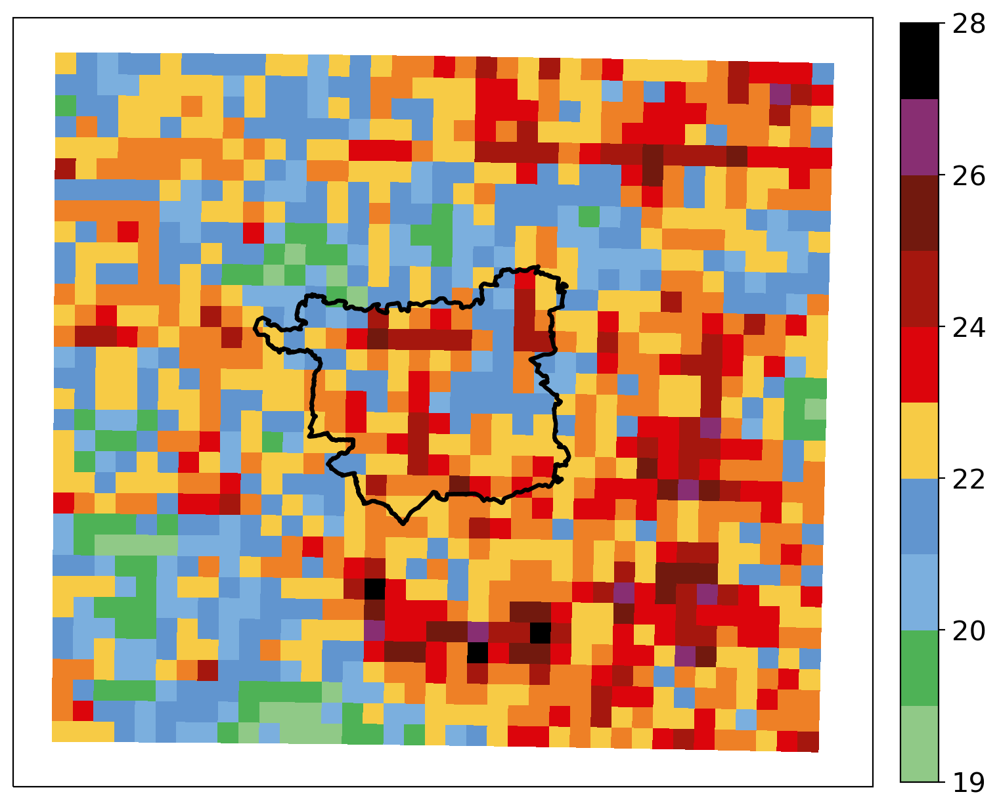
          

 Figure 7. JJA 99.9th Percentile for all hours (left) and wet hours with >0.1mm/hr precipitation (right) 

      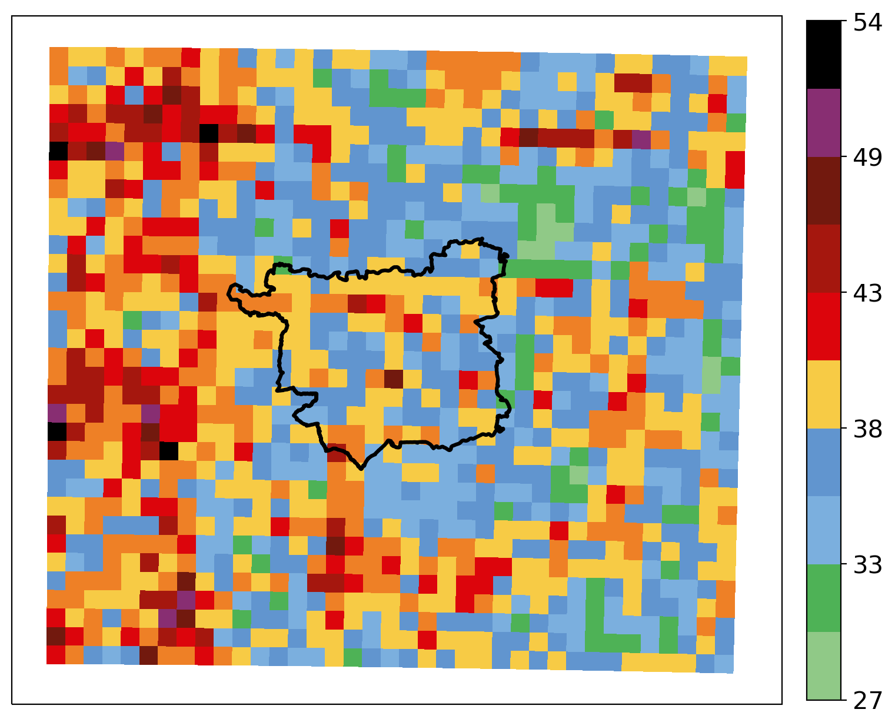
      
    

 Figure 8. JJA max for all hours (left) and wet hours with >0.1mm/hr precipitation (right) 
  

### Northern region     

        
        

 Figure 1. JJA mean for all hours (left) and wet hours with >0.1mm/hr precipitation (right) 

          
          
        

 Figure 2. JJA 95th Percentile for all hours (left) and wet hours with >0.1mm/hr precipitation (right) 

          
          
        

 Figure 3. JJA 97th Percentile for all hours (left) and wet hours with >0.1mm/hr precipitation (right) 

            
            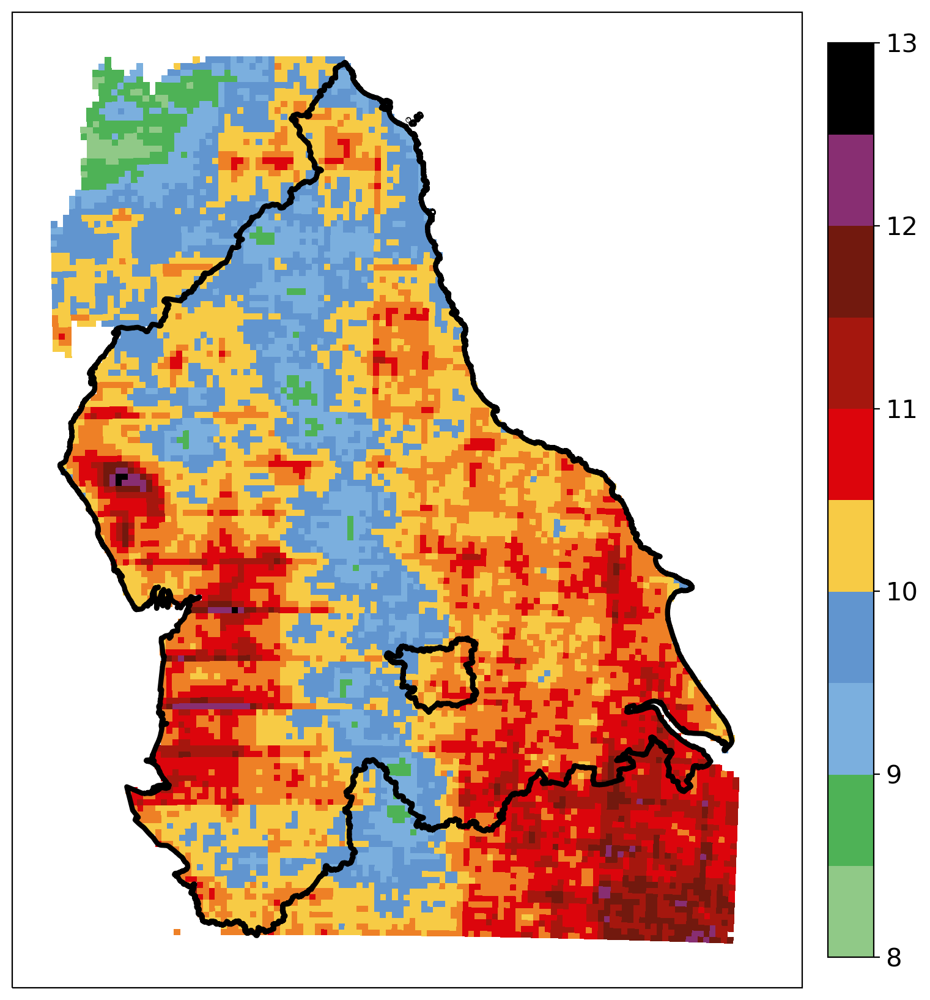
          

 Figure 4. JJA 99th Percentile for all hours (left) and wet hours with >0.1mm/hr precipitation (right) 

          
          
        

 Figure 5. JJA 99.5th Percentile for all hours (left) and wet hours with >0.1mm/hr precipitation (right) 

          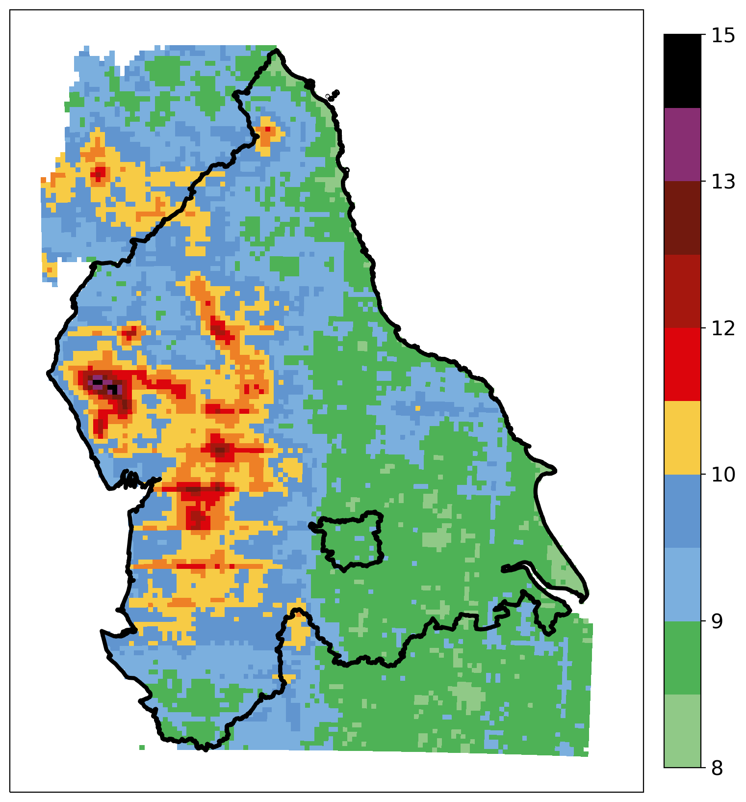
          
        

 Figure 6. JJA 99.75th Percentile for all hours (left) and wet hours with >0.1mm/hr precipitation (right) 

          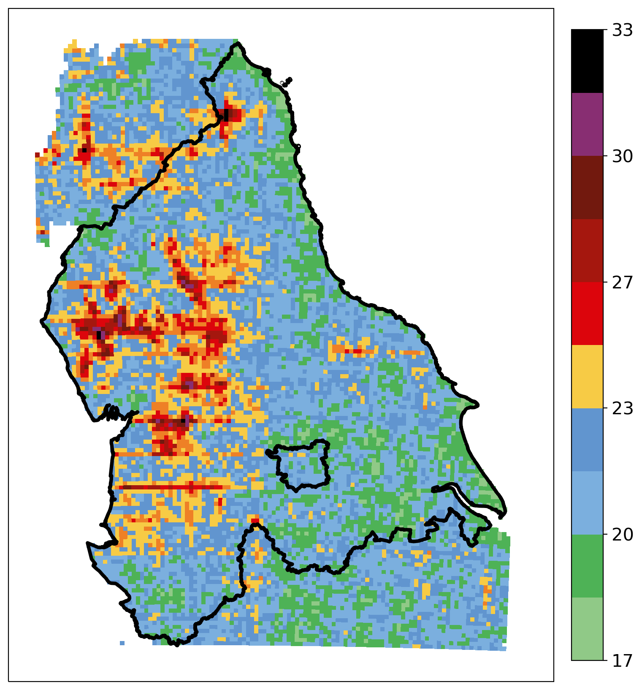
          
        

 Figure 7. JJA 99.9th Percentile for all hours (left) and wet hours with >0.1mm/hr precipitation (right) 

    
    
  

 Figure 8. JJA max for all hours (left) and wet hours with >0.1mm/hr precipitation (right) 
  
