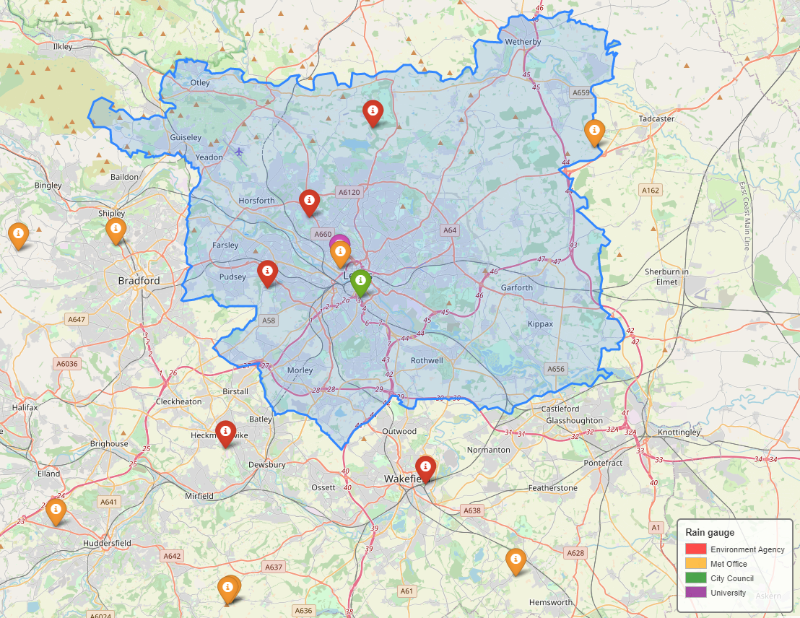

# Rainfall observations
## Rain Gauges
The location of rain gauges in and around the Leeds area which supply sub-hourly rainfall measurements is shown in Figure 1, and further details of these are provided in Table 1. These gauges are operated by the Environment Agency, Met Office, University and City Council, and further details for each of these are provided below.

  

 Figure 1. Location of rain gauges in area surrounding Leeds 

 Table 1. Details of rain gauges proximal to Leeds city region 

  

#### City Council
Data from six rain gauges operated by Leeds City Council for 2014-2018 is provided online via Leeds Data Mill (https://datamillnorth.org/dataset/rain-gauge-rainfall-data) or on the Government website (https://data.gov.uk/dataset/2db7bc77-bf91-49d7-a6b4-df003ae415bd/rain-gauge-rainfall-data). The gauge locations are mostly out with the inner city (Allerton Bywater; Middleton; Shadwell; Wetherby; Pottery Fields (not 2018); Otley (not in lots of them)). Only daily rainfall accumulations are provided for these locations.

Additionally, rainfall accumulations at 15 minute intervals are available at Pottery Fields from 2013-2016 (https://datamillnorth.org/dataset/pottery-fields-rain-gauge-rainfall-data). This data was said to have been released as a one-off extra dataset to supplement the existing rain gauge data for flood hack event at ODI.

#### Met Office
Met Office rain gauge data is available as part of the Met Office Integrated Data Arichive System (MIDAS) and is downloadable from CEDA (https://catalogue.ceda.ac.uk/uuid/5dd1ca58159640cf9c0f27d40f7062ec), although access to the data has to be first granted.

The location of MIDAS stations are mapped here: http://archive.ceda.ac.uk/cgi-bin/midas_stations/midas_googlemap.cgi and you can view MIDAS stations in West Yorkshire here: http://archive.ceda.ac.uk/cgi-bin/midas_stations/search_by_county.cgi.py?county=WEST+YORKSHIRE&minyear=&maxyear=. But it's not clear whether data is accessible for these stations anywhere (only those locations marked on the map in Figure 1 have data available on CEDA)

#### Environment Agency
The Environment Agency are required to provide flood warning and water resource assessment at much higher resolution than Met Office rain gauge network is currently capable of and so they run their own network of automatic rain gauges across England. They have approximately 1000 rain gauges giving 15 minute readings.

The most recent 100 readings (15 minute accumulations) from each rain gauge can be accessed through their Rainfall API demonstrator: https://environment.data.gov.uk/flood-monitoring/assets/demo/index.html. Historic rainfall data for the past 12 months is available to download from the Environment Agency archive: http://environment.data.gov.uk/flood-monitoring/archive. It is noted that none of this data is validated and thus could potentially contain errors due to faulty instruments or on-site maintenance.

To acquire quality controlled, historic (more than a year old) data enquiries should be sent to enquiries@environment-agency.gov.uk (https://support.environment.data.gov.uk/hc/en-gb/articles/360009246272-How-do-I-get-historic-rainfall-data)

## Gridded observations data (CEH-GEAR1hr)
Gridded hourly precipitation values were produced by temporally disaggregating CEH-GEAR daily, a pre-existing validated and quality controlled gridded daily precipitation dataset. The CEH-GEAR daily dataset is produced using a natural neighbour interpolated method and using data solely from Met Office rain gauges (Lewis et al, 2018).

CEH-GEAR daily was temporally disaggregated using a dataset of quality controlled data from hourly rainfall gauges. This dataset was originally compiled by Blenkinsop et al (2017), with data from some additional gauges being added by Lewis et al (2018), alongside application of some further quality control procedures. CEH-GEAR1hr uses data from 1903 quality controlled rain gauges compiled from three sources:
•	UK MIDAS - 216 gauges
•	UK Environment Agency - 1300 gauges
•	SEPA - 141 gauges
The data record at most of these gauges commenced in the early to mid-1990s, and most of the gauges have some missing data.

"Given the relatively high rainfall gauge network density in the UK, a simple nearest neighbour interpolation without height correction was used to preserve a real storm shape for every grid square. This was considered to be beneficial as it will preserve extreme hourly rainfall intensities whereas other interpolation methods will smooth these extremes out. A limitation of this approach is that convective events can be very small and therefore nearest neighbour may sometimes represent a convective storm over too large an area. How-ever, as it is the hourly rainfall fractions that are interpolated here, the actual rainfall total is modulated by the daily rainfall dataset, which is smoothed, meaning that this effect is reduced."  

  

 Figure 2. Location of hourly rain gauges used in construction of CEH-GEAR 

  

 Figure 3. Outline of Leeds city region, with location of Met Office gauges (orange) and Environment Agency gauges (red), and cells coloured by distance to the nearest rain gauge used in the CEH-GEAR1hr dataset production 

