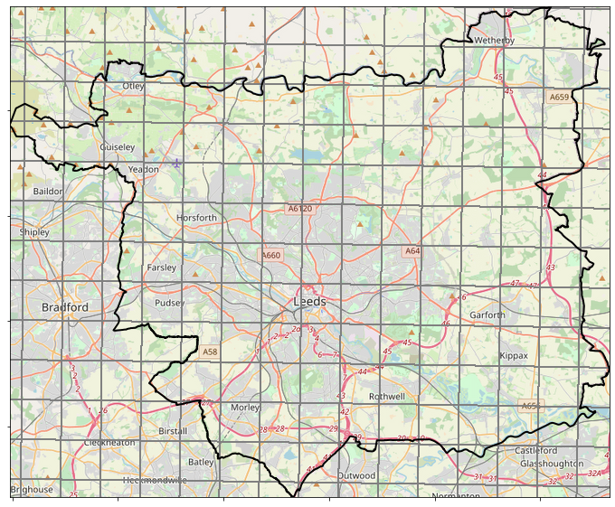
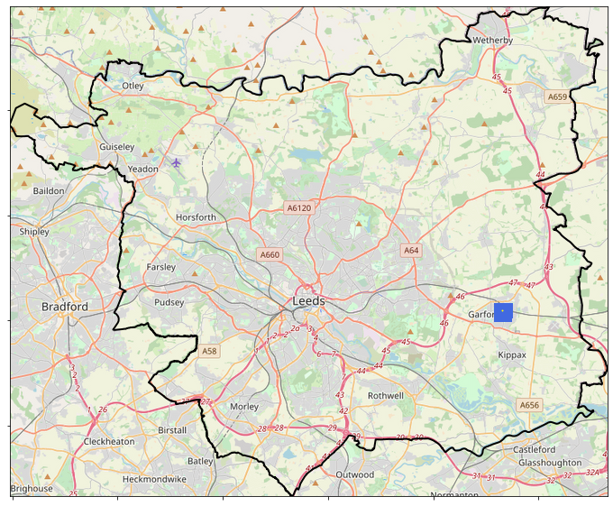
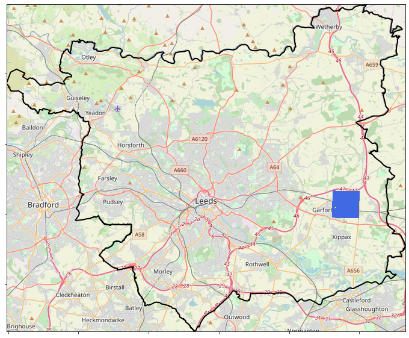

## Regridding

There are two main data sources being used in this analysis:
* UKCP18 2.2km model data
* CEH-GEAR 1km observations

In order to use the observations to validate the model data it is necessary to convert the two datasets to a common resolution.
Iris provides functionality to regrid the cube data from one model, using the horizontal grid of another cube. For instance, in this case regridding the 1km observations cube using the 2.2km horizontal grid from the model cube. A linear regridding scheme is used which calculates the value at a point by extending the gradient of the closest two points.

  
   

<ins> Example </ins>  

It is important to determine the affect of regridding on the data, and particularly on extreme values which can be smoothed in the  

Comparing

  
   

