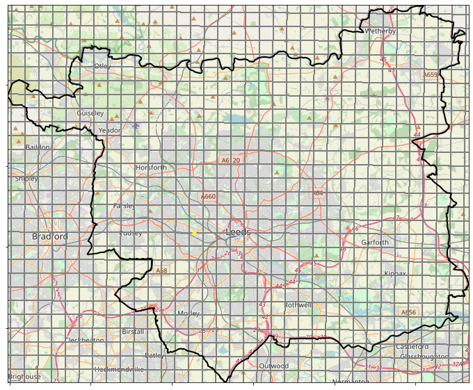
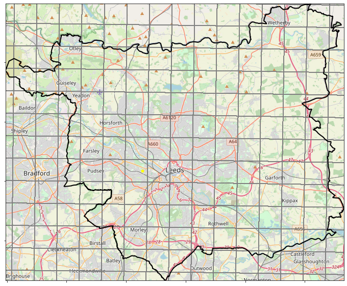

# Regridding

There are two main data sources being used in this analysis:
* UKCP18 2.2km model data
* CEH-GEAR 1km observations

The layout of these grids over the Leeds region can be seen in Figure 1. 

  
  

 Figure 1. Layout of 1km observations grid (model) and 2.2km model grid (right) 

In order to use the observations to validate the model data it is necessary to convert the two datasets to a common resolution.  In this case, the objective is to regrid the 1km observations cube using the 2.2km horizontal grid from the model cube. Regridding involves converting the grid on which data is provided and aims to ensure that the quality of the data being regridded is maintained on the new grid.

There are a number of regridding algorithms which use different methods to transfer information from one grid to the other. Iris provides several different methods to regrid one cube using the horizontal cube of another:
* Linear regridding: The concept of linear regridding is based upon an assumption that the rate of change in value between two known points is constant and can be derived from a simple slope formula. Consequently, the value at an unknown point can be derived from using this gradient (/rate of change) between its closest two points.  
* Nearest Neighbour regridding: In nearest neighbour regridding points take their value from the nearest source point 
* Area weighted regridding:

## Code work flow
* CEH-GEAR_reformat_and_regrid.py:   
  * Reformats the observations data so it can be used in Iris regridding functionality; and
  * Performs regridding to the same format as the 2.2km UKCP18 cube.  
  * Saves a netCDF copy of both the reformatted observations and regridded observations.
* Check_reformat.py: 
  * Checks the reformatting process above works. Checks similarity between max/mean values between original and reformatted data and checks plotting.
* TestingRegridding_CreateTimeSeries.py: 
  * Finds the grid cell covering a point of interest for both the original and reformatted observations data.  
  * Creates a csv containing a 20 year time series of data at this location.    
* TestingRegridding_plotPDFs.py: 
  * Uses the timeseries from above to plot PDFs and percentile threshold plots.

## Questions
* Comparing PDF for the grid containing a point location; however, one of these grid cells is over double the size of the other so is this a fair comparison?
* Comparing PDF over a wider area: but if e.g. select 9 grid cells closest to the point of interest this will result in quite significantly areal coverage between the original 1km and regridded 2.2km data. Should they cover same area to be comparable? If just looked at all grid cells covering an area e.g. Leeds this would be very slow (loading 20 years of data for just one grid cell is slow).

## Next steps
* Look at observations from rain gauge data and cross-check the CEH-GEAR data with these as well
* Once satisfied with the regridded observations, plot the observations over the UK for various stats as have done with the model data. Then create difference plots (difference between each EM and the observations).

