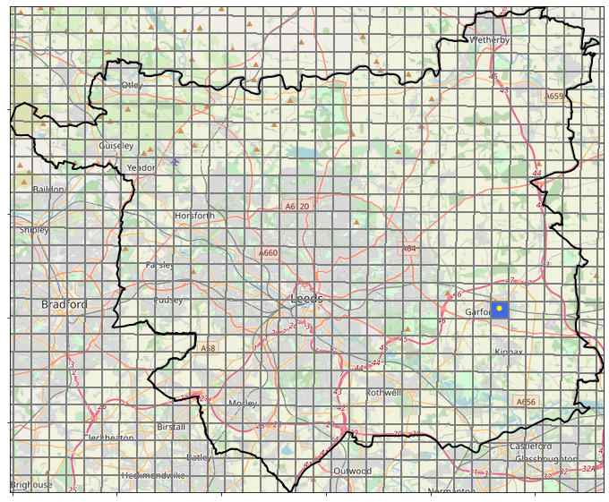
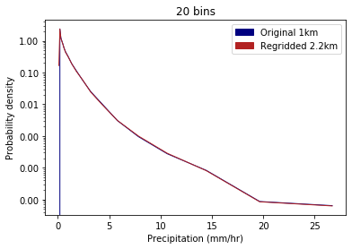
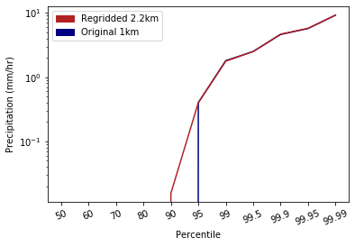
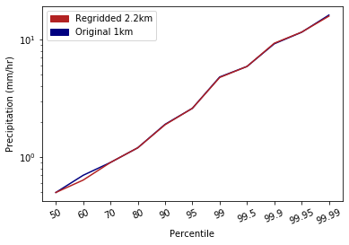
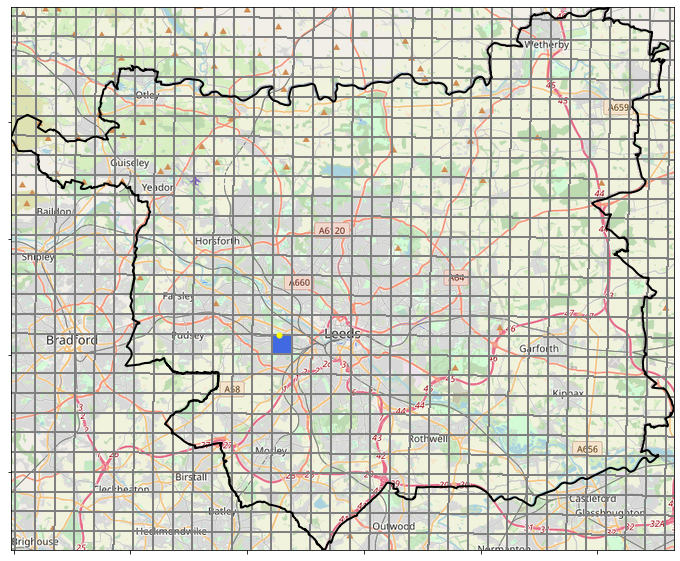
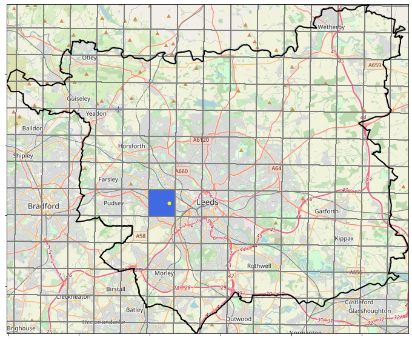
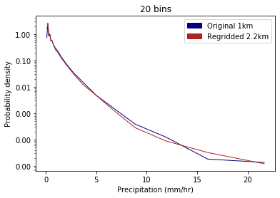
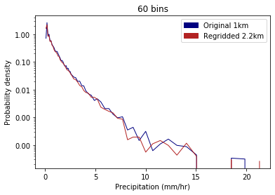
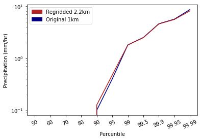
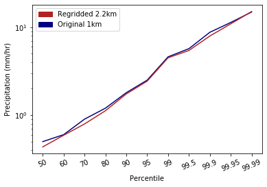

# Regridding

There are two main data sources being used in this analysis:
* UKCP18 2.2km model data
* CEH-GEAR 1km observations

The layout of these grids over the Leeds region can be seen in Figure 1. 

In order to use the observations to validate the model data it is necessary to convert the two datasets to a common resolution.  
Iris provides functionality to regrid cube data using the horizontal grid of another cube. For instance, in this case regridding the 1km observations cube using the 2.2km horizontal grid from the model cube.  

Regridding involves changing the grid on which data values are provided, whilst ensuring that the qualities of the data are preserved. This is done using the horizontal grid of another cube.

Iris offers a number of methods by which to perform this regridding:
* Linear regridding: extrapolation point will be calculated by extending the gradient of the closest two points.

Linear interpolation is a simple technique used to estimate unknown values that lie between known values. The concept of linear interpolation relies on the assumption that the rate of change between the known values is constant and can be calculated from these values using a simple slope formula. Then, an unknown value between the two known points can be calculated using one of the points and the rate of change. Linear interpolation is a relatively straightforward method, but is often not sophisticated enough to effectively interpolate station data to an even grid.

* Nearest neighbour regridding: extrapolation points take their value from the nearest source point 

## Code work flow
* CEH-GEAR_reformat_and_regrid.py:   
  * Reformats the observations data so it can be used in Iris regridding functionality; and
  * Performs regridding to the same format as the 2.2km UKCP18 cube.  
  * Saves a netCDF copy of both the reformatted observations and regridded observations.
* Check_reformat.py: 
  * Checks the reformatting process above works. Checks similarity between max/mean values between original and reformatted data and checks plotting.
* TestingRegridding_CreateTimeSeries.py: 
  * Finds the grid cell covering a point of interest for both the original and reformatted observations data.  
  * Creates a csv containing a 20 year time series of data at this location.    
* TestingRegridding_plotPDFs.py: 
  * Uses the timeseries from above to plot PDFs and percentile threshold plots.

## Testing the impact of regridding on data values (including extremes)

It is important to determine the affect of regridding on the data, and particularly on extreme values which can be smoothed in the regridding process. To test this, a location with specific coordinates is defined and the grid cell which covers this point is determined for both the native 1km and regridded 2.2km observations data. The hourly observations are then extracted from the appropriate grid cell over the period for which data is available (1990-2014).   

Using this data, PDFs of precipitation rates are plotted for both the original 1km data and the regridded 2.2km data, using the method specified at the bottom. 

Hourly rainfall accumulations for a range of percentile thresholds are also plotted for both the regridded 2.2km data and the original 1km data.

### <ins> Example 1: Latitude: 53.79282 and longitude: -1.37818 </ins>

  
  

 Figure 1. Grid cell containing location in east Leeds for 1km grid (left) and 2.2km grid (right) 

  
  
      

 Figure 2. PDF of precipitation rates with log-spaced histogram bins  

  
  

 Figure 3. Hourly rainfall accumulations for percentile thresholds including all hours (left) and wet-hours with rainfall >0.1mm/hr (right) 

### <ins> Example 2: Latitude: 53.796638 and longitude: -1.592600 </ins>

  
  

 Figure 4. Grid cell containing location in west Leeds for 1km grid (left) and 2.2km grid (right) 

  
  
      

 Figure 5. PDF of precipitation rates with log-spaced histogram bins 

  
  

 Figure 6. Hourly rainfall accumulations for percentile thresholds including all hours (left) and wet-hours with rainfall >0.1mm/hr (right) 

## Questions
* Comparing PDF for the grid containing a point location; however, one of these grid cells is over double the size of the other so is this a fair comparison?
* Comparing PDF over a wider area: but if e.g. select 9 grid cells closest to the point of interest this will result in quite significantly areal coverage between the original 1km and regridded 2.2km data. Should they cover same area to be comparable? If just looked at all grid cells covering an area e.g. Leeds this would be very slow (loading 20 years of data for just one grid cell is slow).

## Next steps
* Look at observations from rain gauge data and cross-check the CEH-GEAR data with these as well
* Once satisfied with the regridded observations, plot the observations over the UK for various stats as have done with the model data. Then create difference plots (difference between each EM and the observations).

#### PDF plotting method
The precipitation rates are aggregated into logarithmic-spaced histogram bins which are adjusted to ensure that none of the bin widths are narrower than one decimal place, as this is the degree to which the data is rounded. Additionally, bin width is rounded down to a multiple of 0.1, so bin edges are always located mid-way on the discretisation interval. The probability density in each bin with mean precipitation rate, P(r), is calculated as:  

P(r) = n(r)/NΔr 

Where n(r) is the number of precipitation rates within the bin, Δr is the width of the bin in mm/hr and N is the total number of measurements in the whole dataset.
