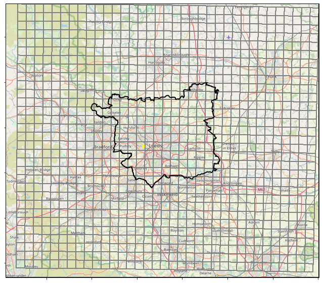
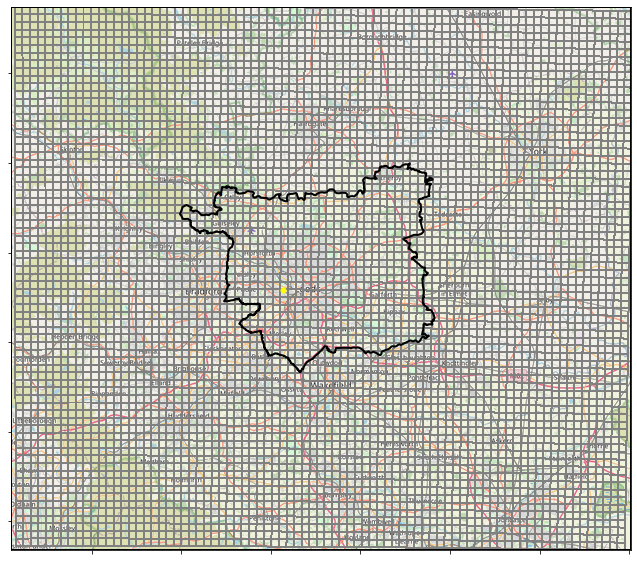

## Testing the impact of regridding on data values 

The impact of regridding on data values is tested here by comparing precipitation values for the grid cell within which a speficied location is found, for both the native 1km and regridded 2.2km observations data. 

  
  

 Figure 1.  

For this grid cell, hourly observations are extracted from the appropriate grid cell over the period for which data is available (1990-2014).

Using this data, PDFs of precipitation rates are plotted for both the original 1km data and the regridded 2.2km data, using the method specified at the bottom.

Hourly rainfall accumulations for a range of percentile thresholds are also plotted for both the regridded 2.2km data and the original 1km data.

PDF of precipitation rates across all cells across region over Leeds

  
  
      

 Figure 1. PDF of precipitation rates with log-spaced histogram bins  

