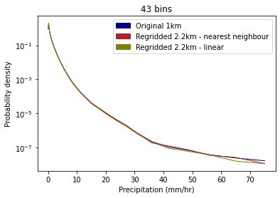
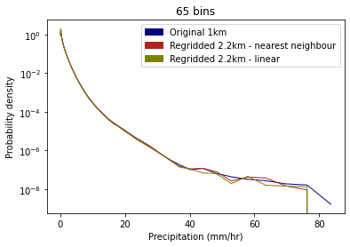
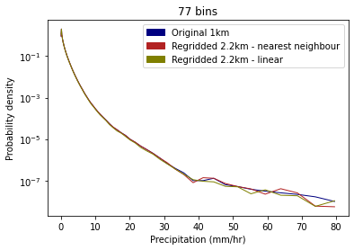

## Testing the impact of regridding on data values 

It is important to determine the affect of regridding on the data, and particularly on extreme values which can be smoothed in the regridding process.  

  
  
      

 Figure 1. PDF of precipitation rates with log-spaced histogram bins  

The hourly observations are then extracted from the appropriate grid cell over the period for which data is available (1990-2014).   

Using this data, PDFs of precipitation rates are plotted for both the original 1km data and the regridded 2.2km data, using the method specified at the bottom. 

Hourly rainfall accumulations for a range of percentile thresholds are also plotted for both the regridded 2.2km data and the original 1km data.
