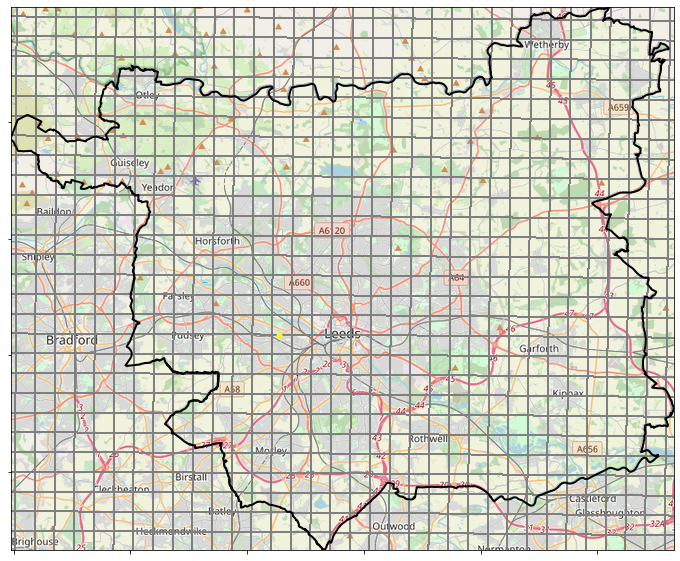
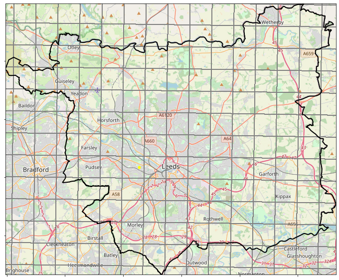

# Regridding

There are two main data sources being used in this analysis:
* UKCP18 2.2km model data
* CEH-GEAR 1km observations

The layout of these grids over the Leeds region can be seen in Figure 1. 

  
  

 Figure 1. Layout of 1km observations grid (model) and 2.2km model grid (right) 

In order to use the observations to validate the model data it is necessary to convert the two datasets to a common resolution.  In this case, the objective is to regrid the 1km observations cube using the 2.2km horizontal grid from the model cube. Regridding involves converting the grid on which data is provided and aims to ensure that the quality of the data being regridded is maintained on the new grid.

There are a number of regridding algorithms which use different methods to transfer information from one grid to the other. Iris provides several different methods to regrid one cube using the horizontal cube of another:
* Linear regridding: The concept of linear regridding is based upon an assumption that the rate of change in value between two known points is constant and can be derived from a simple slope formula. Consequently, the value at an unknown point can be derived from using this gradient (/rate of change) between its closest two points.  
* Nearest Neighbour regridding: In nearest neighbour regridding points take their value from the nearest source point 
* Area weighted regridding: Both linear and nearest neighbour regridding are point based, and sometimes this is not an appropriate approach. According to Iris: "With the AreaWeighted regridding scheme, each target grid-box’s data is computed as a weighted mean of all grid-boxes from the source grid. The weighting for any given target grid-box is the area of the intersection with each of the source grid-boxes. This scheme performs well when regridding from a high resolution source grid to a lower resolution target grid, since all source data points will be accounted for in the target grid...One of the key limitations of the AreaWeighted regridding scheme is that the two input grids must be defined in the same coordinate system as each other. Both input grids must also contain monotonic, bounded, 1D spatial coordinates."

Area weighted regridding is therefore not possible as the 1km observations and 2.2km model data are in different coordinate systems.

## Code work flow
<ins> Reformatting and regridding </ins>
* CEH-GEAR_reformat_and_regrid.py:   
  * Reformats the observations data so it can be used in Iris regridding functionality; and
  * Performs regridding to the same format as the 2.2km UKCP18 cube using both linear and nearest neighbour regridding
  * Saves a netCDF copy of both the reformatted observations and regridded observations.
* Check_reformat.py: 
  * Checks the reformatting process above works. Checks similarity between max/mean values between original and reformatted data and checks plotting.

<ins> Testing reformatting </ins>
* TestingRegridding/IndividualCells/CreateTimeSeriesForGridCell.py
     * Finds the grid cell covering a point of interest for both the original and reformatted observations data.  
     * Creates a csv containing a 20 year time series of data at this location.   
* TestingRegridding/IndividualCells/CompareRegriddedDataPDFs.py
      * Plots PDFs using the regridded and original data
* TestingRegridding/leeds-at-centre/CombineAllYearsDataAcrossRegion.py
      * Data from all cells across the leeds-at-centre region are combined into one array, for both original and regridded data
* TestingRegridding/leeds-at-centre/CompareRegriddedDataPDFs.py
      * These arrays are used to plot PDFs 

## Next steps
* Look at observations from rain gauge data and cross-check the CEH-GEAR data with these as well
* Once satisfied with the regridded observations, plot the observations over the UK for various stats as have done with the model data. Then create difference plots (difference between each EM and the observations).

