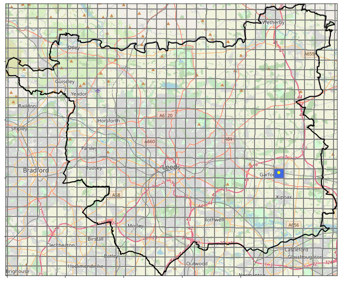
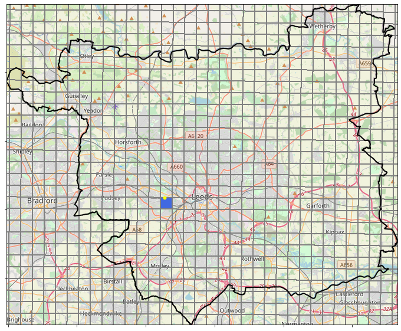
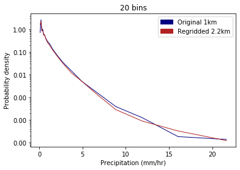
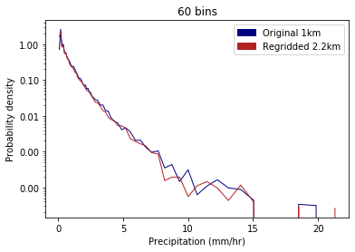

## Testing the impact of regridding on data values 

The impact of regridding on data values is tested here by comparing precipitation values for the grid cell within which a speficied location is found, for both the native 1km and regridded 2.2km observations data. For this grid cell, hourly observations are  extracted from the appropriate grid cell over the period for which data is available (1990-2014).   

Using this data, PDFs of precipitation rates are plotted for both the original 1km data and the regridded 2.2km data, using the method specified at the bottom. 

Hourly rainfall accumulations for a range of percentile thresholds are also plotted for both the regridded 2.2km data and the original 1km data.

### <ins> Example 1: Latitude: 53.79282 and longitude: -1.37818 </ins>

  
  

 Figure 1. Grid cell containing location in east Leeds for 1km grid (left) and 2.2km grid (right) 

  
  
      

 Figure 2. PDF of precipitation rates with log-spaced histogram bins  

  
  

 Figure 3. Hourly rainfall accumulations for percentile thresholds including all hours (left) and wet-hours with rainfall >0.1mm/hr (right) 

### <ins> Example 2: Latitude: 53.796638 and longitude: -1.592600 </ins>

  
  

 Figure 4. Grid cell containing location in west Leeds for 1km grid (left) and 2.2km grid (right) 

  
  
      

 Figure 5. PDF of precipitation rates with log-spaced histogram bins 

  
  

 Figure 6. Hourly rainfall accumulations for percentile thresholds including all hours (left) and wet-hours with rainfall >0.1mm/hr (right) 

### Questions
* Comparing PDF for the grid containing a point location; however, one of these grid cells is over double the size of the other so is this a fair comparison?

### PDF plotting method
The precipitation rates are aggregated into logarithmic-spaced histogram bins which are adjusted to ensure that none of the bin widths are narrower than one decimal place, as this is the degree to which the data is rounded. Additionally, bin width is rounded down to a multiple of 0.1, so bin edges are always located mid-way on the discretisation interval. The probability density in each bin with mean precipitation rate, P(r), is calculated as:  

P(r) = n(r)/NΔr 

Where n(r) is the number of precipitation rates within the bin, Δr is the width of the bin in mm/hr and N is the total number of measurements in the whole dataset.

