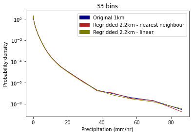

## Testing the impact of regridding on data values 

The impact of regridding on data values is tested here by comparing precipitation values from across all grid cells covering the 'leeds-at-centre' region for both the native 1km and regridded 2.2km observations data, shown in Figure 1. For the 1km grid, this includes 6059 grid cells (73 x 83), and for the 2.2km grid it includes 1221 cells (33 x 37).

  
  

 Figure 1. Layout of 2.2km (left) and 1km (grid) over 'leeds-at-centre' region. NB: some of the grid is msising in the bottom left hand corner because the only way I could get it to plot was by using the matplotlib pcolormesh rather than iplt.pcolormesh and finding the corner coordinates. 

In each case, across all the grid cells within this area, all hourly precipitation observations are extracted over the whole period for which data is available (1990-2014).

Using this data, PDFs of precipitation rates are plotted for both the original 1km data and the regridded 2.2km data, using the method specified at the bottom.

   
  
    
  
  
  
    
  
  
    
  
    

 Figure 1. PDF of precipitation rates with log-spaced histogram bins  

NB: The amount of data included in the regridded plot is much less than for the original data - this could have impact on tails of data.

#### Notes from Steef
When you perform nearest neighbour interpolation, effectively this is like selecting one out of every ~5 points in the data. This will mean that the variations/uncertainty in the highest bins becomes larger, and you may miss out on the single highest value in the data (this is visible in e.g. the plot with 65 bins).  
The linear interpolation means that you will also have fewer values and hence more variation/uncertainty at higher values, but you will also lose some of the extreme values due to interpolation (i.e, the yellow line will generally be below the other lines for high values, though again there may be some scatter). 

