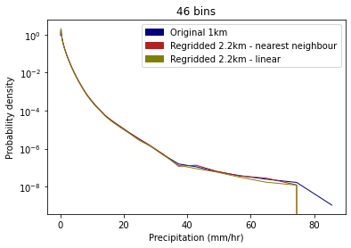

## Testing the impact of regridding on data values 

The impact of regridding on data values is tested here by comparing precipitation values from across all grid cells covering the 'leeds-at-centre' region for both the native 1km and regridded 2.2km observations data, shown in Figure 1. For the 1km grid, this includes 6059 grid cells (73 x 83), and for the 2.2km grid it includes 1221 cells (33 x 37).

  
  

 Figure 1. Layout of 2.2km (left) and 1km (grid) over 'leeds-at-centre' region. NB: some of the grid is msising in the bottom left hand corner because the only way I could get it to plot was by using the matplotlib pcolormesh rather than iplt.pcolormesh and finding the corner coordinates. 

In each case, across all the grid cells within this area, all hourly precipitation observations are extracted over the whole period for which data is available (1990-2014).

Using this data, PDFs of precipitation rates are plotted for both the original 1km data and the regridded 2.2km data, using the method specified at the bottom.

   
  
    
  
  
  
    
  
  
    
  
    

 Figure 1. PDF of precipitation rates with log-spaced histogram bins  

For both regridding methods the data is less smooth, and therefore contains more variation in the values, than in the original 1km data. The nearest neighbour regridding method adds scatter to the data. Nearest neighbour regridding involves selecting one out of every ~5 points in the data, and thus inevitably some of the variation/uncertainty in the highest data bins becomes larger. It is also possible that the highest value(s) in the dataset may not be included (this can be seen, e.g. in the plot with 65 bins). However, nearest neighbour regridding is more likely to preserve data extremes than linear regridding. In linear regridding values are derived as an average of the values at two neighbouring points, because the most extreme values in two grid cells are unlikely to occur at exactly the same time, this means that extremes can be smoothed out from the data.  

The appearance of the PDF plots is dependent upon the number of bins, and where these bins happen to slice the data. The aim is to find a number of bins(/bin size) that preserves the behaviour of the data and avoids the presence of artefacts in the results due to sample size. These artefacts can be seen in the plots with 65 and 77 bins.

Exactly how the PDFs look depends on where the bins happen to slice the data. Need a bin size that preserves behaviour and doesn't show artefacts due to the sample size. For instance, this can be seen in the plots with 46, 65 and 77 bins where there are some empty bins in the regridded data (probably because there is much less data values in the regridded data, than the original data and so this effects the tails of the data). Thus, the most useful plots here are those with < 45 bins. Considering the plots with <45 bins, we see that the nearest neighbour regridding and the linear regridding produce broadly similar results, although in a couple of places the nearest neighbour regridded data appears to be a better fit to the observations line. 

