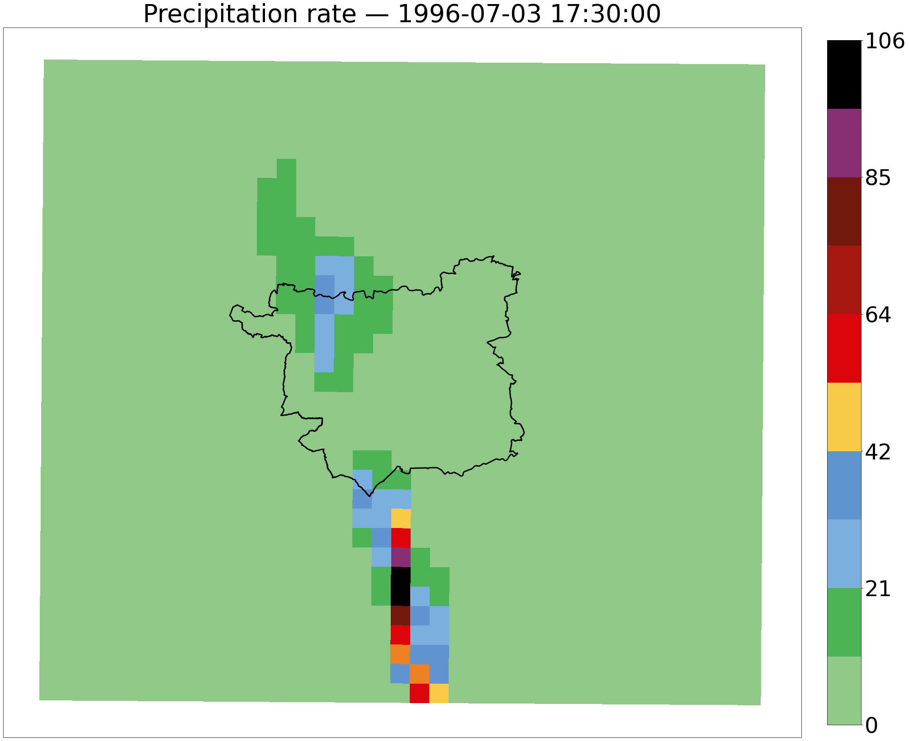
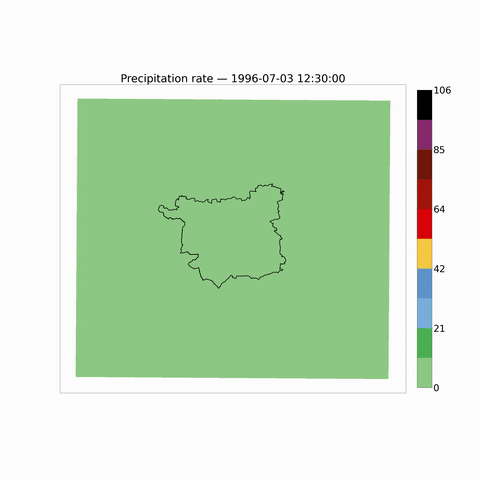
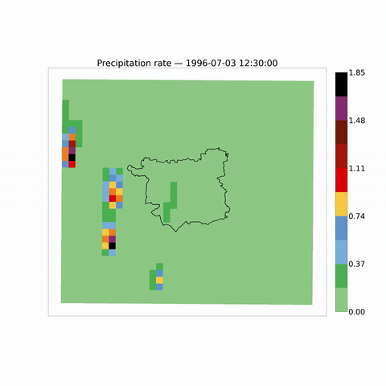
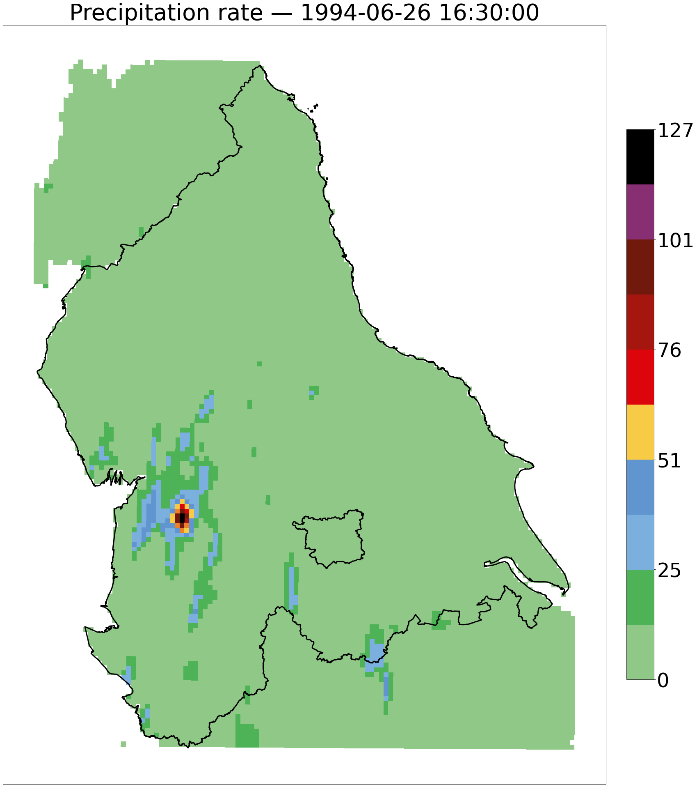
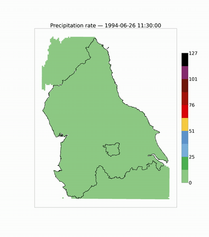
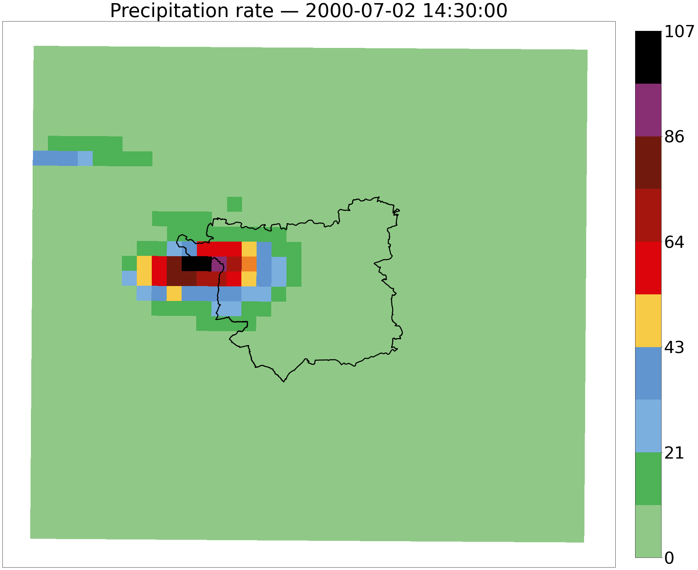
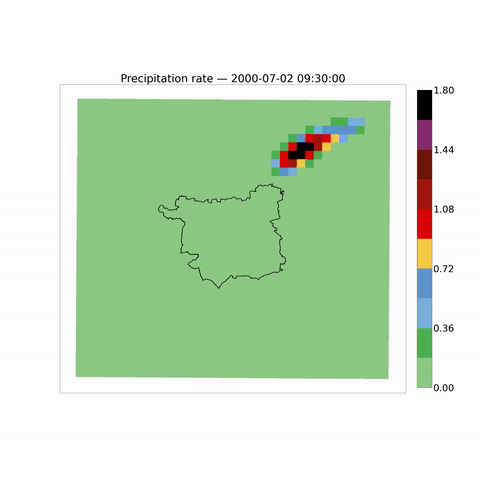
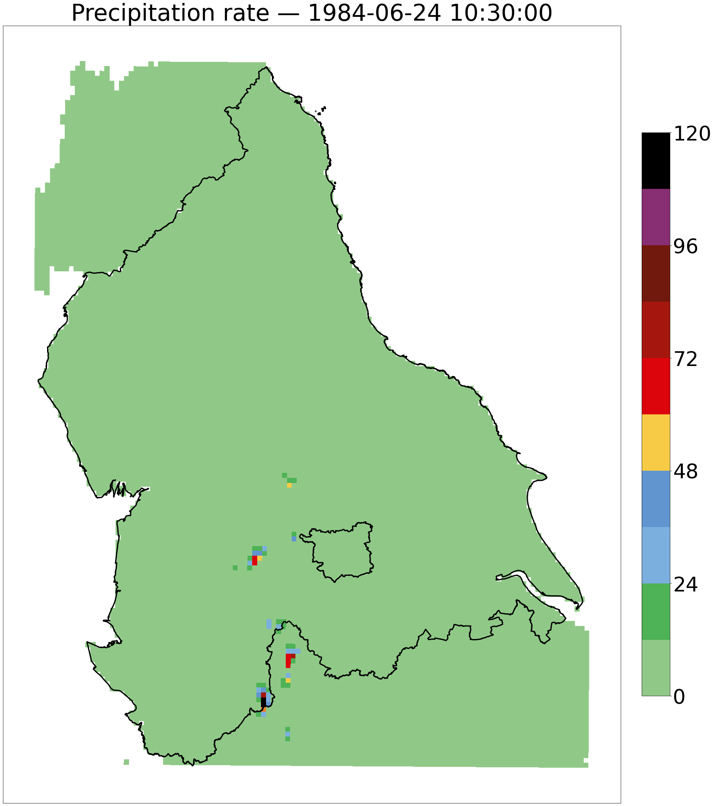
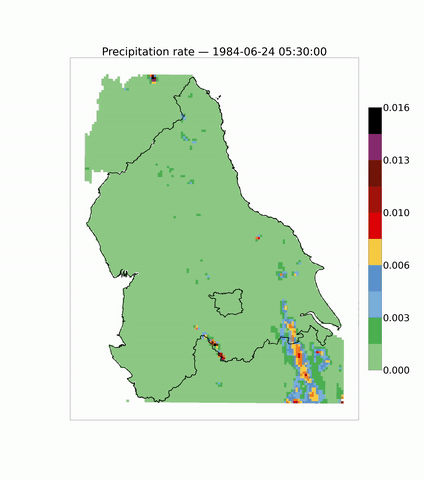

### Cell independence

In regional frequency analysis, or other approaches to spatially pooling data for extreme value analysis, it is assumed that values in neighbouring grid cells are independent from one another.   

By finding the cell with the maximum value over the 1980-2001 time period over a specified area, and observing the values in the cells surrounding it, it is possible to assess the extent to which this assumption holds true.

It is also useful to observe the magnitude of the values in the cells surrounding the cell with the maximum value in the hours before and after the maximum event occurs. 5 hurs before and 5 hours after

### Ensemble Member 4
#### Leeds region

#### Northern region

### Ensemble Member 7
#### Leeds region

#### Northern region

